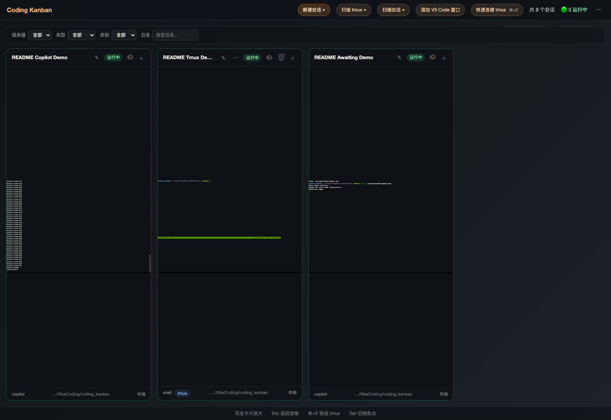
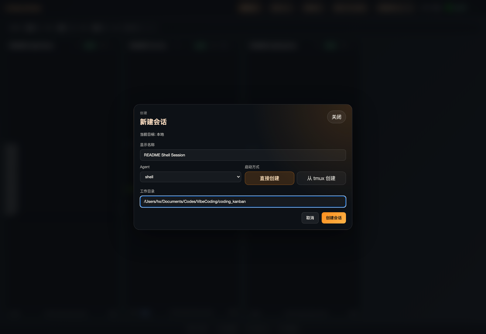
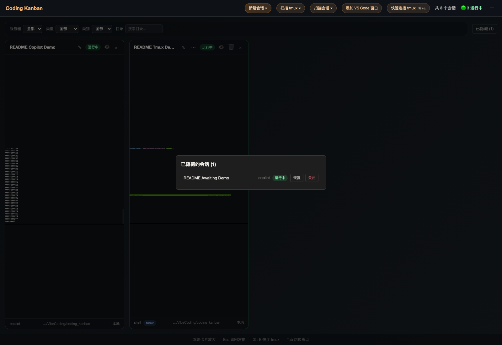
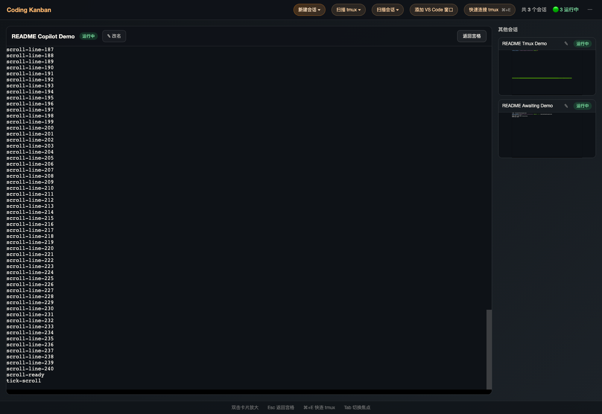
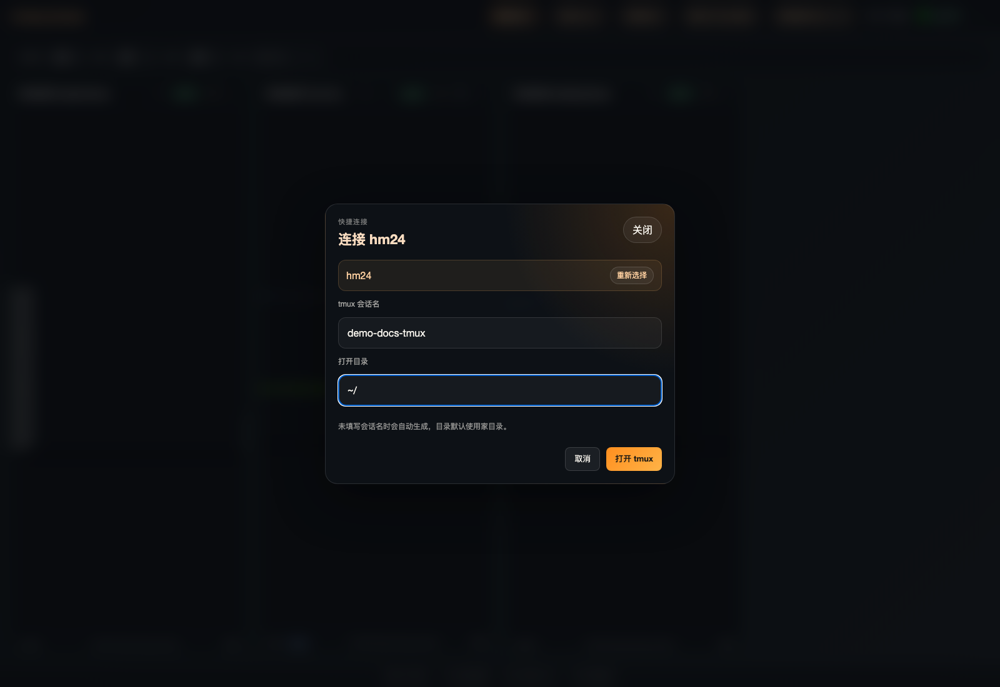

# Agent Orchestrator Kanban

一个面向 CLI Coding Agent 的终端看板。它把本地进程、SSH 远端会话、tmux 会话和目录扫描结果统一放进一个看板里，方便你在一个页面里同时观察、切换、恢复和继续操作多个 Agent。

这个项目当前更适合本地自托管和团队内部工作台场景：前端负责终端看板与交互，后端负责 PTY、WebSocket、tmux 和 SSH 编排。

## TODO

- [ ] 重启后支持恢复历史对话
- [ ] 打包为 electron 应用
- [ ] ...

## 截图

### 宫格总览



- 顶栏集中放置新建会话、扫描 tmux、扫描会话、添加 VS Code 窗口和快速连接 tmux。
- 宫格卡片展示状态、主机、目录和终端缩略图。
- 卡片右上角提供重命名、隐藏、终止 tmux、关闭/脱离等常用动作。

### 新建会话



- 同一套弹窗支持本地和 SSH 目标。
- 可以切换“直接创建”和“从 tmux 创建”。
- 显示名称留空时会自动生成唯一默认名。

### 隐藏与恢复会话



- 点击卡片上的 👁 可以临时隐藏会话，不会打断底层进程。
- 顶部会显示“已隐藏 (n)”入口，方便集中管理暂时不用的会话。
- 抽屉里可以恢复，也可以直接关闭；运行中的普通会话会二次确认。

### 聚焦终端



- 双击卡片进入聚焦态，在主终端直接输入。
- 侧栏保留其他会话上下文，方便来回切换。
- `Esc` 可以快速返回宫格。

### 快速连接 tmux



- 适合快速接入远端开发机上的 tmux 会话。
- 输入主机、会话名和目录后，可以直接拉起并进入聚焦态。
- mac 浏览器提示 `⌘+E`，Windows / Linux 浏览器提示 `Ctrl+E`。

## 它能做什么

### 统一看板管理多个 Agent 会话

- 用宫格视图同时展示多个会话。
- 每张卡片自带终端缩略图、状态标签、工作目录和主机信息。
- 支持双击卡片进入放大视图，聚焦后可直接把键盘输入发给目标终端。

### 直接创建本地或远端会话

- 可以从左侧面板创建新会话。
- 支持直接启动和 tmux 启动两种模式。
- 当前 UI 内置的启动类型包括 `copilot`、`codex`、`claude` 和 `shell`。

### 管理 tmux 会话

- 支持本地 tmux 扫描。
- 支持把 tmux 会话直接接入到看板。
- 支持把已退出但可恢复的会话重新在 tmux 中拉起。
- 支持 Meta/Ctrl+E 打开“快速连接 tmux”弹窗，先选 SSH 主机，再填会话名和目录，直接进入聚焦视图。

### 观察本地 VS Code 窗口

- 支持把本地 VS Code 窗口作为“观察会话”加入看板。
- 观察卡片会显示窗口预览，并根据活动心跳在“运行中 / 等待输入”之间切换。
- 可以随时停止观察，停止后仍保留记录，方便稍后清理。

### 扫描并接管已有 Agent 工作目录

- 可以扫描本地目录，也可以扫描 SSH 主机上的目录。
- 会识别已有的 Agent 会话状态，并把运行中/已停止结果展示在扫描结果里。
- 当前后端会优先识别 Copilot 的 session-state，并把匹配到的 tmux pane 与运行中会话合并展示，减少重复条目。

### 远端主机来自 SSH 配置

- 远端主机列表直接读取当前用户的 `~/.ssh/config`。
- Host、HostName、User、Port、IdentityFile 会被解析成可选目标。
- 这意味着你不需要在应用里再维护一套主机清单。

### 终端交互更贴近真实 tmux

- 支持 WebSocket 驱动的实时终端更新。
- 支持 tmux 鼠标二进制事件透传。
- 支持窗口尺寸同步，避免 SSH -> tmux 场景里尺寸不一致导致的状态栏错位。
- 缩略图不会再把真实 tmux resize 成小终端，而是复用放大视图的几何尺寸做本地缩放预览。

### 方便筛选和恢复

- 按服务器筛选。
- 按 Agent 类型筛选。
- 按 tmux 传输类别筛选。
- 按目录关键字筛选。
- 支持隐藏卡片，已隐藏会话可以在抽屉里统一恢复或关闭。
- 已退出但仍可重连的普通会话支持一键重连。

## 项目结构

```text
.
├─ apps/
│  ├─ server/   # Fastify + WebSocket + node-pty
│  └─ web/      # React + Vite + xterm.js
├─ packages/
│  └─ shared/   # 前后端共享类型
├─ scripts/     # 开发与演示辅助脚本
└─ tests/e2e/   # Playwright 端到端测试
```

## 技术栈

- 前端：React 19、Vite、TypeScript、xterm.js
- 后端：Fastify、@fastify/websocket、TypeScript、node-pty
- 终端与远端：PTY、SSH、tmux
- 测试：Playwright
- 包管理：pnpm workspace

## 安装要求

### 必需

- Node.js：建议使用较新的 LTS 或当前稳定版本。这个仓库当前依赖 `node-pty@1.2.0-beta.12`，在近期 Node 版本上更稳。
- pnpm：仓库使用 `pnpm@10.13.1`。

### 可选但强烈建议

- tmux：如果你要使用 tmux 创建、连接、恢复、缩略图和扫描能力。
- OpenSSH 客户端：如果你要管理远端主机。

### macOS 额外说明

如果本机没有 tmux，可以直接安装：

```bash
brew install tmux
```

### Linux 额外说明

如果你在 Linux 上本地运行，通常还需要准备 tmux、OpenSSH 客户端和 openssl。

Debian / Ubuntu:

```bash
sudo apt update
sudo apt install -y tmux openssh-client openssl
```

Fedora / RHEL:

```bash
sudo dnf install -y tmux openssh-clients openssl
```

## 兼容性约定

- 服务端支持部署在 Linux 和 macOS。
- 本地 PTY 与远端交互 shell 会优先使用当前环境的 `SHELL`，如果没有，再按 `bash -> zsh -> sh` 自动回退，不再假设必须有 zsh。
- 本地 tmux 会自动尝试这些位置：`TMUX_BINARY`、`/opt/homebrew/bin/tmux`、`/usr/local/bin/tmux`，最后再回退到 `PATH` 里的 `tmux`。
- 前端已按 Chromium 浏览器处理快捷键显示：mac 浏览器显示 `⌘+E`，Windows / Linux 浏览器显示 `Ctrl+E`。

## 安装步骤

### 1. 克隆仓库

```bash
git clone <your-repo-url>
cd coding_kanban
```

### 2. 安装依赖

```bash
pnpm install
```

### 3. 准备 SSH 配置（可选）

如果你需要远端看板能力，请在 `~/.ssh/config` 里准备好主机，例如：

```sshconfig
Host hm24
  HostName 10.30.0.24
  User huxing
  Port 10022
```

应用启动后会自动把这些 Host 显示在左侧主机列表里。

## 启动方式

### 推荐：一键重启开发环境

```bash
./scripts/restart-dev.sh
```

这个脚本会：

- 清理占用中的 3000/4000 端口，并在同一个端口重新启动服务
- 启动后端服务
- 启动前端服务，默认绑定 `0.0.0.0`，方便局域网访问
- 默认启用 HTTPS，并自动生成或复用自签证书
- 输出前端实际 Local/Network 地址、后端健康检查地址和日志路径

启动成功后，脚本会打印：

- 前端实际本地地址（Local）
- 前端局域网地址（Network，当前环境可用时）
- 后端健康检查：http://127.0.0.1:4000/api/health

默认前端使用 3000 端口，后端使用 4000 端口。脚本会优先释放这两个端口上的旧进程，然后仍然在这两个端口上重新启动。

如果你想显式指定端口，可以这样启动：

```bash
WEB_PORT=3100 SERVER_PORT=4100 ./scripts/restart-dev.sh
```

默认通过 HTTPS 启动（`scripts/restart-dev.sh` 内 `WEB_HTTPS` 默认值为 `1`），以满足跨机器访问时浏览器安全上下文要求。

如果你想临时关闭 HTTPS（例如仅本机调试），可以这样启动：

```bash
WEB_HTTPS=0 ./scripts/restart-dev.sh
```

如果你要从另一台机器访问并使用浏览器窗口共享能力（需要安全上下文），请保持 HTTPS 开启：

```bash
WEB_HTTPS=1 ./scripts/restart-dev.sh
```

脚本会在 `.dev-runtime/certs/` 下自动生成自签证书。首次访问时浏览器会提示证书不受信任，需要手动继续。

如果你希望证书包含你的局域网 IP，可以覆盖 SAN：

```bash
WEB_HTTPS=1 WEB_HTTPS_SAN='DNS:localhost,IP:127.0.0.1,IP:10.30.0.15' ./scripts/restart-dev.sh
```

### Linux 和 macOS 的启动差异

- 启动命令本身相同，都是 `./scripts/restart-dev.sh`。
- Linux 上脚本通常会把 `hostname -I` 解析到的局域网 IP 自动加入证书 SAN，更适合局域网里的其他设备直接访问 HTTPS 页面。
- macOS 上默认更稳的是 `localhost`、`127.0.0.1` 和主机名；如果你要从其他设备访问 HTTPS 页面，通常需要手动传 `WEB_HTTPS_SAN`。
- tmux 安装路径在 macOS 上常见于 Homebrew 目录，在 Linux 上通常直接来自系统包管理器并位于 `PATH`。

### 备用：分别启动

```bash
pnpm --filter server dev
pnpm --filter web dev
```

### 备用：并发启动

```bash
pnpm dev
```

## 快速上手

### 新建一个本地会话

1. 打开左侧“新建会话”。
2. 填写显示名称、类型和工作目录。
3. 选择“直接创建”或“从 tmux 创建”。
4. 点击“创建会话”。

### 扫描已有会话

1. 在左侧主机列表选择“本地”或一个 SSH 主机。
2. 输入待扫描目录。
3. 点击“扫描”。
4. 在“扫描结果”里选择“接入”“连接 tmux”“恢复”或“tmux 恢复”。

### 快速连接远端 tmux

1. 按 Meta/Ctrl+E，或者点击顶部“快速连接 tmux”。
2. 输入主机名过滤列表。
3. 回车选择主机。
4. 输入 tmux 会话名和打开目录。
5. 点击“打开 tmux”。
6. 新会话会自动进入聚焦视图，也会同步加入宫格。

### 在聚焦视图里工作

1. 双击任意卡片进入聚焦视图。
2. 直接在主终端中输入。
3. `Esc` 返回宫格。
4. 侧栏会展示其他会话的终端缩略图，方便切换上下文。

### 隐藏暂时不用的会话

1. 点击卡片右上角的 👁。
2. 顶部工具栏会出现“已隐藏 (n)”。
3. 点击后可在抽屉里恢复，或直接关闭不再需要的会话。

### 观察一个本地 VS Code 窗口

1. 点击顶部“添加 VS Code 窗口”。
2. 选择要观察的 VS Code 窗口。
3. 宫格会新增一个观察卡片，支持双击进入焦点态。
4. 不再需要时可点击“停止观察”。

## 开发命令

```bash
pnpm dev          # 并发启动前后端
pnpm dev:restart  # 用脚本清端口并重启
pnpm build        # 构建 shared/server/web
pnpm check        # 类型检查 + 生产构建
pnpm e2e          # 运行 Playwright E2E
pnpm test         # 运行所有 workspace test 脚本
pnpm format       # 格式化整个仓库
```

## 演示截图如何更新

仓库里已经提供了一个截图脚本：

```bash
node ./scripts/generate-readme-screenshots.mjs
```

它会：

- 创建一组本地演示会话
- 打开前端页面
- 生成 README 用到的 PNG 截图
- 输出到 `docs/readme-assets/`

当前会生成这些文件：

- `board-overview.png`
- `new-session-dialog.png`
- `hidden-sessions-drawer.png`
- `focus-view.png`
- `quick-tmux-connect.png`

运行前请先保证前端和后端都已经启动。默认假设：

- 前端地址是 `https://localhost:3000`
- 后端地址是 `http://127.0.0.1:4000`

建议把截图脚本指向一套刚启动、没有历史会话的前后端实例。否则 README 截图里可能会混入你当前正在使用的真实会话。

如果你本地关闭了 HTTPS，或者用了其他端口，可以覆盖：

```bash
README_BASE_URL=http://127.0.0.1:3000 README_API_URL=http://127.0.0.1:4000 node ./scripts/generate-readme-screenshots.mjs
```

这个脚本会忽略本地自签证书错误，因此和 `./scripts/restart-dev.sh` 的默认 HTTPS 配置可以直接配合使用。

## 当前实现更适合哪些场景

- 同时跟踪多个 CLI Agent 的工作状态
- 远端开发机上的 tmux 会话切换与接管
- 在一个页面里观察本地、远端、tmux 和扫描结果
- 需要频繁在多个 Agent 之间切换上下文的日常开发工作流

## 已验证的行为

当前仓库已经有覆盖以下关键行为的 E2E：

- 直接创建、tmux 创建和默认命名
- 筛选、隐藏、恢复、关闭会话
- VS Code 窗口观察、停止观察和焦点态预览
- 等待输入状态识别
- tmux 鼠标事件透传
- tmux 缩略图不回写 resize
- tmux 扫描、合并、恢复与终止
- Meta/Ctrl+E 快速连接远端 tmux

## 故障排查

### 没看到 SSH 主机列表

- 检查 `~/.ssh/config` 是否存在。
- 确认使用的是明确的 `Host` 条目，而不是通配符条目。

### tmux 功能不可用

- 确认本机已经安装 tmux。
- 如果是 macOS，程序会自动探测 `/opt/homebrew/bin/tmux` 和 `/usr/local/bin/tmux`。
- 如果你使用了非标准路径，也可以通过环境变量 `TMUX_BINARY` 显式指定。

### 页面打不开或 API 报错

- 先执行：

```bash
./scripts/restart-dev.sh
```

- 再检查：

```bash
curl http://127.0.0.1:4000/api/health
```

### 远端 tmux 尺寸或状态栏显示异常

- 确认后端正常运行。
- 确认 tmux 会话是通过当前看板接入，而不是另一个终端窗口占用了不同的 client geometry。

## 说明

这个项目当前是一个偏工程化、偏实用主义的 Agent 控制台原型，重点在于把多终端编排、tmux 连接、目录扫描和实时终端交互整合到一个工作流里，而不是做成通用 SaaS 产品。
