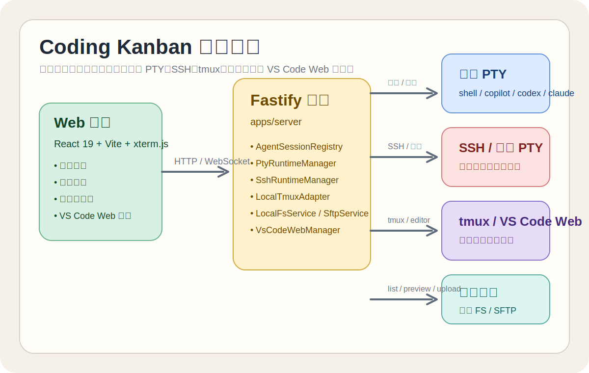
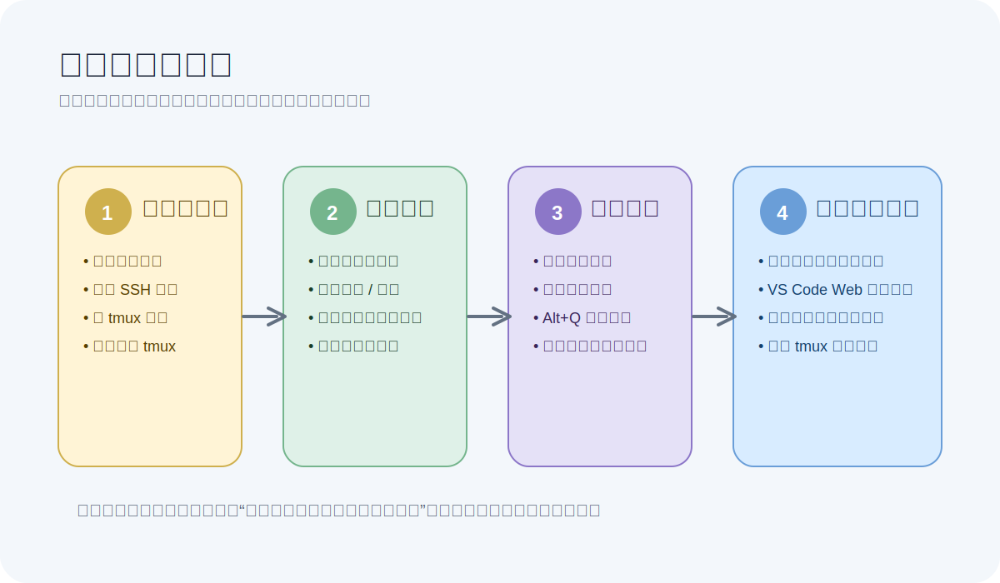
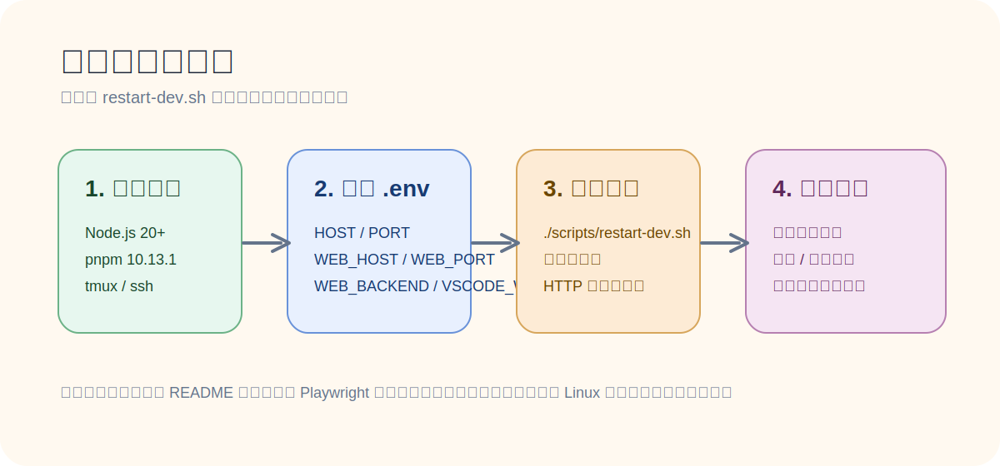

# Coding Kanban

一个面向 CLI Coding Agent 的多终端工作台。它把本地 PTY、SSH 远端会话、tmux 会话、目录扫描结果、文件浏览器和 VS Code Web 放到同一个浏览器界面里，目的是把“观察、切换、接管、继续输入、顺手改文件”压缩成一个连续工作流。

它更适合本地自托管、内网开发机、团队共享工作台这些场景，而不是公网 SaaS。前端负责宫格看板和交互，后端统一处理 PTY、WebSocket、tmux、SSH、文件系统和 VS Code Web 编排。

## 为什么要用它

- 同时盯多个 Agent，而不是反复切终端窗口。
- 把“新的 shell / copilot / codex / claude 会话”和“已有 tmux / 历史工作目录”放进一个统一面板。
- 在聚焦某个会话时，旁边直接打开文件浏览器或 VS Code Web，不需要再切回本地编辑器。
- 用浏览器完成本地和远端工作流，降低上下文切换成本。

## 架构总览



## 使用工作流



## 核心界面

### 宫格总览


- 顶栏集中放置新建会话、扫描 tmux、扫描会话、快速连接 tmux、文件浏览器和 VS Code Web 入口。
- 每张卡片显示名称、主机、目录、状态、Agent 类型和终端缩略图。
- 卡片右上角可直接执行重命名、隐藏、关闭、终止 tmux 等动作。

### 新建会话


- 同一个弹窗支持本机和 SSH 主机。
- 支持 direct 和 tmux 两种启动模式。
- 内置 `copilot`、`codex`、`claude`、`shell` 四类会话模板。
- 显示名称留空时，会根据主机、Agent 类型和启动模式自动生成唯一默认名。

### 聚焦终端


- 双击卡片进入聚焦态，在主终端直接输入。
- 右侧仍保留其他会话上下文，适合在多个 Agent 之间快速来回切换。
- 聚焦态顶部可打开文件浏览器和 VS Code Web 面板。

### 隐藏与恢复会话


- 隐藏只影响看板显示，不会打断底层 PTY 或 tmux。
- 顶栏里的“已隐藏”抽屉可统一恢复或关闭。
- 对运行中的普通会话，关闭前会有额外确认。

### 快速连接 tmux


- 用于快速接入本机或 SSH 远端 tmux 会话。
- 默认命令为 `tmux new-session -A -s <session> -c <dir>`。
- macOS 浏览器显示 `⌘+E`，Windows / Linux 浏览器显示 `Ctrl+E`。

## 操作演示

<video src="docs/readme-assets/20260423_151840.mp4" controls muted playsinline width="100%"></video>

如果当前 Markdown 渲染器不支持内嵌视频，可以直接打开 [docs/readme-assets/20260423_151840.mp4](docs/readme-assets/20260423_151840.mp4)。

## 功能详解

### 1. 统一看板管理多个 Agent 会话

- 宫格视图同时展示本地、SSH、tmux、扫描接入和观察类会话。
- 每张卡片都有状态标签、终端缩略图、工作目录和主机信息。
- 支持按服务器、Agent 类型、tmux 类别、目录关键字筛选。
- 已退出但仍可恢复的会话支持一键重连。

### 2. 新建本地或远端会话

- 新建会话可选择本机或 SSH 目标。
- 支持 direct 启动和 tmux 启动。
- 本机会话走 `/api/agent-launch/pty`，远端会话走 `/api/agent-launch/ssh-pty`。
- 远端目录输入支持目录建议，适合经常切换项目目录的开发机。

### 3. tmux 扫描、接管与恢复

- 支持本地 tmux 扫描。
- 支持 SSH 远端 tmux 扫描。
- 可把已存在的 tmux pane 接入为可交互终端，而不只是静态观察。
- 支持 `refresh`、`takeover`、`release`、`kill` 等管理动作。
- 缩略图不会把真实 tmux resize 成小终端，而是复用主终端的几何尺寸做本地缩放预览。

### 4. 扫描工作目录并接管已有 Agent 历史

- 支持扫描本地目录，也支持扫描 SSH 主机上的目录。
- 当前会优先识别 Copilot 的 `~/.copilot/session-state`，并读取 `workspace.yaml`、锁文件和运行状态。
- 扫描结果会尝试与 tmux pane 合并，减少重复卡片。
- 适合把“已经在别处跑起来的工作目录”重新拉回看板管理。

### 5. 文件浏览器

- 聚焦态下可打开内置文件浏览器。
- 支持本地文件系统，也支持通过 SFTP 访问 SSH 远端文件系统。
- 支持目录树、面包屑、显示隐藏文件、筛选、排序、拖拽上传、下载、重命名、删除和 chmod。
- 文本文件支持直接预览和编辑，适合快速改配置或看日志。

### 6. 内嵌 VS Code Web

- 仅本地终端会话支持打开 VS Code Web。
- 后端会优先复用 `code-server`，找不到时再尝试 `openvscode-server`。
- 默认复用当前用户的 `~/.vscode-server/extensions` 作为共享扩展目录，避免重复安装扩展。
- 每个会话会生成稳定的 `.code-workspace` 文件，便于复用工作区状态。

### 7. 观察本地 VS Code 窗口

- 可把本地 VS Code 窗口作为观察卡片加入看板。
- 观察卡片会显示窗口预览，并根据活动心跳切换到“运行中 / 等待输入”等状态。
- 不再需要时可停止观察，但记录仍会保留，便于后续清理。

### 8. 更贴近真实终端的交互细节

- 终端通过 WebSocket 实时同步，并先重放 scrollback 再进入 live 模式。
- 支持 tmux 的二进制鼠标事件透传。
- 支持 resize，同步主终端与后端 PTY 几何尺寸。
- 会过滤终端自动响应 payload，避免 CPR / 设备属性响应被错误写回真实 PTY。

## 安装与启动



### 环境要求

必需：

- Node.js：建议使用较新的 LTS 或当前稳定版本，推荐 Node.js 20 及以上。
- pnpm：仓库固定使用 `pnpm@10.13.1`。

强烈建议：

- tmux：需要用到 tmux 创建、扫描、接管、恢复时必备。
- OpenSSH 客户端：需要连接远端主机时必备。
- openssl：使用 `./scripts/restart-dev.sh` 并开启 HTTPS 时需要。

Linux 常见安装：

```bash
sudo apt update
sudo apt install -y tmux openssh-client openssl
```

Fedora / RHEL：

```bash
sudo dnf install -y tmux openssh-clients openssl
```

macOS：

```bash
brew install tmux
```

### 1. 克隆仓库

```bash
git clone <your-repo-url>
cd coding_kanban
```

### 2. 安装依赖

```bash
pnpm install
```

### 3. 准备 `.env`

推荐先复制模板：

```bash
cp .env.example .env
```

最常用的配置项如下：

| 变量 | 作用 | 默认值 |
| --- | --- | --- |
| `HOST` | Fastify 监听地址 | `0.0.0.0` |
| `PORT` | Fastify 监听端口 | `4000` |
| `WEB_HOST` | Vite 监听地址 | `0.0.0.0` |
| `WEB_PORT` | Vite 监听端口 | `3000` |
| `WEB_BACKEND_HOST` | 前端代理到后端的主机 | `localhost` |
| `WEB_BACKEND_PORT` | 前端代理到后端的端口 | `4000` |
| `WEB_HTTPS` | 是否启用前端 HTTPS | `1` |
| `FILE_BROWSER_DEFAULT_LOCAL_PATH` | 文件浏览器默认本地目录 | 自动探测仓库根目录 |
| `VSCODE_WEB_EXTENSIONS_DIR` | 内嵌 VS Code Web 的扩展目录 | `~/.vscode-server/extensions` 或内置目录 |
| `VSCODE_WEB_PUBLIC_HOST` | 浏览器访问 `/vscode` 的公共主机名 | 当前请求 Host |
| `VSCODE_WEB_BIND_HOST` | code-server / openvscode-server 的内部绑定地址 | `0.0.0.0` |

说明：

- `./scripts/restart-dev.sh` 会先读取仓库根目录下的 `.env`。
- 如果你已经习惯用 `SERVER_PORT`，脚本也接受这个兼容覆盖项，但仓库主配置名仍然是 `PORT`。
- 当前前端会把 `/api`、`/ws`、`/vscode` 全部代理到 `WEB_BACKEND_HOST:WEB_BACKEND_PORT`。

### 4. 准备 SSH 配置（可选）

如果你要管理远端开发机，请在 `~/.ssh/config` 里准备主机：

```sshconfig
Host hm24
  HostName 10.30.0.24
  User huxing
  Port 10022
```

应用启动后会自动解析这些 Host，并显示在新建会话、扫描会话和快速连接 tmux 的主机下拉里。

### 5. 推荐启动方式

```bash
./scripts/restart-dev.sh
```

这个脚本会自动完成以下事情：

- 读取 `.env`。
- 清理旧的前后端进程与端口占用。
- 启动后端 Fastify 服务。
- 启动前端 Vite 服务。
- 默认启用 HTTPS，并在 `.dev-runtime/certs/` 下自动生成或复用自签证书。
- 输出前端 Local / Network 地址、后端健康检查地址和日志路径。

常用变体：

```bash
WEB_PORT=3100 PORT=4100 ./scripts/restart-dev.sh
WEB_HTTPS=0 ./scripts/restart-dev.sh
WEB_HTTPS=1 WEB_HTTPS_SAN='DNS:localhost,IP:127.0.0.1,IP:10.30.0.15' ./scripts/restart-dev.sh
```

### 6. 分别启动前后端（备用）

```bash
pnpm --filter server dev
pnpm --filter web dev
```

或者：

```bash
pnpm dev
```

### 7. 启动后如何确认服务正常

检查后端：

```bash
curl http://127.0.0.1:4000/api/health
```

如果你修改过端口，把 `4000` 替换成实际 `PORT`。

前端默认地址：

- `https://localhost:3000`
- 或 `./scripts/restart-dev.sh` 输出里的 `Local` / `Network` 地址

## 详细使用方法

### 场景 1：新建一个本地 Agent 会话

1. 点击顶栏“新建会话”。
2. 选择“本机”。
3. 选择 Agent 类型，例如 `copilot`、`codex`、`claude` 或 `shell`。
4. 填写工作目录。
5. 选择启动模式：`direct` 或 `tmux`。
6. 点击创建，新的卡片会出现在宫格中。

适用场景：

- 你想直接从浏览器拉起一个新的本地工作会话。
- 你想把 shell 和 AI agent 混着放在一个看板里统一观察。

### 场景 2：连接一台远端开发机

1. 先把 SSH 主机写入 `~/.ssh/config`。
2. 点击“新建会话”并选择目标主机。
3. 填写工作目录和 Agent 类型。
4. 创建后，会话会以 SSH PTY 的形式加入看板。

适用场景：

- 把远端 Linux 开发机上的任务统一纳入本地浏览器工作台。
- 在一个页面里同时看本地和远端多个 Agent。

### 场景 3：快速连接 tmux

1. 点击“快速连接 tmux”，或按 `⌘+E` / `Ctrl+E`。
2. 选择主机。
3. 输入 tmux 会话名和工作目录。
4. 提交后，会自动运行 `tmux new-session -A -s <session> -c <dir>`。
5. 成功后会直接进入聚焦视图。

适用场景：

- 你已经习惯用 tmux 管理长任务。
- 你只想快速回到已有 tmux，会话存在就 attach，不存在就创建。

### 场景 4：扫描已有工作目录

1. 点击“扫描会话”。
2. 选择本机或 SSH 主机。
3. 输入待扫描的根目录，例如 `~/Projects`。
4. 点击扫描。
5. 查看扫描结果，选择直接加入、以 tmux 方式加入、聚焦已有会话或恢复。

扫描器目前擅长：

- 识别 Copilot `session-state`。
- 识别目录中的 Agent 历史痕迹。
- 把扫描到的结果与 tmux 绑定信息合并。

### 场景 5：扫描并接管 tmux

1. 点击“扫描 tmux”。
2. 选择本机或 SSH 主机。
3. 查看当前可发现的 tmux 会话。
4. 选择加入宫格或聚焦已有接管卡片。

适用场景：

- 你已经在另一处开好了 tmux，但现在想转到看板里继续工作。
- 你要管理多台机器上的长驻 tmux 任务。

### 场景 6：进入聚焦视图并直接处理任务

1. 双击任意卡片。
2. 在主终端里直接输入。
3. 右侧保留其他会话缩略图，方便切换上下文。
4. 按 `Alt+Q` 返回宫格。

聚焦态适合：

- 长时间盯一个 Agent 输出。
- 边看主会话，边保留其他终端的上下文缩略图。

### 场景 7：打开文件浏览器

1. 先进入某个会话的聚焦态。
2. 点击顶栏“文件”。
3. 浏览当前目录或切换到其他主机路径。
4. 预览文本、打开编辑、上传下载、拖拽文件。

适用场景：

- 快速改 `.env`、脚本、配置文件。
- 查看远端日志或配置，不必重新开 SFTP 客户端。

### 场景 8：打开 VS Code Web

1. 进入一个本地会话的聚焦态。
2. 点击顶栏“VS Code”。
3. 系统会自动启动或复用 `code-server` / `openvscode-server`。
4. 在右侧面板中直接编辑当前会话工作目录。

注意：

- 目前只支持本地会话，SSH 远端会话暂不支持内嵌 VS Code Web。
- 如果切换扩展目录，可通过 `VSCODE_WEB_EXTENSIONS_DIR` 覆盖默认值。

### 场景 9：隐藏和恢复不需要立即处理的会话

1. 点击卡片上的隐藏按钮。
2. 顶栏会出现“已隐藏 (n)”。
3. 在隐藏抽屉中恢复或关闭。

适用场景：

- 当前会话不想删，但又不想让它一直占着看板位置。

## 项目结构

```text
.
├─ apps/
│  ├─ server/   # Fastify + WebSocket + PTY / SSH / tmux / FS
│  └─ web/      # React + Vite + xterm.js
├─ packages/
│  └─ shared/   # 前后端共享类型
├─ scripts/     # 开发、演示、截图、tmux 辅助脚本
├─ tests/e2e/   # Playwright 端到端测试
├─ docs/        # 设计、计划、README 素材
└─ memories/    # 仓库级记忆，不参与产品运行
```

## 技术栈

- 前端：React 19、Vite、TypeScript、xterm.js
- 后端：Fastify、@fastify/websocket、TypeScript、node-pty、ssh2
- 终端能力：PTY、SSH、tmux
- 测试：Playwright、Node test runner
- 包管理：pnpm workspace

## 常用开发命令

```bash
pnpm dev          # 并发启动前后端
pnpm dev:restart  # 用脚本清端口并重启
pnpm build        # 构建 shared / server / web
pnpm check        # 类型检查 + 构建
pnpm e2e          # 运行 Playwright E2E
pnpm test         # 运行所有 workspace test
pnpm format       # 格式化整个仓库
```

## README 截图和插图如何更新

仓库里提供了 README 截图脚本：

```bash
node ./scripts/generate-readme-screenshots.mjs
```

它会自动：

- 创建一组演示会话。
- 打开前端页面。
- 生成 README 用到的截图资源。
- 将截图写入 `docs/readme-assets/`。

运行前默认假设：

- 前端地址：`https://localhost:3000`
- 后端地址：`http://127.0.0.1:4000`

如果你本地用的是其他地址：

```bash
README_BASE_URL=https://localhost:8484 README_API_URL=http://127.0.0.1:8282 node ./scripts/generate-readme-screenshots.mjs
```

如果你要在 Linux 上跑这个脚本，请先确保 Playwright 浏览器依赖齐全。常见方式：

```bash
npx playwright install
sudo npx playwright install-deps
```

补充说明：

- 本 README 里的三张 SVG 插图是手工维护的静态说明图，便于在截图之外补充功能结构和安装流程说明。
- 截图脚本更适合对着一套刚启动、没有历史会话污染的环境运行。

## 已验证的行为

当前仓库已有 E2E 覆盖以下关键行为：

- 直接创建、tmux 创建和默认命名。
- 筛选、隐藏、恢复、关闭会话。
- 等待输入状态识别。
- tmux 鼠标事件透传。
- tmux 缩略图不回写 resize。
- tmux 扫描、合并、恢复与终止。
- 快速连接远端 tmux。
- VS Code 窗口观察与焦点态预览。

## 适合的使用场景

- 同时跟踪多个 CLI Agent 的工作状态。
- 在一个页面里管理本地、远端、tmux 和扫描接入结果。
- 频繁在多个 Agent 之间切换上下文。
- 需要把文件编辑和终端观察压缩到同一工作界面里。

## 故障排查

### 没看到 SSH 主机列表

- 检查 `~/.ssh/config` 是否存在。
- 确认使用的是明确的 `Host` 条目，而不是通配符 Host。
- 确认当前用户对该文件有读取权限。

### tmux 功能不可用

- 确认系统已安装 tmux。
- macOS 会尝试 `/opt/homebrew/bin/tmux`、`/usr/local/bin/tmux`，最后回退到 `PATH`。
- 如果 tmux 在非标准位置，可显式设置 `TMUX_BINARY`。

### 页面打不开或 API 报错

优先检查：

```bash
./scripts/restart-dev.sh
curl http://127.0.0.1:4000/api/health
```

如果你改过端口，请把 `4000` 替换成实际 `PORT`。

### VS Code Web 打不开

- 确认当前聚焦的是本地终端会话，而不是 SSH 会话。
- 确认系统能找到 `code-server` 或 `openvscode-server`。
- 如果没有安装，后端会尝试自动安装 `code-server` standalone。
- 如果扩展目录或公共 Host 需要定制，请检查 `VSCODE_WEB_EXTENSIONS_DIR`、`VSCODE_WEB_PUBLIC_HOST`、`VSCODE_WEB_BIND_HOST`。

### README 截图脚本无法启动浏览器

- 先运行 `npx playwright install`。
- Linux 上再运行 `sudo npx playwright install-deps`。
- 如果仍然失败，通常是缺少系统图形库而不是仓库代码本身有问题。

## Roadmap

- [ ] 服务重启后恢复历史对话。
- [ ] 补充 Electron 打包形态。
- [ ] 继续完善远端 VS Code Web 和更多恢复策略。
