<div align="center">


# OpenPrism

### OpenPrism — Vibe Writing for Academia

[](https://nodejs.org/)
[](LICENSE)
[](https://github.com/OpenDCAI/OpenPrism/stargazers)
[](https://github.com/OpenDCAI/OpenPrism/network/members)
[](https://github.com/OpenDCAI/OpenPrism/issues)
[](https://github.com/OpenDCAI/OpenPrism/pulls)

[中文](README_ZH.md) | [English](README.md)

---

### ✨ Highlights

| 🤖 AI Assistant | ✍️ Compile & Preview | 📚 Templates |
|:---:|:---:|:---:|
| Chat / Agent history<br>Tools multi-step edits | TexLive / Tectonic / Auto<br>PDF preview & download | ACL / CVPR / NeurIPS / ICML<br>One-click conversion |

| 🔄 Template Transfer | | |
|:---:|:---:|:---:|
| Legacy (LaTeX→LaTeX) / MinerU (PDF→MD→LaTeX)<br>LLM-powered migration + auto compile fix + VLM layout check | | |

| 🔧 Advanced Editing | 🗂️ Project Management | ⚙️ Configuration |
|:---:|:---:|:---:|
| AI autocomplete / Diff / diagnose | Multi-project + file tree + upload | OpenAI-compatible endpoint<br>Local-first privacy |

| 🔍 Search | 📊 Charting | 🧠 Recognition |
|:---:|:---:|:---:|
| WebSearch / PaperSearch | Chart from tables | Formula/Chart recognition |

| 👥 Collaboration | 📝 Peer Review | |
|:---:|:---:|:---:|
| Multi-user real-time editing<br>Cursor sync & online management | AI Review Report / Consistency<br>Missing Citations / Compile Summary | |

---

<a href="#-quick-start" target="_self">
  
</a>
<a href="#-core-features" target="_self">
  
</a>
<a href="#-contributing" target="_self">
  
</a>
<a href="#wechat-group" target="_self">
  
</a>

</div>

## 📢 News

> [!WARNING]
> 🚧 <strong>Template Transfer is under testing</strong><br>
> The Template Transfer feature is currently in beta and may contain known or unknown bugs. If you encounter any issues, please report them via [Issues](https://github.com/OpenDCAI/OpenPrism/issues).

> [!TIP]
> 🆕 <strong>2025-02 · Template Transfer (Dual Mode)</strong><br>
> Two transfer modes are now available: Legacy mode (LaTeX→LaTeX direct migration) and MinerU mode (PDF→Markdown→LaTeX via MinerU API). Both modes feature LLM-powered content migration, automatic compile error fixing, and optional VLM-based layout checking.

> [!TIP]
> 🆕 <strong>2025-02 · Real-time Collaboration</strong><br>
> Multi-user simultaneous editing is now available, powered by CRDT with automatic conflict resolution and cursor sync. Current version requires a server with a public IP; invite remote collaborators via token-based links.

---

<div align="center">
<br>
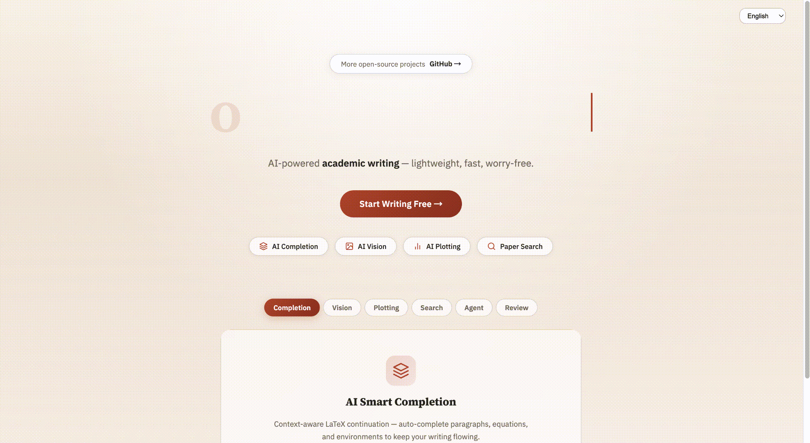
<br>
<sub>✨ Home preview: three-panel workspace + editor + preview</sub>
<br><br>
</div>

---

## ✨ Core Features

OpenPrism is a local-first LaTeX + AI workspace for academic writing, optimized for fast editing, controlled changes, and privacy.

### 🤖 AI Assistant

- **Chat mode**: read-only Q&A, no tools or file changes
- **Agent mode**: propose paper edits for confirmation, no direct writes or code execution
- **Tools mode**: multi-step tools, cross-file work, and controlled `code/` operations
- **Tasks**: polish, rewrite, restructure, translate, custom
- **Autocomplete**: Option/Alt + / or Cmd/Ctrl + Space, Tab to accept

### ✍️ Compile & Preview

- **Engines**: TexLive / Tectonic / Auto fallback
- **Preview toolbar**: zoom, fit width, 100%, download PDF
- **Compile log**: error parsing + one-click diagnose + jump to error
- **Views**: PDF / Figures / Diff

### 📚 Template System

- **Built-ins**: ACL / CVPR / NeurIPS / ICML
- **Conversion**: one-click template switch with content preserved

### 🔄 Template Transfer

- **Dual mode**: Legacy (LaTeX→LaTeX) and MinerU (PDF→Markdown→LaTeX)
- **MinerU integration**: parse PDF via MinerU API, extract Markdown + images, then fill into target template
- **LLM-powered migration**: AI analyzes source/target structure, drafts transfer plan, and applies content mapping
- **Auto compile fix**: automatically detect and fix LaTeX compilation errors with retry loop
- **VLM layout check**: optional visual layout validation using VLM to detect overflow, overlap, and spacing issues
- **Asset handling**: automatic copy of images, bib files, and style files from source to target

### 🗂️ Project Management

- **Projects panel**: manage multiple projects
- **File tree**: create/rename/delete/upload/drag
- **BibTeX**: quick create `references.bib`

### ⚙️ Configuration

- **LLM Base URL**: OpenAI-compatible, supports custom base URL
- **Env-backed settings**: LLM provider, key, base URL, and model are stored in repository `.env` and API keys are masked in the UI
- **TexLive config**: customizable TexLive resources
- **Language switch**: toggle 中文/English in the top bar

### 🔍 Search & Reading

- **WebSearch**: online search with summaries
- **PaperSearch**: academic paper search with citation info

### 📊 Charts & Recognition

- **Table-to-chart**: generate charts directly from tables
- **Smart recognition**: formulas and charts auto-detected

### 📝 Peer Review

- **AI Quality Check**: automated paper quality assessment
- **Full Review Report**: generate detailed reviewer-style review comments
- **Consistency Check**: terminology and symbol consistency detection
- **Missing Citations**: find statements that need citations
- **Compile Log Summary**: summarize compile errors and fix suggestions

### 👥 Real-time Collaboration

- **Multi-user editing**: multiple users edit the same document simultaneously with real-time sync
- **Cursor & selection sync**: each user's cursor displayed in a distinct color, visible in real time
- **Online user list**: collaboration panel shows currently connected users and their status
- **Invite to collaborate**: invite others via link or token to join the editing session

---

## 🎨 Showcase

### 🖥️ Three-Panel Workspace

<div align="center">
<br>
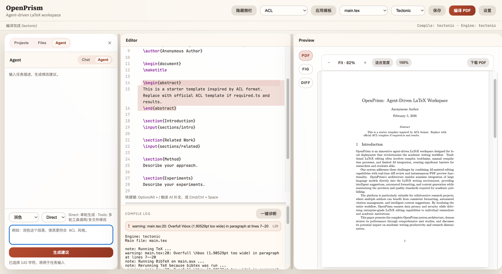
<br>
<sub>✨ AI Assistant | LaTeX Editor | PDF Preview</sub>
<br><br>
</div>

### ✍️ Editor View

<div align="center">
<br>
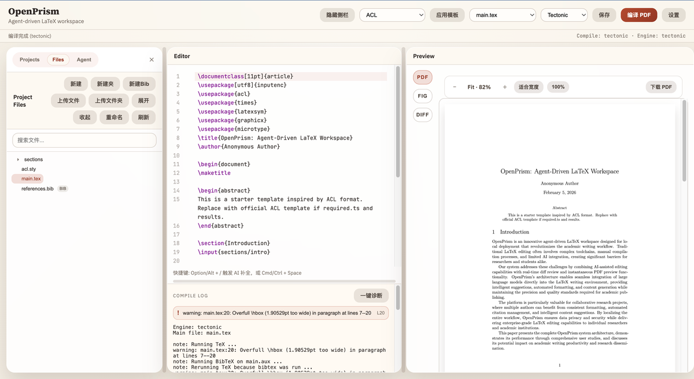
<br>
<sub>✨ Synchronized editing and preview</sub>
<br><br>
</div>

### 🤖 Agent Mode

<div align="center">
<br>
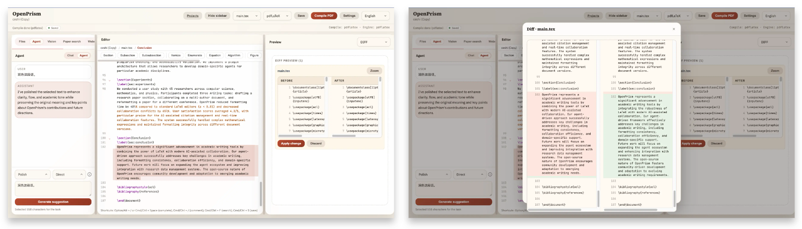
<br>
<sub>✨ Generate diff suggestions for review</sub>
<br><br>
</div>

### 🧪 One-Click Diagnose

<div align="center">
<br>
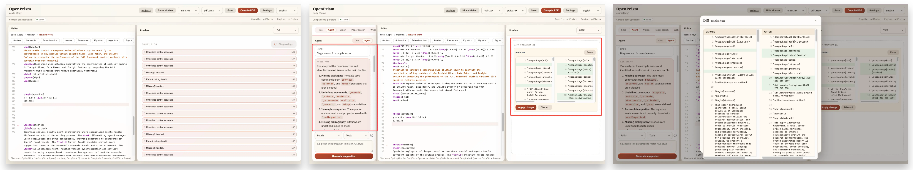
<br>
<sub>✨ Parse compile errors and jump to locations</sub>
<br><br>
</div>

### 🌐 WebSearch

<div align="center">
<br>
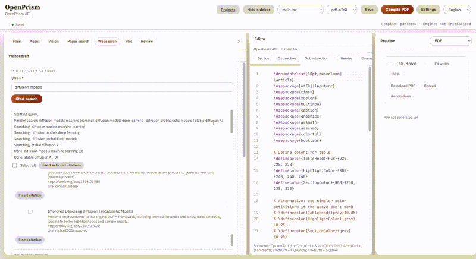
<br>
<sub>✨ Online search with concise summaries</sub>
<br><br>
</div>

### 📄 PaperSearch

<div align="center">
<br>
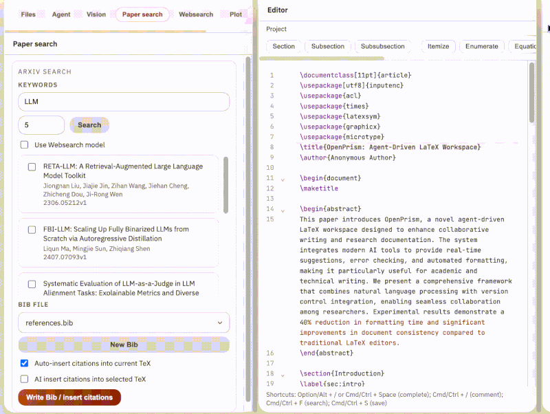
<br>
<sub>✨ Academic search and citation info</sub>
<br><br>
</div>

### 📊 Table-to-Chart

<div align="center">
<br>
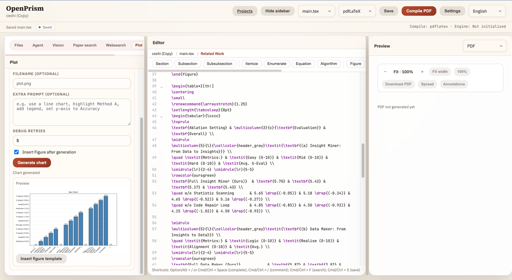
<br><sub>✨ Turn tables into charts in one step</sub>
<br><br>
</div>

### 🧠 Formula/Chart Recognition

<div align="center">
<br>
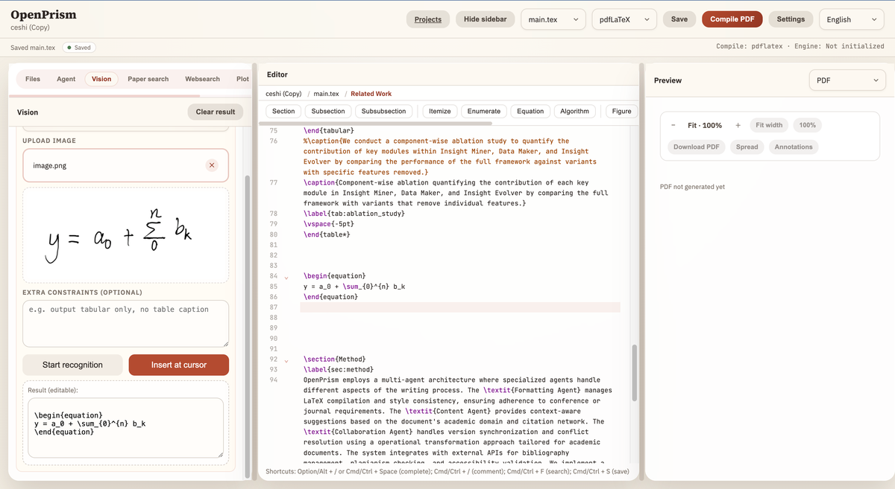
<br><sub>✨ Recognize structures for editable outputs</sub>
<br><br>
</div>

### 🔧 AI Autocomplete

<div align="center">
<br>
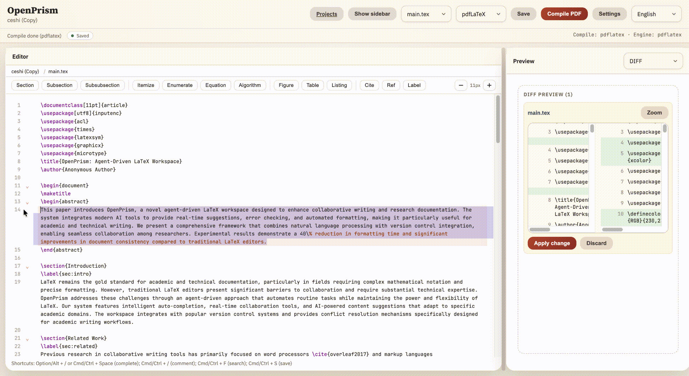
<br>
<sub>✨ Option/Alt + / to trigger, Tab to accept</sub>
<br><br>
</div>

### 📝 Peer Review

<div align="center">
<br>
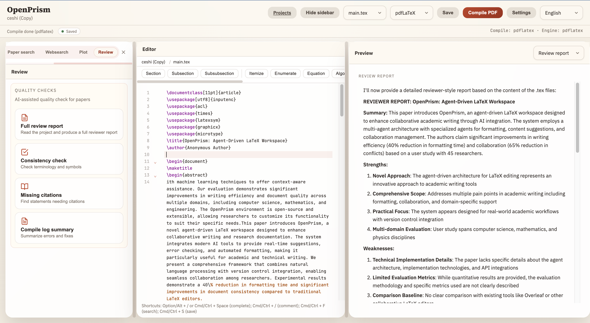
<br>
<sub>✨ AI Quality Check: Review Report / Consistency Check / Missing Citations / Compile Summary</sub>
<br><br>
</div>

### 👥 Real-time Collaboration

<div align="center">
<br>
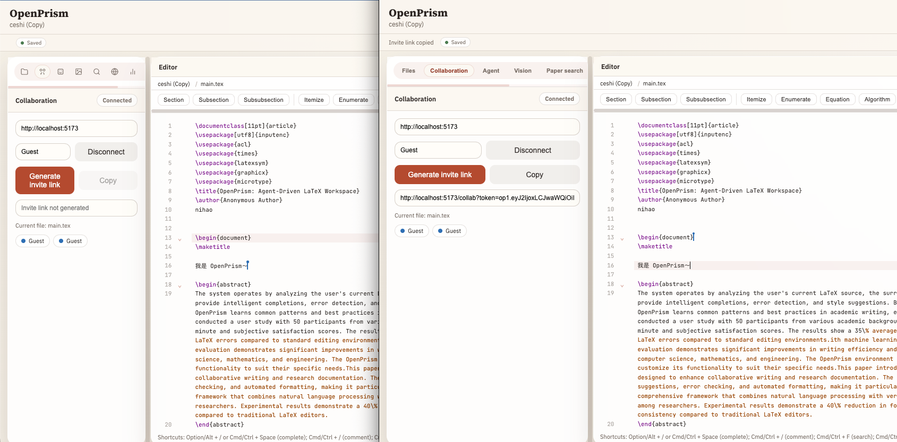
<br>
<sub>✨ Multi-user real-time collaborative editing with cursor sync and online user management</sub>
<br><br>
</div>

---

## 🚀 Quick Start

### 📋 Requirements

#### Basic Environment
- **Node.js** >= 18.0.0
- **npm** >= 9.0.0
- **OS**: Windows / macOS / Linux

#### LaTeX Compilation Environment (Required)

OpenPrism requires a LaTeX engine to generate PDFs. Choose one of the following options based on your OS:

**Option 1: TexLive (Recommended)**
- **Linux (Ubuntu/Debian)**:
  ```bash
  sudo apt-get update
  sudo apt-get install texlive-full
  ```
- **Linux (CentOS/RHEL)**:
  ```bash
  sudo yum install texlive texlive-*
  ```
- **macOS**:
  ```bash
  brew install --cask mactex
  ```
- **Windows**: Download [TexLive](https://www.tug.org/texlive/) installer

**Option 2: Tectonic (Lightweight)**
- **Linux/macOS**:
  ```bash
  curl --proto '=https' --tlsv1.2 -fsSL https://drop-sh.fullyjustified.net | sh
  ```
- **Windows**: Download [Tectonic](https://tectonic-typesetting.github.io/) installer

> **Note**: TexLive full installation is ~5-7GB, Tectonic is lighter but with fewer features. TexLive is recommended for Linux servers.

### 📦 Install & Run

#### Development Deployment

```bash
# 1. Clone repository
git clone https://github.com/OpenDCAI/OpenPrism.git
cd OpenPrism

# 2. Install dependencies
npm install

# 3. Start dev server (frontend + backend)
npm run dev
```

Access:
- **Frontend**: http://localhost:5173
- **Backend**: http://localhost:8787

#### Production Deployment

```bash
# 1. Build frontend and backend
npm run build

# 2. Start production server
npm start
```

#### Complete Linux Server Deployment Example

```bash
# 1. Install Node.js (Ubuntu example)
curl -fsSL https://deb.nodesource.com/setup_18.x | sudo -E bash -
sudo apt-get install -y nodejs

# 2. Install TexLive
sudo apt-get update
sudo apt-get install -y texlive-full

# 3. Verify installation
node --version  # Should show >= 18.0.0
pdflatex --version  # Should show TexLive version

# 4. Clone and deploy project
git clone https://github.com/OpenDCAI/OpenPrism.git
cd OpenPrism
npm install
npm run build

# 5. Configure environment variables (optional)
cat > .env << EOF
OPENPRISM_LLM_BASE_URL=https://api.openai.com/v1
OPENPRISM_LLM_API_KEY=your-api-key
OPENPRISM_LLM_MODEL=gpt-5.5
OPENPRISM_DATA_DIR=/var/openprism/data
PORT=8787
EOF

# 6. Start service
npm start

# 7. Use PM2 for process management (recommended)
sudo npm install -g pm2
pm2 start npm --name "openprism" -- start
pm2 save
pm2 startup
```

---

## ⚙️ Configuration

### Environment Variables

Create a `.env` file in the project root (optional):

```bash
# LLM Configuration
OPENPRISM_LLM_BASE_URL=https://api.openai.com/v1
OPENPRISM_LLM_API_KEY=your-api-key
OPENPRISM_LLM_MODEL=gpt-5.5

# Data storage path
OPENPRISM_DATA_DIR=./data

# Backend service port
PORT=8787

# MinerU API Configuration (for PDF→MD→LaTeX transfer)
OPENPRISM_MINERU_API_BASE=https://mineru.net/api/v4
OPENPRISM_MINERU_TOKEN=your-mineru-token
```

### LLM Configuration

OpenPrism supports any **OpenAI-compatible** endpoint, including custom base URL:

**Method 1: Environment Variables**
```bash
# .env file
OPENPRISM_LLM_BASE_URL=https://api.openai.com/v1
OPENPRISM_LLM_API_KEY=your-api-key
OPENPRISM_LLM_MODEL=gpt-5.5
```

**Method 2: Frontend Settings Panel**
- Click the "Settings" button in the frontend interface
- Fill in Base URL, API Key, and Model
- Configuration is saved to the repository `.env` through the backend; existing API keys are masked in API responses and are not cached in browser localStorage

<div align="center">
<br>
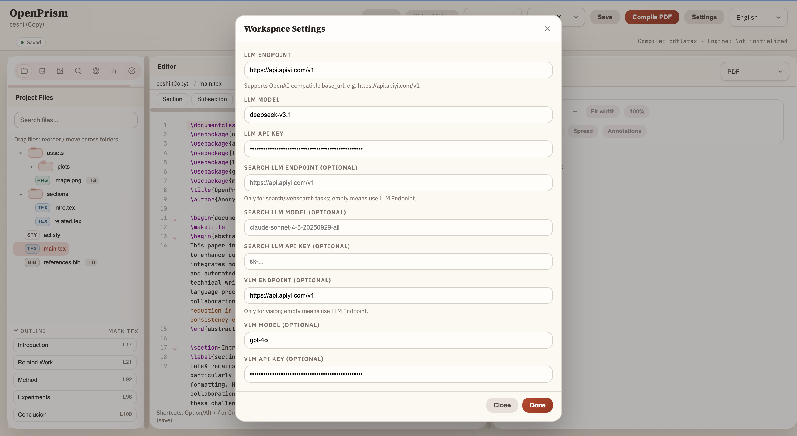
<br>
<sub>✨ LLM Configuration Settings Panel</sub>
<br><br>
</div>

**Supported Third-party Services:**
- OpenAI: `https://api.openai.com/v1`
- Azure OpenAI: `https://your-resource.openai.azure.com/openai/deployments/your-deployment`
- Other compatible services: `https://api.apiyi.com/v1`

### LaTeX Compilation Configuration

**Supported Compilation Engines:**
- `pdflatex` - Standard LaTeX engine
- `xelatex` - Supports Unicode and Chinese
- `lualatex` - Supports Lua scripting
- `latexmk` - Automated build tool
- `tectonic` - Modern lightweight engine

**Configuration Method:**
1. Select compilation engine in frontend "Settings" panel
2. Set to "Auto" for automatic fallback to available engines
3. Customize TexLive resource path

### Data Storage Configuration

Default data storage is in `./data` directory, can be modified via environment variable:

```bash
# Custom data directory
OPENPRISM_DATA_DIR=/var/openprism/data
```

**Directory Structure:**
```
data/
├── projects/           # User projects
│   ├── project-1/
│   │   ├── main.tex
│   │   └── references.bib
│   └── project-2/
└── templates/          # Template cache
```

---

## 👥 Collaboration Guide

OpenPrism includes a built-in real-time collaboration system based on CRDT (Yjs) + WebSocket, allowing multiple users to edit the same document simultaneously without any third-party service.

### Collaboration Environment Variables

Add the following to your `.env` file:

```bash
# Token signing secret (must change for production)
OPENPRISM_COLLAB_TOKEN_SECRET=your-secure-random-string

# Require token for collaboration (default: true, set false for local dev)
OPENPRISM_COLLAB_REQUIRE_TOKEN=true

# Token TTL in seconds (default: 86400 = 24 hours)
OPENPRISM_COLLAB_TOKEN_TTL=86400
```

### How to Use

1. **Deploy**: Deploy OpenPrism to a server with a public IP, configure a domain and HTTPS
2. **Generate invite**: Click "Generate Invite Link" in the collaboration panel on the editor page
3. **Share link**: Send the generated link to your collaborator
4. **Join**: Collaborator opens the link, token is verified automatically, and they enter the editor
5. **Edit together**: Multiple cursors visible in real time, edits sync automatically, conflicts resolved by CRDT

<details>
<summary><strong>Nginx Reverse Proxy (Recommended, For Public Servers)</strong></summary>

Collaboration requires WebSocket. Nginx must be configured with upgrade headers:

```nginx
server {
    listen 443 ssl;
    server_name your-domain.com;

    location / {
        proxy_pass http://127.0.0.1:8787;
        proxy_http_version 1.1;
        proxy_set_header Upgrade $http_upgrade;
        proxy_set_header Connection "upgrade";
        proxy_set_header Host $host;
    }
}
```

> **Tip**: Local access (127.0.0.1) bypasses token verification by default, suitable for local development.

</details>

<details>
<summary><strong>No Public Server? Use Tunnel (ngrok)</strong></summary>

You can collaborate remotely without a public server. OpenPrism has built-in tunnel support — one command exposes your local service to the internet.

#### Quick Start (ngrok, Recommended)

1. Sign up for a free [ngrok](https://dashboard.ngrok.com/get-started/your-authtoken) account and get your authtoken
2. Run the following commands:

```bash
export NGROK_AUTHTOKEN=your_token_here

npm run tunnel:ngrok

```

3. On startup, the terminal prints a public URL. Share it with your collaborator:

```
  OpenPrism started at http://localhost:8787

  Tunnel active (ngrok):
  Public URL: https://xxxx.ngrok-free.app
  Share this URL to collaborate remotely!
```

4. Your collaborator opens the URL in their browser and starts editing in real-time

#### Other Tunnel Options

| Option | Command | Notes |
|--------|---------|-------|
| localtunnel | `npm run tunnel` | Zero-config, but may be unstable |
| Cloudflare Tunnel | `npm run tunnel:cf` | Requires [cloudflared](https://developers.cloudflare.com/cloudflare-one/connections/connect-apps/install-and-setup/installation/) installed |

> **Note**: Tunnel is off by default. Regular `npm start` does not create a tunnel. You can also set it via env var: `OPENPRISM_TUNNEL=ngrok npm start`

</details>

---

## 🎯 Usage Guide (Quick)

1. **Create Project**: Create new project in Projects panel and select template
2. **Write Paper**: Edit LaTeX in Files tree
3. **AI Edits**: Switch to Agent / Tools, generate diff and confirm
4. **Compile & Preview**: Click "Compile PDF", preview on right side
5. **Export PDF**: Click "Download PDF" in preview toolbar

---

## 📁 Project Structure

```
OpenPrism/
├── apps/
│   ├── frontend/           # React + Vite frontend
│   │   ├── src/
│   │   │   ├── app/App.tsx    # Main application logic
│   │   │   ├── app/TransferPanel.tsx  # Template transfer UI
│   │   │   ├── api/client.ts  # API calls
│   │   │   └── latex/         # TexLive integration
│   └── backend/            # Fastify backend
│       └── src/
│           ├── index.js       # API / compile / LLM proxy
│           ├── routes/transfer.js  # Transfer API endpoints
│           └── services/
│               ├── mineruService.js        # MinerU API integration
│               └── transferAgent/          # LangGraph transfer workflows
│                   ├── graph.js            # Legacy transfer graph
│                   ├── graphMineru.js       # MinerU transfer graph
│                   ├── state.js            # Transfer state schema
│                   └── nodes/              # Workflow nodes
├── templates/              # LaTeX templates (ACL/CVPR/NeurIPS/ICML)
├── data/                   # Project storage directory (default)
└── README.md
```

---

## 🗺️ Roadmap

<table>
<tr>
<th width="35%">Feature</th>
<th width="15%">Status</th>
<th width="50%">Description</th>
</tr>
<tr>
<td><strong>👥 Real-time Collaboration</strong></td>
<td></td>
<td>Multi-user real-time editing with cursor sync and online user management (currently requires a server with public IP)</td>
</tr>
<tr>
<td><strong>🌐 Serverless Collaboration</strong></td>
<td></td>
<td>Local collaboration without a public server: ① built-in tunnel integration (ngrok / Cloudflare Tunnel) to expose local services in one click; ② WebRTC-based P2P direct connection without third-party relay</td>
</tr>
<tr>
<td><strong>🔍 Enhanced WebSearch</strong></td>
<td></td>
<td>Integrate third-party Search APIs (e.g. Google / Baidu / SerpAPI) for improved search quality and coverage</td>
</tr>
<tr>
<td><strong>📚 Template Transfer (Dual Mode)</strong></td>
<td></td>
<td>Legacy (LaTeX→LaTeX) and MinerU (PDF→MD→LaTeX) dual-mode template transfer with LLM-powered migration, auto compile fix, and VLM layout check</td>
</tr>
<tr>
<td><strong>📸 Version Snapshots &amp; Rollback</strong></td>
<td></td>
<td>Project version management with snapshot saving and one-click rollback</td>
</tr>
<tr>
<td><strong>📖 Citation Search Assistant</strong></td>
<td></td>
<td>Auto-search related papers and generate BibTeX citations</td>
</tr>
</table>

---

## 🤝 Contributing

Welcome to submit Issues or PRs:
1. Fork the repository
2. Create a new branch
3. Commit your changes
4. Submit a PR

Development commands:
```bash
npm run dev
npm run dev:frontend
npm run dev:backend
npm run build
```

---

## 📄 License

MIT License. See [LICENSE](LICENSE).

---

## 🙏 Acknowledgments

- Tectonic
- CodeMirror
- PDF.js
- LangChain
- React / Fastify

---

<div align="center">

**If this project helps you, please give us a ⭐️ Star!**

[](https://github.com/OpenDCAI/OpenPrism/stargazers)
[](https://github.com/OpenDCAI/OpenPrism/network/members)

<br>

<a name="wechat-group"></a>

<br>
<sub>Scan to join the community WeChat group</sub>

<p align="center">
  <em>Made with ❤️ by OpenPrism Team</em>
</p>

</div>
