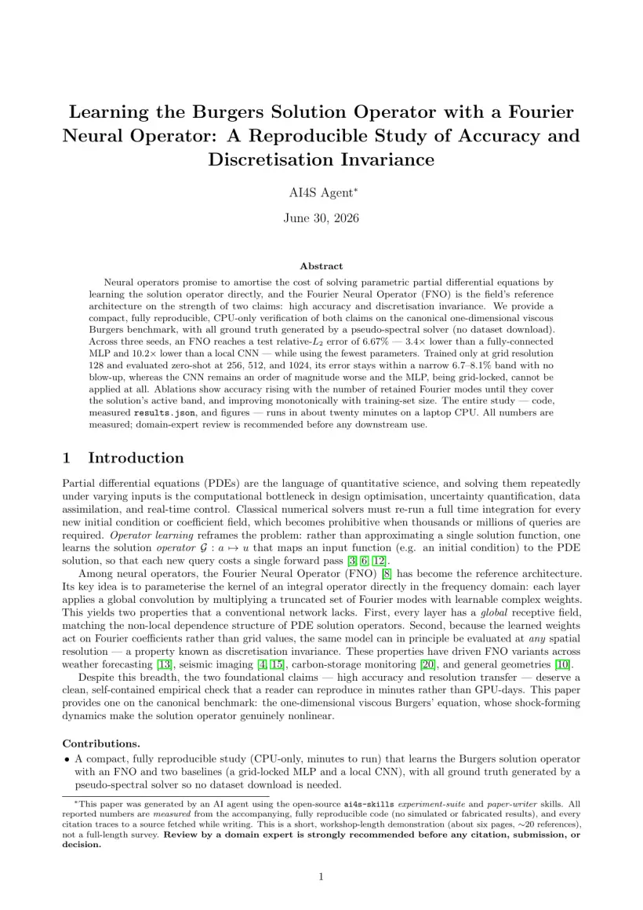
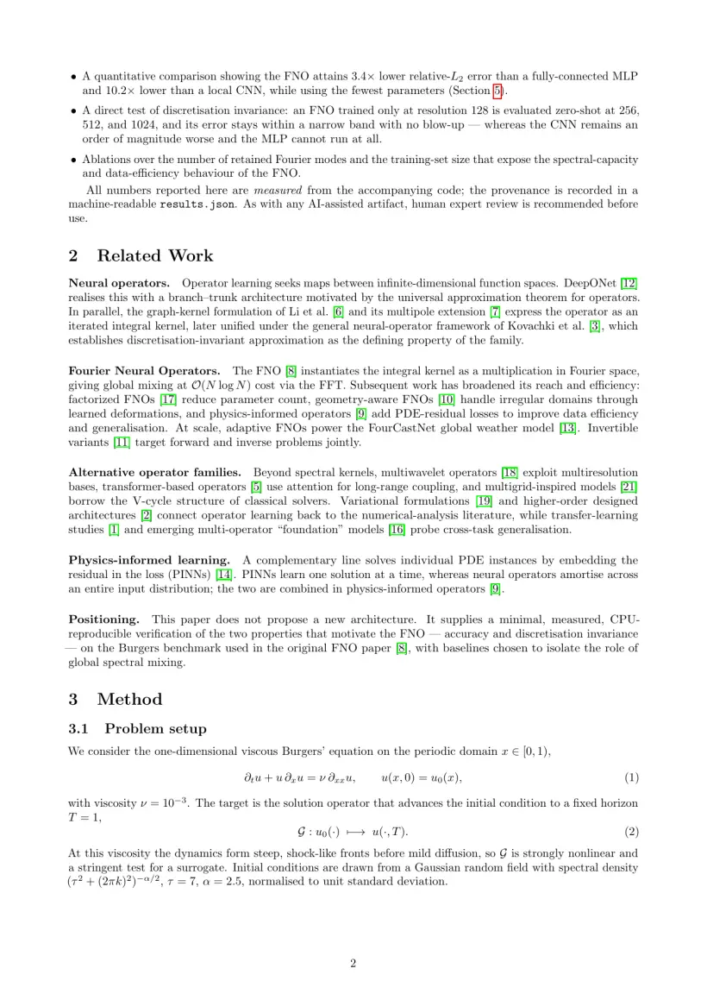
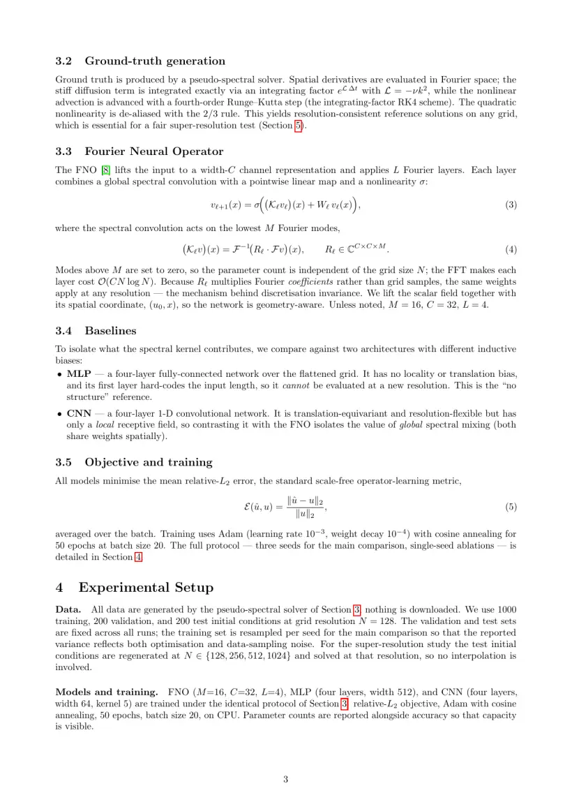
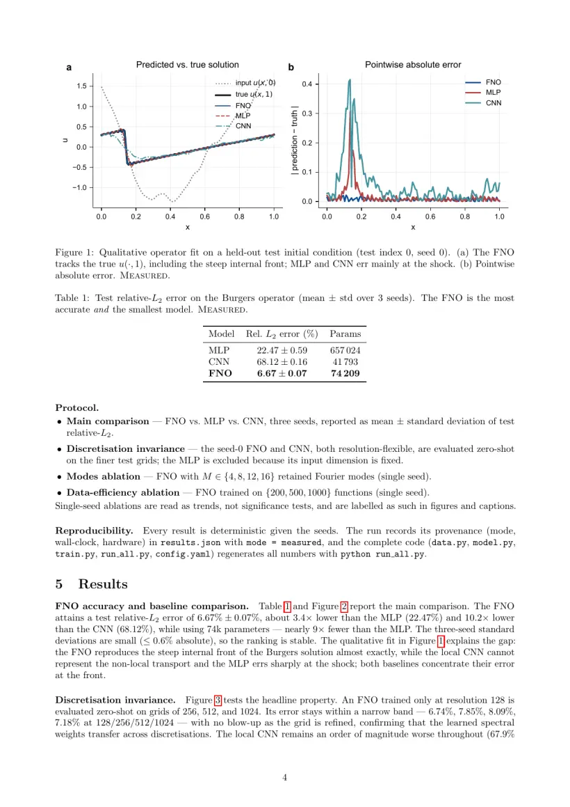
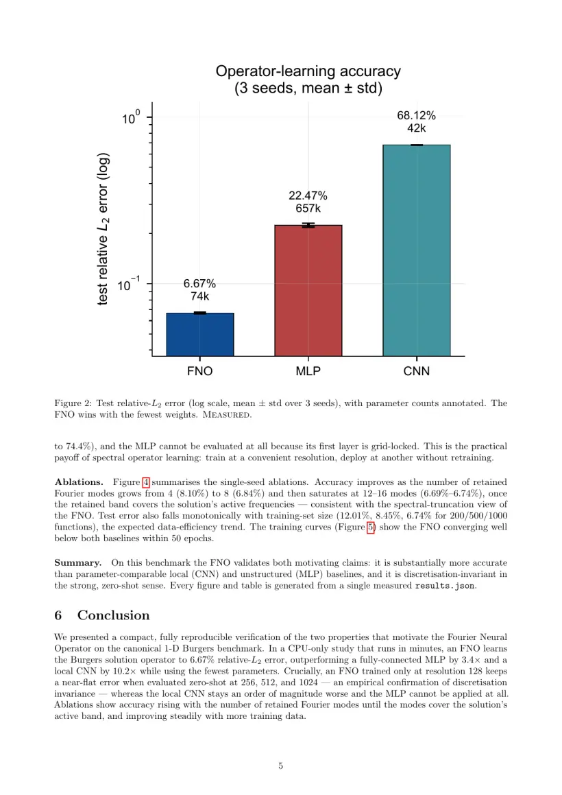
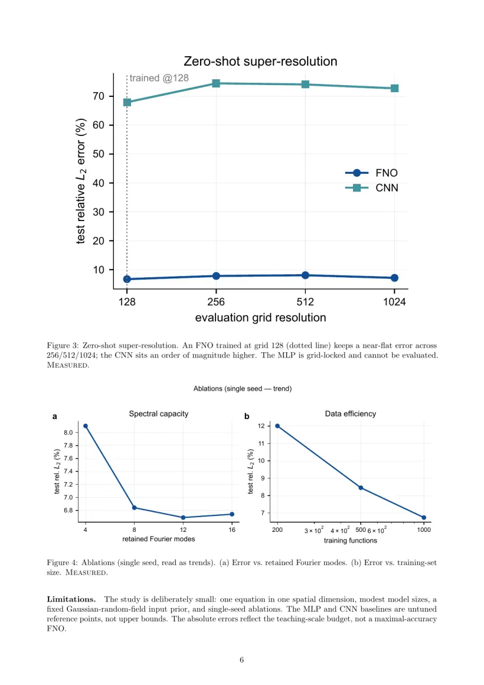

<div align="center">

[](https://github.com/ai4s-research/ai4s-skills)

面向 AI for Science 研究流程的七个 agent skill —— 把一个研究方向,变成文献综述、可跑实验、发表级论文与完整性审计,且每一条引用、每一个数字、每一张图都可追溯到来源。

<p align="center"><a href="README.md">English</a> · <b>中文</b></p>

<p>
  <a href="LICENSE"></a>
  
  <a href="http://makeapullrequest.com"></a>
  <a href="https://linux.do"></a>
</p>

</div>

---

## 目录

- [🧩 七个 skill](#七个-skill)
- [🔗 如何衔接](#如何衔接)
- [✅ 真实、可核验](#真实可核验)
- [🔬 示例](#示例)
- [📦 安装](#安装)
- [🚀 使用](#使用)
- [🗂️ 仓库结构](#仓库结构)
- [🛠️ 内置工具](#内置工具)
- [🤝 贡献](#贡献)
- [⚖️ 许可证](#许可证)
- [🙏 致谢](#致谢)

## 七个 skill

| Skill | 角色 | 主要产物 |
|---|---|---|
| [ai4s-agent](skills/ai4s-agent/SKILL.md) | 按顺序运行下面四个 | 完整研究包 |
| [research-explorer](skills/research-explorer/SKILL.md) | 从宽泛方向做选题探索 | `research_exploration.md`、`topic_matrix.md`、`literature_pre_survey.md` |
| [literature-survey](skills/literature-survey/SKILL.md) | 撰写文献综述 | 6–20 页 PDF、60+ 真引用、LaTeX 源码、分类法图 |
| [experiment-suite](skills/experiment-suite/SKILL.md) | 构建实验包 | 设计文档、可跑代码、带 provenance 的 `results.json`、图、报告 |
| [paper-writer](skills/paper-writer/SKILL.md) | 撰写研究论文 | 8–14 页 PDF、200+ 引用、4–8 图、表格 |
| [mindmap-render](skills/mindmap-render/SKILL.md) | 渲染脑图 | 由 `topic_matrix.md` 生成图(Python 脚本) |
| [integrity-auditor](skills/integrity-auditor/SKILL.md) | 论文完整性审计 | 图像/数值/逻辑发现、4 级证据分级、`audit_report.md` |

每个 skill 是一个文件夹,含 `SKILL.md` 及其 references、模板与工具。MIT 许可;可配合 Claude Code、Cursor、Codex、Aider 使用。

## 如何衔接

```
方向 (direction)
   │
   ▼
[1] research-explorer ──▶ 选定一个 $TOPIC
   │
   ├──▶ [2] literature-survey   → 综述 PDF + bibliography.bib
   ├──▶ [3] experiment-suite    → results.json + figures/
   └──▶ [4] paper-writer        → 论文 PDF(复用 [2] 与 [3])

integrity-auditor ──▶ 审计任意论文:外部 PDF / DOI / arXiv,或 [4] 的产物
```

`ai4s-agent` 按 1–4 顺序运行。各 skill 通过共享的 slug 和路径 `output/<skill>/<slug>/latest/` 交接产物。

## 真实、可核验

这是本项目的重点。每个 skill 都强制:

| 原则 | 具体做法 |
|---|---|
| **真引用** | 每条 BibTeX 都链接到 agent 本会话抓取过的 URL,不凭记忆。 |
| **数字标注来源** | 每个数字都标 `measured` / `simulated` / `illustrative`;模拟值绝不当作实测报告。 |
| **可跑实验** | `experiment-suite` 产出可运行代码和带 provenance 的 `results.json`。提供实测结果后即替换模拟值,"simulated" 声明随之去除。 |
| **可续跑** | 长任务每步存盘、断点续跑;报告"完成"即代表工作真正完成。 |
| **发表级版式** | booktabs 表格、`[!t]` 浮动、`~\cite{}`;矢量 PDF 图,内嵌字体、指定配色。 |
| **复核声明** | 每份生成文档都注明建议由领域专家复核。 |
| **完整性检查** | `integrity-auditor` 检查论文的图像、数值、逻辑问题,并对证据分级。 |

## 示例

一次由 `experiment-suite` + `paper-writer` 端到端产出的完整案例:**《Learning the
Burgers Solution Operator with a Fourier Neural Operator》** —— 一篇 8 页论文,背后是
agent 亲手写并运行的代码。完整产物见 [`examples/fno-burgers/`](examples/fno-burgers/)(论文、代码、`results.json`、报告)。

<div align="center">
<table>
<tr>
<td><a href="examples/fno-burgers/paper.pdf"></a></td>
<td><a href="examples/fno-burgers/paper.pdf"></a></td>
<td><a href="examples/fno-burgers/paper.pdf"></a></td>
</tr>
<tr>
<td><a href="examples/fno-burgers/paper.pdf"></a></td>
<td><a href="examples/fno-burgers/paper.pdf"></a></td>
<td><a href="examples/fno-burgers/paper.pdf"></a></td>
</tr>
</table>
<sub><i>8 页论文(此处展示前 6 页)—— 点击任意页查看完整 PDF。</i></sub>
</div>

- **真代码、真运行** —— `model.py` 是一个 1-D FNO;完整实验在笔记本 CPU 上约 20 分钟跑完。
- **实测结果** —— FNO 6.67% rel-L2,优于 MLP 22.47%、CNN 68.12%(3 seeds);零样本超分辨率在 128→1024 网格上稳定于 6.7–8.1%。
- **真引用** —— 22 条参考文献,每条都可追溯来源。

所有数字均为 `measured`(provenance 见 `results.json`);论文已注明系 AI 生成,并建议由领域专家复核。

## 安装

在你要使用 skill 的项目里运行安装脚本:

```bash
git clone https://github.com/ai4s-research/ai4s-skills

cd /path/to/your-project
/path/to/ai4s-skills/install.sh                              # 全部 skill → ./.claude/skills
/path/to/ai4s-skills/install.sh paper-writer                 # 或只装指定的
SKILLS_DIR=~/.claude/skills /path/to/ai4s-skills/install.sh  # 或装到全局
```

也可手动安装:把任意 `skills/<name>/` 复制到 `~/.claude/skills/`(全局)或 `<项目>/.claude/skills/`(项目级)。

## 使用

在 Claude Code 里:

> 用 literature-survey 这个 skill,就 \<你的选题\> 写一篇综述。

配合 Cursor、Codex、Aider,让 agent 读对应 skill 文件:

```
读 skills/literature-survey/SKILL.md 及其 references/,然后按其中规范就 "<你的选题>" 产出综述。
```

每个 `SKILL.md` 会要求 agent 先读完自己的 `references/`;这些文件里是文献扩展、图表、版式与质量检查的具体流程。

## 仓库结构

```
ai4s-skills/
├── skills/
│   ├── ai4s-agent/          SKILL.md + references/
│   ├── research-explorer/   SKILL.md
│   ├── literature-survey/   SKILL.md + references/ + templates/survey/
│   ├── experiment-suite/    SKILL.md + references/ + figure_examples/
│   ├── paper-writer/        SKILL.md + references/ + templates/paper/
│   ├── mindmap-render/      SKILL.md + scripts/ + tests/
│   └── integrity-auditor/   SKILL.md + references/ + forensics_tools/ + templates/ + tests/
├── tools/validate_skills.py   结构 / frontmatter 校验器(CI 中运行)
├── install.sh
└── .github/workflows/ci.yml
```

每个 `SKILL.md` 都带 YAML frontmatter(`name`、`description`),便于 agent 发现并路由。

## 内置工具

skill 调用的、单一职责的小脚本。每个目录都有各自的 `requirements.txt`。

- `skills/integrity-auditor/forensics_tools/` —— 图像重复 / ORB 匹配、面板切分、通道检查、量级(Benford 式)一致性、小数匹配、表格聚合一致性。
- `skills/experiment-suite/figure_examples/` —— matplotlib 样式工具包(`style_kit.py`)与范例图脚本。
- `skills/mindmap-render/scripts/` —— `generate_mindmap.py`。

## 贡献

新增一个 skill 需要:

1. `skills/<name>/SKILL.md`,带 `name` 与 `description` frontmatter(`name` = 文件夹名)。
2. 可选的 `references/`、`templates/` 与工具。
3. 任何地方都不 `import anthropic` / `import openai`。
4. `python tools/validate_skills.py` 通过(每个 PR 都会跑 CI)。

详见 [CONTRIBUTING.md](CONTRIBUTING.md) 与 [行为准则](CODE_OF_CONDUCT.md)。

## 许可证

[MIT](LICENSE)。

> 输出均为草稿。在任何引用、投稿或决策前,建议由领域专家复核。请核实数字、引用与论断。

## 致谢

感谢 [linux.do](https://linux.do) —— 一个充满活力的技术社区,本项目在此分享与讨论。
