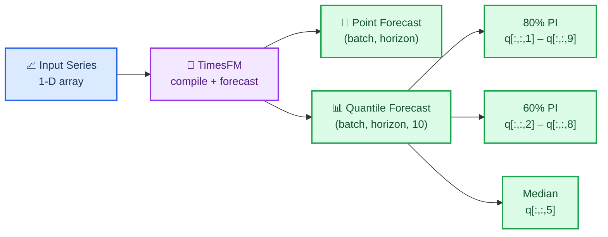

# Output Structure & ForecastConfig Reference

How to read TimesFM's `(point_forecast, quantile_forecast)` return and every
`ForecastConfig` parameter. The SKILL.md body summarizes; this is the full reference.

## Understanding the Output

### Quantile Forecast Structure

TimesFM returns `(point_forecast, quantile_forecast)`:

- **`point_forecast`**: shape `(batch, horizon)` — the median (0.5 quantile)
- **`quantile_forecast`**: shape `(batch, horizon, 10)` — ten slices:

| Index | Quantile | Use |
| ----- | -------- | --- |
| 0 | Mean | Average prediction |
| 1 | 0.1 | Lower bound of 80% PI |
| 2 | 0.2 | Lower bound of 60% PI |
| 3 | 0.3 | — |
| 4 | 0.4 | — |
| **5** | **0.5** | **Median (= `point_forecast`)** |
| 6 | 0.6 | — |
| 7 | 0.7 | — |
| 8 | 0.8 | Upper bound of 60% PI |
| 9 | 0.9 | Upper bound of 80% PI |

> The most common bug: `quant_fc[..., 0]` is the **mean**, not q0. q10 = index 1, q90 = index 9.

### Extracting Prediction Intervals

```python
point, q = model.forecast(horizon=H, inputs=data)

# 80% prediction interval (most common)
lower_80 = q[:, :, 1]  # 10th percentile
upper_80 = q[:, :, 9]  # 90th percentile

# 60% prediction interval (tighter)
lower_60 = q[:, :, 2]  # 20th percentile
upper_60 = q[:, :, 8]  # 80th percentile

# Median (same as point forecast)
median = q[:, :, 5]
```



## ForecastConfig Reference

All forecasting behavior is controlled by `timesfm.ForecastConfig`:

```python
timesfm.ForecastConfig(
    max_context=1024,                    # Max context window (truncates longer series)
    max_horizon=256,                     # Max forecast horizon
    normalize_inputs=True,               # Normalize inputs (RECOMMENDED for stability)
    per_core_batch_size=32,              # Batch size per device (tune for memory)
    use_continuous_quantile_head=True,   # Better quantile accuracy for long horizons
    force_flip_invariance=True,          # Ensures f(-x) = -f(x) (mathematical consistency)
    infer_is_positive=True,              # Clamp forecasts ≥ 0 when all inputs > 0
    fix_quantile_crossing=True,          # Ensure q10 ≤ q20 ≤ ... ≤ q90
    return_backcast=False,               # Return backcast (for covariate workflows)
)
```

| Parameter | Default | When to Change |
| --------- | ------- | -------------- |
| `max_context` | 0 | Set to match your longest historical window (e.g., 512, 1024, 4096) |
| `max_horizon` | 0 | Set to your maximum forecast length |
| `normalize_inputs` | False | **Always set True** — prevents scale-dependent instability |
| `per_core_batch_size` | 1 | Increase for throughput; decrease if OOM |
| `use_continuous_quantile_head` | False | **Set True** for calibrated prediction intervals |
| `force_flip_invariance` | True | Keep True unless profiling shows it hurts |
| `infer_is_positive` | True | Set False for series that can be negative (temperature, returns) |
| `fix_quantile_crossing` | False | **Set True** to guarantee monotonic quantiles |
