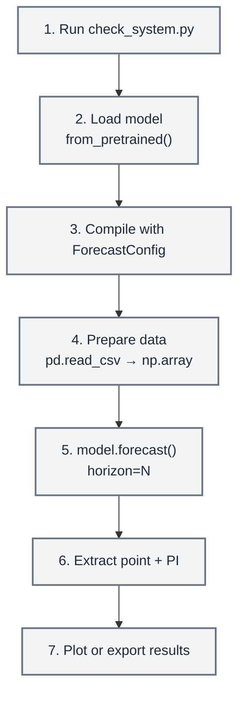

# Common Workflows, Performance Tuning & Integration

Copy-paste workflows for single/batch/eval forecasting, GPU and memory tuning, and
integration with statsmodels / matplotlib / EDA. All checkpoint ids and the
`forecast_with_covariates()` API are current as of TimesFM 2.5.

## Workflow 1: Single Series Forecast



```python
import torch, numpy as np, pandas as pd, timesfm

# 1. System check (run once)
# python scripts/check_system.py

# 2-3. Load and compile
torch.set_float32_matmul_precision("high")
model = timesfm.TimesFM_2p5_200M_torch.from_pretrained(
    "google/timesfm-2.5-200m-pytorch"
)
model.compile(timesfm.ForecastConfig(
    max_context=512, max_horizon=52, normalize_inputs=True,
    use_continuous_quantile_head=True, fix_quantile_crossing=True,
))

# 4. Prepare data
df = pd.read_csv("weekly_demand.csv", parse_dates=["week"])
values = df["demand"].values.astype(np.float32)

# 5. Forecast
point, quantiles = model.forecast(horizon=52, inputs=[values])

# 6. Extract prediction intervals
forecast_df = pd.DataFrame({
    "forecast": point[0],
    "lower_80": quantiles[0, :, 1],
    "upper_80": quantiles[0, :, 9],
})

# 7. Plot
import matplotlib.pyplot as plt
fig, ax = plt.subplots(figsize=(12, 5))
ax.plot(values[-104:], label="Historical")
x_fc = range(len(values[-104:]), len(values[-104:]) + 52)
ax.plot(x_fc, forecast_df["forecast"], label="Forecast", color="tab:orange")
ax.fill_between(x_fc, forecast_df["lower_80"], forecast_df["upper_80"],
                alpha=0.2, color="tab:orange", label="80% PI")
ax.legend()
ax.set_title("52-Week Demand Forecast")
plt.tight_layout()
plt.savefig("forecast.png", dpi=150)
print("Saved forecast.png")
```

## Workflow 2: Batch Forecasting (Many Series)

```python
import pandas as pd, numpy as np

# Load wide-format CSV (one column per series)
df = pd.read_csv("all_stores.csv", parse_dates=["date"], index_col="date")
inputs = [df[col].dropna().values.astype(np.float32) for col in df.columns]

# Forecast all series at once (batched internally)
point, quantiles = model.forecast(horizon=30, inputs=inputs)

# Collect results
results = {}
for i, col in enumerate(df.columns):
    results[col] = {
        "forecast": point[i].tolist(),
        "lower_80": quantiles[i, :, 1].tolist(),
        "upper_80": quantiles[i, :, 9].tolist(),
    }

# Export
import json
with open("batch_forecasts.json", "w") as f:
    json.dump(results, f, indent=2)
print(f"Forecasted {len(results)} series → batch_forecasts.json")
```

## Workflow 3: Evaluate Forecast Accuracy

```python
import numpy as np

# Hold out the last H points for evaluation
H = 24
train = values[:-H]
actual = values[-H:]

point, quantiles = model.forecast(horizon=H, inputs=[train])
pred = point[0]

# Metrics
mae = np.mean(np.abs(actual - pred))
rmse = np.sqrt(np.mean((actual - pred) ** 2))
mape = np.mean(np.abs((actual - pred) / actual)) * 100

# Prediction interval coverage
lower = quantiles[0, :, 1]
upper = quantiles[0, :, 9]
coverage = np.mean((actual >= lower) & (actual <= upper)) * 100

print(f"MAE:  {mae:.2f}")
print(f"RMSE: {rmse:.2f}")
print(f"MAPE: {mape:.1f}%")
print(f"80% PI Coverage: {coverage:.1f}% (target: 80%)")
```

## Performance Tuning

### GPU Acceleration

```python
import torch

# Check GPU availability
if torch.cuda.is_available():
    print(f"GPU: {torch.cuda.get_device_name(0)}")
    print(f"VRAM: {torch.cuda.get_device_properties(0).total_mem / 1e9:.1f} GB")
elif hasattr(torch.backends, "mps") and torch.backends.mps.is_available():
    print("Apple Silicon MPS available")
else:
    print("CPU only — inference will be slower but still works")

# Always set this for Ampere+ GPUs (A100, RTX 3090, etc.)
torch.set_float32_matmul_precision("high")
```

### Batch Size Tuning

```python
# Start conservative, increase until OOM
# GPU with 8 GB VRAM:  per_core_batch_size=64
# GPU with 16 GB VRAM: per_core_batch_size=128
# GPU with 24 GB VRAM: per_core_batch_size=256
# CPU with 8 GB RAM:   per_core_batch_size=8
# CPU with 16 GB RAM:  per_core_batch_size=32
# CPU with 32 GB RAM:  per_core_batch_size=64

model.compile(timesfm.ForecastConfig(
    max_context=1024,
    max_horizon=256,
    per_core_batch_size=32,  # <-- tune this
    normalize_inputs=True,
    use_continuous_quantile_head=True,
    fix_quantile_crossing=True,
))
```

### Memory-Constrained Environments

```python
import gc, torch

# Force garbage collection before loading
gc.collect()
if torch.cuda.is_available():
    torch.cuda.empty_cache()

# Load model
model = timesfm.TimesFM_2p5_200M_torch.from_pretrained(
    "google/timesfm-2.5-200m-pytorch"
)

# Use small batch size on low-memory machines
model.compile(timesfm.ForecastConfig(
    max_context=512,        # Reduce context if needed
    max_horizon=128,        # Reduce horizon if needed
    per_core_batch_size=4,  # Small batches
    normalize_inputs=True,
    use_continuous_quantile_head=True,
    fix_quantile_crossing=True,
))

# Process series in chunks to avoid OOM
CHUNK = 50
all_results = []
for i in range(0, len(inputs), CHUNK):
    chunk = inputs[i:i+CHUNK]
    p, q = model.forecast(horizon=H, inputs=chunk)
    all_results.append((p, q))
    gc.collect()  # Clean up between chunks
```

## Integration with Other Skills

### With `statsmodels`

Use `statsmodels` for classical models (ARIMA, SARIMAX) as a **comparison baseline**:

```python
# TimesFM forecast
tfm_point, tfm_q = model.forecast(horizon=H, inputs=[values])

# statsmodels ARIMA forecast
from statsmodels.tsa.arima.model import ARIMA
arima = ARIMA(values, order=(1,1,1)).fit()
arima_forecast = arima.forecast(steps=H)

# Compare
print(f"TimesFM MAE: {np.mean(np.abs(actual - tfm_point[0])):.2f}")
print(f"ARIMA MAE:   {np.mean(np.abs(actual - arima_forecast)):.2f}")
```

### With `matplotlib` / `scientific-visualization`

Plot forecasts with prediction intervals as publication-quality figures.

### With `exploratory-data-analysis`

Run EDA on the time series before forecasting to understand trends, seasonality, and stationarity.
