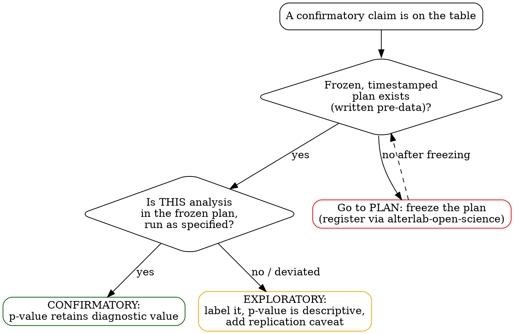

# PLAN → COLLECT → CONFIRM → EXPLORE: Phase Gates

The full form of the four-phase discipline workflow. The SKILL.md body carries the
summary; this file is the on-demand detail. Each phase has an **entry condition** and an
**exit gate**. You may not enter a phase until the previous gate passes. The whole point
is that the confirmatory/exploratory boundary is decided *before* the data can influence
it — the Center for Open Science model (https://www.cos.io/initiatives/prereg): once an
analysis is exploratory, its p-values are descriptive and the finding needs independent
replication.

## Decision flowchart

The non-obvious edge is `inplan -> explore`: a *deviation* (unplanned test swap, added
covariate, outlier rule invented after seeing data) routes a result to EXPLORE even when
a plan exists. Existence of a plan is necessary but not sufficient; the specific analysis
must trace to it.

## 1. PLAN — freeze before data are visible

**Entry:** a research question and a manipulable/observable design exist.

Lock all of the following in a written artifact:

| Element | Why it must be frozen |
|---|---|
| Hypotheses (directional where applicable) | Prevents HARKing — hypothesizing after results are known (Kerr, 1998). |
| Primary outcome (+ ranked secondaries) | Stops outcome-switching to whatever came out significant. |
| Test(s) per hypothesis | Stops test-shopping. *Choice* of test → `alterlab-statistical-analysis`; record the decision here. |
| Inclusion/exclusion + outlier rule | Removes a major researcher degree of freedom (Simmons et al., 2011). |
| Stopping rule / planned N | Removes optional stopping; sequential designs must be declared here. |
| Covariates, transformations, missing-data handling | Closes the "garden of forking paths" (Gelman & Loken, 2014). |

**Exit gate:** the plan is timestamped, registered (OSF Registries / AsPredicted /
PROSPERO via `alterlab-open-science`), and you can answer *"what result would falsify
this?"* Nothing in the plan may depend on having seen the outcome data.

## 2. COLLECT — data, untouched

**Entry:** PLAN gate passed.

Collect strictly according to the stopping rule. Do not inspect the outcome to decide
whether to continue. Any interim analysis must have been a pre-specified sequential
design recorded in PLAN.

**Exit gate:** data collection matched the frozen rule; no outcome-dependent stopping.

## 3. CONFIRM — run exactly the planned tests

**Entry:** COLLECT gate passed.

Run the pre-specified tests, in order, on the pre-specified sample. Assumption checks
(`alterlab-statistical-analysis`, e.g. Shapiro–Wilk / Levene) run and are **reported
before** interpretation. An assumption failure does **not** license an unplanned test
swap — an unplanned swap demotes the result to EXPLORE. If 3+ tests get run on one
hypothesis chasing significance, the escalation gate fires (correct for all, or declare
the analysis exploratory).

**Exit gate:** every confirmatory number traces to a line in the frozen plan.

## 4. EXPLORE — everything else, explicitly flagged

**Entry:** CONFIRM gate passed (or there was never a frozen plan, in which case *all*
analysis is exploratory).

New subgroups, post-hoc covariates, alternative models, serendipitous patterns. This is
legitimate, valuable, hypothesis-*generating* work. It is reported under an
**Exploratory** heading; p-values are descriptive; each finding carries a "requires
replication" caveat.

**Exit gate:** every exploratory finding is labeled; none is laundered into the
confirmatory narrative. Reporting completeness (effect sizes, CIs, full disclosure) is
handed to `alterlab-results-transparency`.

## Sources

- Center for Open Science. *Preregistration.* https://www.cos.io/initiatives/prereg
- Kerr, N. L. (1998). HARKing: Hypothesizing After the Results are Known. *Personality
  and Social Psychology Review, 2*(3), 196–217. https://doi.org/10.1207/s15327957pspr0203_4
- Simmons, J. P., Nelson, L. D., & Simonsohn, U. (2011). False-Positive Psychology.
  *Psychological Science, 22*(11), 1359–1366.
- Gelman, A., & Loken, E. (2014). The Statistical Crisis in Science. *American
  Scientist, 102*(6), 460. https://doi.org/10.1511/2014.111.460
