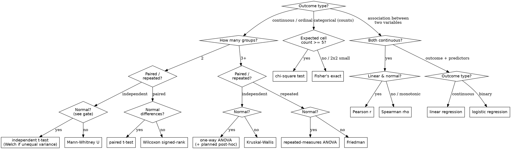

# Test-Selection Guard — Iron Law: No Test Chosen After Seeing the P-Value

**Skill type: DISCIPLINE-ENFORCING.** This is a thin discipline layer, not a stats
engine. It does not run tests, fit models, or compute power — it forces the *order* of
operations so the test is chosen by the data's shape, never by the result it produces.
For the actual computation, hand off to the skills below.

> **REQUIRED BACKGROUND** — this skill orchestrates, it does not reimplement:
> - **`alterlab-statistical-analysis`** — runs the chosen test, the assumption checks
>   (its `assumption_checks.py`: Shapiro-Wilk, Levene, Q-Q), power, and APA reporting.
> - **`alterlab-statsmodels`** — fits the model (OLS/GLM/mixed/ARIMA) once the test is fixed.
> - **`alterlab-scientific-thinking`** — judges design validity, biases, confounders upstream.
> - **`alterlab-preregistration-discipline`** — the frozen analysis plan this gate presumes.
>
> When the user needs *execution*, route there. This skill's whole job is what happens
> **before** the first `scipy.stats` call.

---

## The Iron Law

```
NO TEST CHOSEN AFTER SEEING THE P-VALUE.
```

The test is a function of the **research question and the data's structure** — outcome
type, number of groups, pairing, and assumption checks — fixed *before* any p-value is
visible. Choosing or switching a test in response to its significance is p-hacking. It
inflates the Type I error rate by an unknown amount and makes the reported p-value a lie.

**Violating the letter of the pre-specified test is violating the spirit of the inference.**

A non-significant result is **not** a reason to try another test. It is a finding.

---

## When to Use This Skill

Trigger this guard whenever a test is being **selected, defended, or swapped**:

- "Which statistical test should I use for this design / these variables?"
- "My t-test wasn't significant — should I try Mann-Whitney instead?" (← the canonical trap)
- "I ran ANOVA, t-tests, and a regression on the same hypothesis; which do I report?"
- "Can I drop these outliers / add this covariate and re-run to get under .05?"
- "Is it OK to switch to a non-parametric test now?"

The skill runs the decision tree, names the test, and — critically — **interrogates the
*timing and motive* of any switch**.

### Does NOT Trigger

Route these adjacent requests to the real sibling skill instead. This guard chooses and
polices the test; it does not execute, model, design, or write.

| The request is really about… | Route to | Why not this skill |
|---|---|---|
| Actually running the chosen test, assumption checks, power, APA write-up | `alterlab-statistical-analysis` | This guard picks the test; that skill computes it. |
| Fitting a specific model class (OLS/GLM/mixed/ARIMA), coefficient tables, residual diagnostics | `alterlab-statsmodels` | Programmatic model fitting, not test selection. |
| Grading evidence quality, spotting confounders / design validity / bias (GRADE, RoB) | `alterlab-scientific-thinking` | Upstream judgment about the study, not which test. |
| Freezing the whole analysis plan before data; HARKing, optional-stopping, frozen-covariate discipline | `alterlab-preregistration-discipline` | The plan-level discipline; this guard is the test-choice slice of it. |
| Reporting *every* analysis run, effect sizes + CIs, deviation disclosure in the write-up | `alterlab-results-transparency` | Reporting discipline, downstream of test choice. |
| Choosing the study design itself (RCT vs observational vs quasi-experiment) | `alterlab-scientific-thinking` | Design selection precedes test selection. |
| Open-science / repository / DMP / preregistration *logistics* (OSF, AsPredicted, Zenodo) | `alterlab-open-science` | Platform/workflow guidance, not test-choice logic. |

---

## The Decision Tree

Walk this top-down. **Each branch is decided by the data's structure, not by any
p-value.** Normality is decided by the assumption-check gate below — *not* by eyeballing
which test "comes out significant."



This routing mirrors the Test Selection Guide in `alterlab-statistical-analysis` (`references/test_selection_guide.md`)
— the guard adds the *timing* and *anti-shopping* discipline on top of it. Full branch
logic and edge cases: `references/decision_tree.md`. A runnable router that prints the
named test from your answers: `scripts/test_picker.py`.

---

## The Assumption-Check Gate (MANDATORY — never skip)

Normality and homogeneity are **inputs to the decision tree**, not after-the-fact
excuses. The order is fixed:

1. **Pre-specify** which test the structure points to (parametric branch by default).
2. **Run the assumption checks** via `alterlab-statistical-analysis` (its
   `assumption_checks.py`) — Shapiro-Wilk (normality), Levene (homogeneity of
   variance), residual/Q-Q and linearity for regression. **Report them.**
3. **Only then** read the assumption verdict to confirm the parametric branch or move to
   the pre-specified non-parametric fallback (e.g. t-test → Mann-Whitney; ANOVA →
   Kruskal-Wallis). The fallback is chosen by the *assumption check*, never by the p-value.

If the assumption checks were not run and reported, the test result is **uninterpretable**.
This is the analog of "verify RED before GREEN": you cannot trust the GREEN (the p-value)
until the assumptions are shown. Detail: `references/assumption_gate.md`.

---

## Stopping Test-Shopping (Excuse vs. Reality)

These are the rationalizations that precede a p-value-driven test switch. When one
appears — yours or the user's — name it and stop.

| Excuse | Reality |
|---|---|
| "The t-test wasn't significant, let me try Mann-Whitney." | You are choosing the test by its result. That is test-shopping. The non-parametric test is only valid if the *assumption check* (not the p-value) sent you there. |
| "The data suggested a better test after I looked." | You are fitting noise / HARKing. Re-run the *pre-specified* test; report anything else as exploratory. |
| "I'll just drop these 3 outliers and re-run." | Outlier rules must be pre-specified or reported as a sensitivity analysis — not invented to cross .05. |
| "Adding this covariate obviously improves the model." | Obvious *post hoc* = a researcher degree of freedom. Pre-specify it or label the result exploratory. |
| "Non-parametric is more conservative, so switching is safe." | Switching *because the first test failed* still conditions the choice on the outcome. The inflation is real regardless of direction. |
| "It's only exploratory anyway." | Then say so explicitly, drop the confirmatory p-value language, and do not report it as a test of the hypothesis. |
| "Everyone reports the test that worked." | Selective reporting of the significant test among several is p-hacking; report all tests run or correct for them. |

More patterns and the counters: `references/rationalizations.md`.

---

## Red Flags — STOP

If any of these thoughts appear, **STOP**. You are about to condition the test on its
result.

- "Let me just try a different test and see if it comes out."
- "The t-test was p = .07, so I'll switch to a non-parametric one."
- "I'll drop these outliers and rerun."
- "The effect is there if I add this one covariate."
- "Let me run a few tests and report whichever is significant."
- "We can stop collecting now — it's already significant."
- "This subgroup looks interesting" (you did not pre-specify it).
- "I'll pick the test after I see the descriptives split by outcome."

**All of these mean: STOP. You are exploiting researcher degrees of freedom. Return to the
pre-specified test, or label the analysis exploratory and drop the confirmatory claim.**

---

## The Escalation Gate (multiplicity)

Mirrors the "3 fixes then question the architecture" rule, applied to hypothesis testing:

```
Ran 3+ tests on the SAME hypothesis searching for significance? STOP.
```

This is multiple comparisons / test-shopping. You have two honest options — never a fourth
test:

1. **Correct for all of them.** Apply Bonferroni (divide alpha by the number of tests) or a
   less conservative FDR control (Benjamini-Hochberg) across the full family of tests
   actually run — including the ones that "didn't work."
2. **Declare the analysis exploratory.** Label it, report every test run, and drop the
   confirmatory p-value language.

Do **not** run test #4 to find p < .05. Correction math and family definition:
`references/multiplicity.md`.

---

## Workflow

1. **Identify the research question and data structure** — outcome type, groups, pairing.
2. **Walk the decision tree** (`scripts/test_picker.py` can do this from your answers) to a
   named test, *before* looking at any result.
3. **Run + report the assumption checks** via `alterlab-statistical-analysis`. Take the
   pre-specified parametric/non-parametric branch the *checks* dictate.
4. **Detect shopping** — if a switch is proposed, check the Excuse/Reality table and Red
   Flags. A switch is legitimate only if an *assumption check* (not a p-value) drove it.
5. **Apply the escalation gate** if 3+ tests touched one hypothesis: correct or declare
   exploratory.
6. **Hand off execution** to `alterlab-statistical-analysis` / `alterlab-statsmodels`, and
   reporting discipline to `alterlab-results-transparency`.

---

## Self-Check Before Reporting

- Was the test fixed by structure + assumption checks **before** any p-value was seen?
- Were Shapiro-Wilk / Levene / linearity checks run **and reported**, not skipped?
- Did any test switch follow a *non-significant result*? If so, it is test-shopping — revert.
- Were 3+ tests run on one hypothesis without correction or an exploratory label?
- Is every test actually run disclosed (handed to `alterlab-results-transparency`)?

---

## References

- `references/decision_tree.md` — full branch logic, edge cases, Welch/post-hoc notes.
- `references/assumption_gate.md` — the pre-interpretation check order and fallback rules.
- `references/rationalizations.md` — extended Excuse-vs-Reality table with counters.
- `references/multiplicity.md` — Bonferroni / Benjamini-Hochberg FDR, defining the test family.
- `scripts/test_picker.py` — stdlib decision-tree router; prints the named test from answers.

Part of the AlterLab Academic Skills suite.
