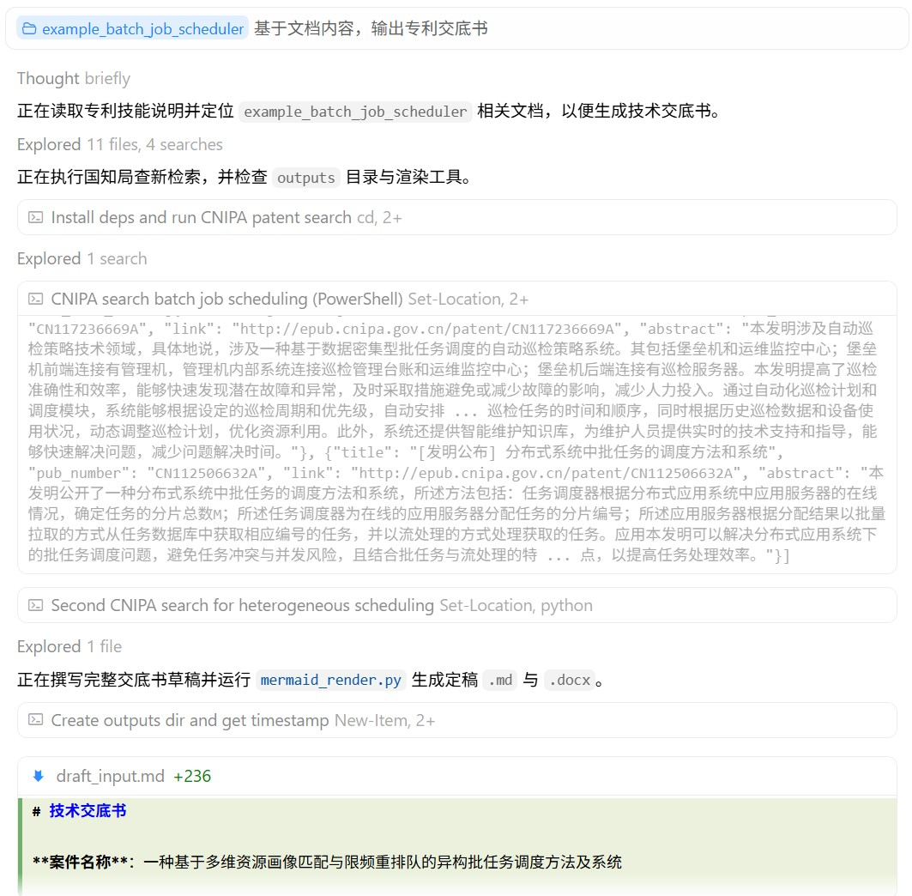
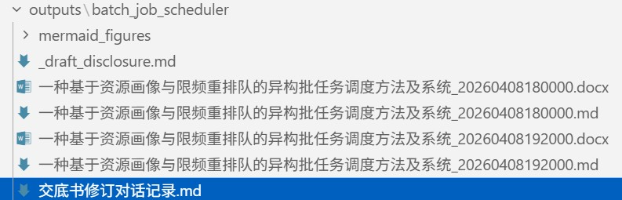

<div align="center">

# 中国专利.skill

> 从项目文档到**可交付的技术交底书**：专利点挖掘、**查新优先国知局公布公告站**、脱敏成文与自检闭环。

[](LICENSE)
[](https://www.python.org/)
[](https://nodejs.org/)
[](https://agentskills.io)

<br>

有设计文档和代码，但**专利点还没梳**？<br>
交底书要**系统框图、流程图**，还要**代理人能直接改的 Word**？<br>
定稿之后还要**多轮补材料、纠错**，并希望**文件修改追溯**？<br>
国知局公布站检索，期望 **次次爬成功、精准检索**？

**本 Skill 按 AgentSkills 约定编排全流程，`SKILL.md` + `prompts/` 分步可读可迭代。**

[功能特性](#功能特性) · [安装](#安装) · [使用](#使用) · [项目结构](#项目结构) · [示例](#示例) · [运行效果](#运行效果) · [参考文档](#参考文档) · [详细安装说明](INSTALL.md) · [技能入口](SKILL.md)

</div>

---

## 功能特性

<!-- 使用 HTML 表格：GitHub 上 Markdown 管道表会因右侧长路径/URL 把左列挤窄导致中文换行 -->
<table>
<colgroup>
<col width="1%">
<col>
</colgroup>
<thead>
<tr><th align="left" nowrap width="1%">能力</th><th align="left">说明</th></tr>
</thead>
<tbody>
<tr><td nowrap width="1%"><strong>项目扫描</strong></td><td>按优先级读文档 / 代码；<code>.docx</code> / <code>.pptx</code> 先转 Markdown 再扫（见 <code>prompts/project_scan.md</code>）</td></tr>
<tr><td nowrap width="1%"><strong>专利点</strong></td><td>候选点讨论与融合（<code>patent_points_analyzer.md</code>）</td></tr>
<tr><td nowrap width="1%"><strong>查新</strong></td><td><strong>优先</strong> <a href="http://epub.cnipa.gov.cn/">国知局 · 中国专利公布公告</a>（<code>tools/cnipa_epub_search.py</code>）；异常或无果时降级 WebSearch（Google 学术 / Patents）。著录与外链写入第一章（<code>prior_art_search.md</code>）</td></tr>
<tr><td nowrap width="1%"><strong>交底书成稿</strong></td><td>脱敏模版 + <strong>mermaid</strong> 系统框图与流程图；<code>mermaid_render.py</code> → PNG，默认再出 <strong>.docx</strong></td></tr>
<tr><td nowrap width="1%"><strong>交付命名</strong></td><td>凡落盘交付：<code>{案件名}_{YYYYMMDDHHmmss}.md</code> 与同名 <code>.docx</code>（<code>disclosure_builder.md</code> §7.3）</td></tr>
<tr><td nowrap width="1%"><strong>自检</strong></td><td>逻辑闭环、公式与参数一致（<code>disclosure_self_check.md</code>，不写入正文）</td></tr>
<tr><td nowrap width="1%"><strong>迭代</strong></td><td><strong>合并</strong> / <strong>纠正</strong> 另存新文件；<code>交底书修订对话记录.md</code> 逐条追加（<code>iteration_context.md</code>、<code>iteration_dialog_log.py</code>）</td></tr>
</tbody>
</table>

**Office 抽取**：`.docx` / `.pptx` 先用本仓库 `docx_to_md.py` / `pptx_to_md.py` 转为 Markdown 再扫描（见 `SKILL.md`）。

**Python 依赖（分文件）**：
- **基础（Office / 交底书转换）**：根目录 [`requirements.txt`](requirements.txt) — `pip install -r requirements.txt`
- **查新（国知局公布公告站，可选）**：[`tools/requirements-cnipa.txt`](tools/requirements-cnipa.txt) — `pip install -r tools/requirements-cnipa.txt`，再执行 `python -m playwright install chromium`  
  不装亦可：Step 5 将按 `prior_art_search.md` 仅用 **WebSearch** 降级。详见 [INSTALL.md](INSTALL.md)、[tools/README.md](tools/README.md)。

---

## 安装

### Claude Code

> 请在 **git 仓库根目录** 或全局 skills 路径下放置本目录，使 `SKILL.md` 位于技能文件夹根级（与 [INSTALL.md](INSTALL.md) 一致）。

```bash
# 示例：安装到当前项目的 skills 目录
mkdir -p .claude/skills
git clone <本仓库 URL> .claude/skills/patent-disclosure-skill
```

### Cursor

将本仓库完整内容放到 Cursor 约定的 skills 路径（见 [INSTALL.md](INSTALL.md) 表格），重启后在 **Settings → Rules** 中确认技能已被发现。

### 依赖

```bash
# 基础（Office 转换、交底书相关 Python 包）
pip install -r requirements.txt
```

```bash
# 可选：国知局查新（epub.cnipa.gov.cn）
pip install -r tools/requirements-cnipa.txt
python -m playwright install chromium
```

图示定稿另需 **Node.js**；在 `tools/` 下执行 `npm install` 或使用 `npx mmdc`（详见 [tools/README.md](tools/README.md)）。

---

## 使用

在 Agent 中用自然语言描述需求即可，例如：

- 专利挖掘、专利点、**技术交底书**、查新、现有技术对比  
- 斜杠指令（视宿主配置）：如 `/patent-disclosure-skill`、`/交底书`

建议同时说明 **项目路径** 或 **技术主题**（与 `SKILL.md` 中 `argument-hint` 一致）。  
**查新（Step 5）** 会优先通过 [中国专利公布公告](http://epub.cnipa.gov.cn/) 检索中国专利公开信息，再按需补充其他来源；流程见 `prompts/prior_art_search.md`。  
在**已有交底书文件**上补充材料或纠错时，无需说「迭代」——技能会按 `merger.md` / `correction_handler.md` 处理；细则见 [SKILL.md](SKILL.md)。

---

## 项目结构

本仓库遵循 [AgentSkills](https://agentskills.io)，根目录即一个 skill：

```
patent-disclosure-skill/
├── SKILL.md                    # 入口：触发条件、工具表、步骤与 prompts 引用
├── prompts/                    # 分步模板（Agent Read 后遵循）
│   ├── intake.md
│   ├── project_scan.md
│   ├── patent_points_analyzer.md
│   ├── prior_art_search.md
│   ├── disclosure_preview.md
│   ├── disclosure_builder.md
│   ├── disclosure_self_check.md
│   ├── iteration_context.md
│   ├── merger.md
│   ├── correction_handler.md
│   └── template_reference.md
├── tools/                      # mermaid_render、md_to_docx、docx_to_md、pptx_to_md；国知局 cnipa_epub_*（查新）；iteration_dialog_log 等
├── docs/                       # PRD、仓库结构说明、运行效果截图（效果例-*.jpg）
├── examples/                   # 原材料示例（如 example_batch_job_scheduler/knowledge/）
├── outputs/                    # 用户产出，整目录 .gitignore
├── requirements.txt
├── LICENSE
├── INSTALL.md
└── .gitignore
```

---

## 示例

虚构扫描原材料见 [examples/README.md](examples/README.md)（如 `examples/example_batch_job_scheduler/knowledge/`）。  
专利点、查新笔记、交底书等**完整产物**由流程生成到本地 **`outputs/{案件标识}/`**。

---

## 运行效果

**初版生成**（首次落盘交付）



**迭代更新**（合并/纠正后再交付，多版本并存 + 对话记录）



---

## 参考文档

- [技能入口与 Agent 流程](SKILL.md)（触发条件、`prompts/` 映射、工具表）
- [详细安装说明](INSTALL.md)（Claude Code / Cursor 路径）
- [图示与转换脚本](tools/README.md)（mermaid / mmdc、Word 导出、国知局 epub 查新工具）
- [示例案件与原材料说明](examples/README.md)
- [产品流程与目录约定](docs/PRD.md)
- [工程结构说明](docs/skill-structure.md)
- [交底书模版细则](prompts/template_reference.md)

---

## 支持作者

如果这个 Skill 帮您节省了写交底书的时间，可以请我喝杯咖啡☕随缘支持，感谢感谢🙏🙏

<div align="left">

<table>
<tr>
<td valign="middle" align="left" style="padding-right: 16px;">


</td>
<td valign="middle" align="left">

<a href="https://www.star-history.com/?repos=handsomestWei%2Fpatent-disclosure-skill&type=date&legend=top-left">
  <picture>
    <source media="(prefers-color-scheme: dark)" srcset="https://api.star-history.com/chart?repos=handsomestWei/patent-disclosure-skill&type=date&theme=dark&legend=top-left" />
    <source media="(prefers-color-scheme: light)" srcset="https://api.star-history.com/chart?repos=handsomestWei/patent-disclosure-skill&type=date&legend=top-left" />
    
  </picture>
</a>

</td>
</tr>
</table>

</div>

---

<div align="center">

MIT License © [handsomestWei](https://github.com/handsomestWei/)

</div>
