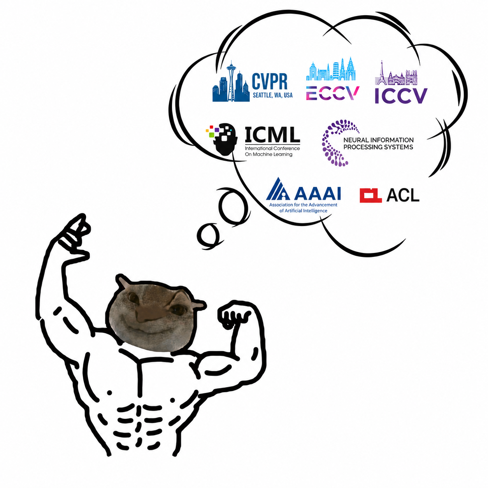

<div align="center">
  

# Awesome Rebuttal

**面向学术论文 rebuttal 的项目级 skill 包：辅助策略分析、证据组织与 author response 写作。**

[English](README.md) · [简体中文](README_ZH.md)

[](https://github.com/xiongqi123123/awesome-rebuttal)
[](LICENSE)
[](https://github.com/xiongqi123123/awesome-rebuttal/stargazers)
[](https://github.com/xiongqi123123/awesome-rebuttal/forks)
[](SKILL.md)
[](AI_AGENT_INSTALL.md)
[](AI_AGENT_INSTALL.md)

</div>

---

## 这是什么？

`Awesome Rebuttal` 是一个可全局安装、但在具体论文工作区内运行的项目级 skill，面向 AI / ML / CV / NLP / Robotics 等方向的论文 rebuttal。它帮助 AI 编程助手在论文工作区中持久化结构化记忆、分析审稿意见、规划补充实验，并在用户确认会议规则后起草安全、专业的 author response。

## 免责声明

Awesome Rebuttal 与任何会议、出版方、审稿平台或投稿系统均无隶属、背书或官方合作关系。本项目只是用于组织证据和辅助起草 rebuttal 的工作流，不保证论文接收，也不能替代作者的最终责任。正式提交前，请作者自行确认会议规则、匿名要求、事实表述、实验数字、格式限制以及最终上传文件均准确无误。

## 亮点

- **Skill-first 架构**：以 `SKILL.md` 为入口，按原子能力拆分能力文件。
- **项目级状态管理**：每篇论文的 memory、draft、snapshot、template、log 都保存在该工作区的 `.awesome-rebuttal/` 中。
- **审稿意见拆解**：整理 reviewer metadata、原始意见、atomic concerns 与 common concern clusters。
- **策略制定**：分析 rebuttal 局势、优先级问题、不同 reviewer 的目标，以及面向 AC 的决策事实。
- **补充实验规划**：区分必须做、高收益可选、不推荐、不可行的 rebuttal 实验。
- **格式感知写作**：支持一页 PDF、OpenReview 逐 reviewer 回复、global comment、hybrid response、Markdown+LaTeX comment。
- **安全门控**：阻止无证据结论、编造实验、不合规会议权限、攻击性语气和匿名泄露。
- **可选 Overleaf 同步**：仅在用户需要时引导 LeafLink 同步云端/本地论文。

## 安装

发布仓库根目录就是 skill 包根目录。克隆后，当前目录应直接包含 `SKILL.md`。

```bash
git clone https://github.com/xiongqi123123/awesome-rebuttal.git
cd awesome-rebuttal
test -f SKILL.md
```

### 方式 A：手动安装到 Codex

```bash
CODEX_SKILLS_DIR="${CODEX_HOME:-$HOME/.codex}/skills"
TARGET="$CODEX_SKILLS_DIR/awesome-rebuttal"
mkdir -p "$CODEX_SKILLS_DIR"
rsync -a --exclude '.git/' --exclude '.awesome-rebuttal/' ./ "$TARGET"/
```

安装后重启 Codex。

### 方式 B：手动安装到 Claude Code

```bash
CLAUDE_SKILLS_DIR="$HOME/.claude/skills"
TARGET="$CLAUDE_SKILLS_DIR/awesome-rebuttal"
mkdir -p "$CLAUDE_SKILLS_DIR"
rsync -a --exclude '.git/' --exclude '.awesome-rebuttal/' ./ "$TARGET"/
```

安装后重启或 reload Claude Code。

### 方式 C：让大模型辅助安装

直接把下面这个安装说明链接发给本地 AI 编程助手，让它按说明安装即可：

- GitHub 页面：https://github.com/xiongqi123123/awesome-rebuttal/blob/main/AI_AGENT_INSTALL.md
- Raw Markdown：https://raw.githubusercontent.com/xiongqi123123/awesome-rebuttal/main/AI_AGENT_INSTALL.md

推荐提示词：

```text
请按照这个安装说明安装 Awesome Rebuttal：
https://github.com/xiongqi123123/awesome-rebuttal/blob/main/AI_AGENT_INSTALL.md
不要在没有备份的情况下覆盖已有文件。
```

### 方式 D：Cursor 项目规则

Cursor 可以通过 project rule 指向这个已克隆或已安装的 skill。最小 `.cursor/rules/awesome-rebuttal.mdc` adapter 见 [`AI_AGENT_INSTALL.md`](AI_AGENT_INSTALL.md)。

## 基本使用

在论文 rebuttal 工作区中，对 AI 助手说：

```text
Use Awesome Rebuttal to initialize this rebuttal workspace.
```

推荐工作区结构：

```text
<rebuttal-workspace>/
├── Code/
├── Paper/
├── Reference/
├── Temp/
└── .awesome-rebuttal/
    ├── memory/
    ├── drafts/
    ├── snapshots/
    ├── templates/
    ├── logs/
    └── cache/
```

如果你的工作区已经有其他结构，skill 会非破坏式地识别和映射，而不会强制重命名。

## 宿主环境兼容性

| 宿主 | 状态 | 安装方式 |
|---|---|---|
| Codex | 原生 skill 包 | 复制到 `~/.codex/skills/awesome-rebuttal` |
| Claude Code | skill-compatible 包 | 复制到 `~/.claude/skills/awesome-rebuttal` |
| Cursor | 项目规则 adapter | 创建 `.cursor/rules/awesome-rebuttal.mdc` |
| 其他 agent | Prompt/reference 包 | 让 agent 读取 `SKILL.md` |

## 内置资源

- 一页 PDF rebuttal fallback LaTeX 模板：[`assets/one-page-rebuttal-template/`](assets/one-page-rebuttal-template/)
- Snapshot renderer：[`scripts/render_snapshot.py`](scripts/render_snapshot.py)
- Memory schemas：[`references/memory-schemas/`](references/memory-schemas/)
- 原子能力文件：[`references/capabilities/`](references/capabilities/)

## 安全原则

`Awesome Rebuttal` 不应该：

- 编造实验结果、数字、引用、reviewer 立场或会议规则；
- 攻击 reviewer 或暗示 reviewer 恶意；
- 绕过匿名规则或会议规则；
- 过度承诺未来修改；
- 把 LeafLink 或本地工具说明等其他与论文不相关的任何东西写进最终投稿文本。

## License

MIT License. 见 [`LICENSE`](LICENSE)。

## Star History

<a href="https://www.star-history.com/#xiongqi123123/awesome-rebuttal&Date">
  <picture>
    <source media="(prefers-color-scheme: dark)" srcset="https://api.star-history.com/svg?repos=xiongqi123123/awesome-rebuttal&type=Date&theme=dark" />
    <source media="(prefers-color-scheme: light)" srcset="https://api.star-history.com/svg?repos=xiongqi123123/awesome-rebuttal&type=Date" />
    
  </picture>
</a>
