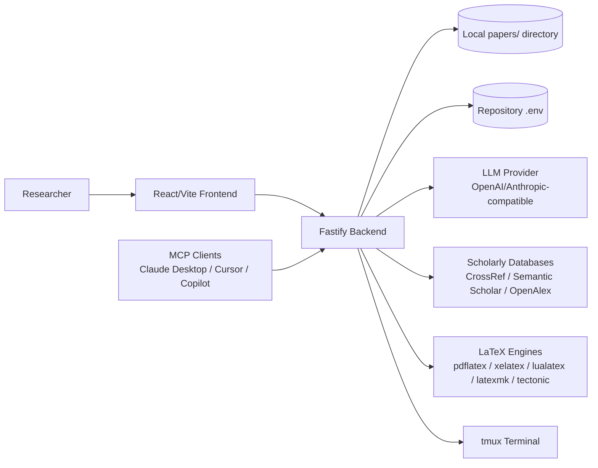
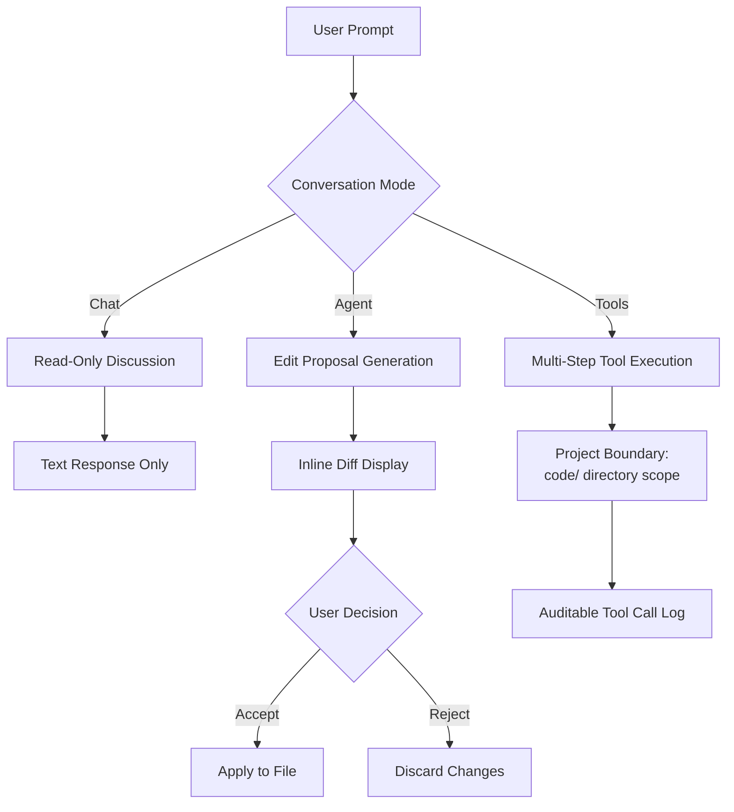
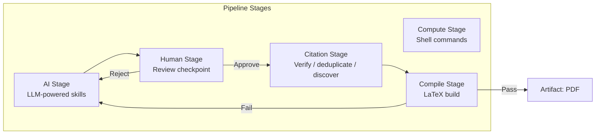
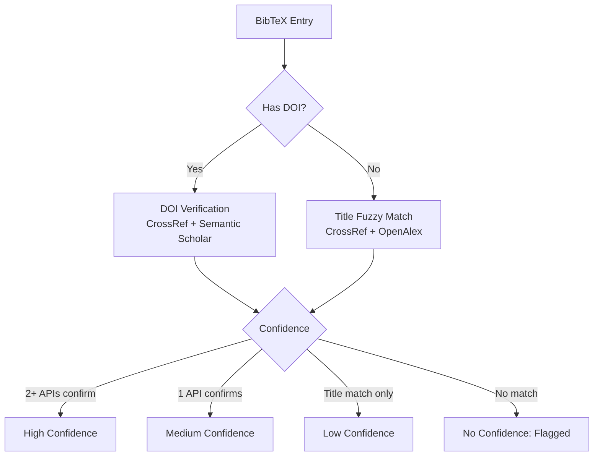

# Architecture Diagrams for SPE Manuscript

These Mermaid diagrams are source material for SPE figures. The current
submission figure files live in the manuscript root as `fig-*.pdf`; editable
SVG counterparts live beside them as `fig-*.svg`.

## Figure 1: System Architecture

## Figure 2: Permission-Aware AI Interaction Modes

## Figure 3: Pipeline 2.0 Stage Types

## Figure 4: Citation Verification Strategy

