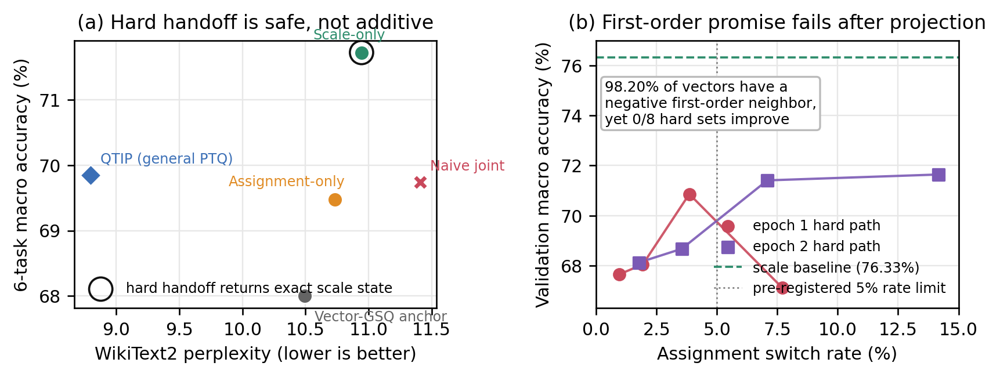

# 一阶可改进不等于可部署组合：2-bit Block-Scaled VQ 中的坐标竞争

## 摘要

极低比特向量量化 checkpoint 同时保留连续 group scale 与离散 codeword assignment；二者都可训练，但能否叠加并不由可训练性本身保证。本文研究固定共享码本的 2-bit block-scaled VQ，并提出一个反常现象：以已经任务适应的 scale 硬 checkpoint 为锚点，98.20% 的量化向量都能在当前码字 8-way 附近领域内找到负一阶功能变化，却没有一个集合级硬投影优于该锚点。我们先用 block scale 将不同动态范围映射到共享领域，以 Hessian-aware Vector-GPTQ 得到硬量化锚点；随后比较两个部署坐标：训练 FP16 scale 得到 71.72% 六任务平均和 10.9448 WikiText2 PPL，训练稀疏局部 assignment 得到 69.48% 和 10.7347。同步软训练两者会产生补偿—投影失配。为排除该失配，我们固化 scale、重新计算局部候选并只训练 assignment，再对两个 epoch 的 1/8、1/4、1/2 和 full 八个真实 int32 投影逐一 Gate。八个端点的验证平均仅 67.11%--71.64%，全部低于 scale 的 76.33%；最佳 changed loss 仍高 8.32%。部署选择因而安全回滚为零切换，正式结果与 scale-only bit-exact。该结果说明 hard checkpoint 交接是防止软补偿的必要条件，却不是连续—离散坐标可组合的充分条件；在当前模型、层和候选机制下，scale 与 assignment 是竞争性适应接口，一阶逐向量 proposal 不能可靠预测集合级部署收益。本文报告这一可复现边界，并把下一问题限定为 scale-conditioned curvature 或跨 batch 梯度一致性，而非超参数扫描。

**关键词：** 大语言模型压缩；向量量化；码字指派；任务适应；连续—离散优化；硬投影；一阶代理

## 1 引言

约 2 bit/parameter 的大模型压缩必须在有限码率下组织结构化表示。GPTVQ、AQLM、QuIP# 和 QTIP 分别利用向量、加性码本、格码与 trellis 提升表示能力 [2--5]；GPTQ、AWQ、OmniQuant 与旋转类方法则利用激活二阶信息、通道显著性或等价变换改善量化条件 [1,6--9]。这些方法通常从浮点权重构造一个低比特 checkpoint，但部署表示并不是单一整数张量。Block-scaled VQ 至少包含共享 codebook、离散 assignment 和连续 group scale。模型需要在不恢复浮点影子权重、不增加逻辑码率时适应任务，真正的问题不是“能否训练”，而是“应该训练哪个部署坐标，以及这些坐标是否能叠加”。

我们从一个固定的 2-bit block-scaled VQ 出发。每个 block 先按尺度映射到相同数值域，再在所有 block 共享的 4096 个六维码字上做 VQ；Vector-GPTQ 用 Hessian 加权候选选择和误差反馈构造硬 assignment。固定码本后，group scale 是组级连续径向坐标，assignment 是向量级离散切向坐标。PV-Tuning 已经将量化中的连续 value 与离散 partition/code 形式化为交替坐标优化 [12]。因此本文不声称首次训练连续/离散变量，也不把“先 scale 后 assignment”当作创新。我们追问一个更具体、可被部署状态回答的问题：两个坐标分别可改善任务时，后一个坐标是否还在前一个坐标的硬端点附近保有可用自由度？

单坐标实验给出看似有希望的答案。在完全相同的 Meta-Llama-3.1-8B-Instruct 2.1208-bpp 锚点上，只训练最后四层已有的 552 万个 FP16 group scale，使六任务平均从 68.00% 提至 71.72%，PPL 从 10.4960 退化至 10.9448；只在当前码字 8-way 附近领域训练 assignment，接受 0.378% 的硬切换，使平均提至 69.48%，PPL 为 10.7347。Scale 具有更高任务收益，assignment 的语言建模漂移更小。两个坐标不是同一种能力的不同参数化，而是同一表示中的不同质量方向。

然而，可分别改善不意味着可联合改善。同步学习 scale 与 binary Concrete assignment 的 naive joint 只有 69.74%/11.4098，被 scale-only 在任务与 PPL 上严格支配；把 joint 的 switch 全部清零后，scale hard state 的验证平均甚至低于未修改锚点。该反例表明 scale 补偿了尚未部署的 soft codeword mixture，hard projection 后补偿失效。由此导出的最小修复很直接：先把 scale 折叠为真实 FP16 checkpoint，再以该硬权重重新计算附近领域候选，只训练 assignment。

本版完整执行了这一 hard handoff。结果比“修复成功”更值得报告：145,465,344 个向量中，98.1965% 具有负一阶邻居，28 个 Linear 的比例均超过 97.47%；但 0.9635%--14.1665% 切换率的八个真实 hard set 全部使任务验证退化。即使放宽预注册的 5% 切换上限，最佳 changed endpoint 仍比 scale baseline 低 4.69 pp，balanced loss 高 8.32%。Hard handoff 保住了 scale，却没有产生可叠加 assignment。

这个结果排除了两个简单解释。首先，失败不再来自 joint scale 对 soft mixture 的补偿，因为 scale 已冻结且训练/选择/部署共享同一个 hard anchor。其次，失败不只是 full projection 过密，因为 1/8 到 full 的嵌套路径均被真实评估。剩下的核心缺口是逐向量一阶 proposal 与集合级部署损失之间的失配：大量负线性项可以被曲率和跨向量交互系统性抵消。

本文做出三项与证据严格对应的贡献：

1. 在同一 block-scaled VQ 表示、同一模型和同一监督下，建立 scale-only、assignment-only、同步 joint 与 scale→assignment hard handoff 的完整因果链，区分“坐标可训练”“软状态可联合”和“硬端点可叠加”。
2. 提出并实现部署一致的 hard-handoff assignment repair：冻结已审计 FP16 scale，在真实权重上重算当前码字 8-way 功能候选，对每个嵌套 int32 projection 独立 Gate，并在失败时精确回滚。它的贡献是可审计的接口和负结果，不是虚构的质量增益。
3. 揭示一阶 proposal 的系统性失准：98.20% 逐向量负方向与 0/8 集合级成功形成直接反差。该证据把下一方法问题从 LR、group、seed 或 projection ratio 调整，收缩为 scale-conditioned curvature 与跨 batch/任务一致性。

## 2 相关工作

### 2.1 极低比特表示与二阶锚点

GPTQ 以校准激活近似 Hessian，在逐列量化时把当前误差反馈到后续权重 [1]。GPTVQ 将选择对象从标量扩展到向量 [2]；AQLM 用多个码本的加性组合提高极低比特表达能力，并做输入自适应和 block-level refinement [3]；QuIP# 与 QTIP 通过 incoherence、格码或 trellis 改善误差形状 [4,5]。本文使用 block scale 后的共享 VQ 和 Vector-GPTQ 建立共同硬锚点，但不把码本形状本身作为贡献。我们的对象是锚点形成后，表示中已有的 scale 与 assignment 如何承担任务变化。

### 2.2 可学习量化变量

OmniQuant、SpinQuant 等方法训练 clipping、scale 或等价旋转 [7,9]；GSQ 通过 Gumbel-Softmax 学习标量量化 assignment [10,11]。Concrete/Gumbel 松弛提供离散变量的可微训练路径 [11,13]，但 soft mixture 与 hard deployment 之间可以存在间隙。本文的 assignment 不是对 4096 个码字做全局重分配，而是从当前硬码字出发，在 8-way 几何邻域中由功能梯度选一个 alternative，再学习二元 switch。附近领域定义可部署信赖域，不能保证其中任意多个一阶有利切换可同时成立。

### 2.3 连续—离散坐标与任务适应

PV-Tuning 最直接地研究连续 value 和离散 partition/code 的交替更新，并在小子空间中用实际梯度寻找离散步 [12]。这覆盖了比本文更一般的坐标下降视角，所以“交替连续与离散变量”不是我们的新颖性。本文补充的是固定共享码本、乘性 group scale 与当前码字局部 assignment 的部署证据：同步软联合会补偿失配，hard handoff 虽消除该问题，逐向量一阶候选仍不能组成改善的硬集合。LoTA-QAF 等任务适应方法引入可合并低比特适配变量 [14]；本文不增加 adapter，而修改 checkpoint 已有字段。由于 scale/assignment 正结果使用目标任务 training split，QTIP/GSQ 只能定位通用 PTQ 质量，不能被写成同监督下被超越的基线。

## 3 方法

### 3.1 Block scale 后的共享码本 VQ

将 Linear 权重划分为 $d$ 维向量 $w_i$，group 映射为 $g(i)$，共享码本为 $\mathcal C=\{c_1,\ldots,c_K\}$。不同 block 的动态范围差异会让单一共享码本偏向高幅值区域。我们先用 group scale 归一化：

$$
u_i=\frac{w_i}{s_{g(i)}} ,\qquad a_i=\arg\min_{k}\|u_i-c_k\|_2^2,
$$

部署重构为

$$
\hat w_i=s_{g(i)}c_{a_i}.
$$

所有 block 经尺度映射后在同一领域使用同一套码本。实验固定 $d=6$、$K=4096$、group size 160；12-bit index 分摊到六个权重得到 2 bit/weight，计入 FP16 scale、码本与元数据后为 2.1207557 bpp。这一表示天然暴露两个可部署坐标：连续 $s_g$ 与离散 $a_i$。

### 3.2 Hessian-aware Vector-GPTQ

几何 VQ 只最小化权重空间距离，不能反映输入激活对不同方向的敏感性。我们以校准激活估计 Hessian/逆 Hessian 因子，在 top-128 几何候选内最小化向量化二阶代价。选定第 $j$ 个向量码字后，将量化误差 $e_j$ 反馈到剩余列：

$$
W_{:,j+1:}\leftarrow W_{:,j+1:}-e_j\frac{H^{-1}_{j,j+1:}}{H^{-1}_{jj}}.
$$

与标量 GPTQ 相比，决策对象是六维 codeword，误差反馈仍保持顺序二阶校正。该阶段产生覆盖 32 层、224 个 Linear 的硬锚点 $(s^0,a^0,\mathcal C)$；后续适应始终固定码本和 normalizer。

### 3.3 两个部署坐标

Scale 坐标对每个已有尺度学习有界 log delta：

$$
\tilde s_g=s_g^0\exp(r_g),\qquad |r_g|\le\rho.
$$

训练完成后以 FP16 写回 checkpoint。它同时改变组内多个向量，是密集、组级、径向的变化。

Assignment 坐标先为当前码字 $a_i^0$ 构造包含自身的 8-way 几何邻域 $\mathcal N(a_i^0)$。在当前 hard weight 上对任务监督、浮点教师 KL 与长文本 guard 求权重梯度 $g_i$，定义邻居的一阶变化

$$
\Delta_i(c)=\langle g_i\odot s_{g(i)},c-c_{a_i^0}\rangle.
$$

取邻域中 $\Delta_i$ 最小的 $c_i^1$，每个向量只保留“当前/alternative”两个状态。Binary Concrete 松弛为

$$
p_i=\sigma((z_i+\epsilon_i)/\tau),\qquad
\tilde w_i=s_{g(i)}[(1-p_i)c_{a_i^0}+p_ic_i^1].
$$

训练时 $p_i$ 连续，部署时只保存 int32 assignment。正 logit 按置信度形成 1/8、1/4、1/2 与 full 嵌套硬集合。

### 3.4 为何先做 hard handoff

若 $s_g$ 与 $p_i$ 同时训练，scale 可补偿组内 soft prototype $m_i(p_i)=(1-p_i)c_{a_i^0}+p_ic_i^1$。部署将其投影成 $h_i\in\{c_{a_i^0},c_i^1\}$，此时 soft 状态学到的尺度未必适合 hard prototype。V9 的零-switch 反例已经观察到该补偿—投影失配。

因此本版先完成并审计 scale-only，得到 FP16 硬 checkpoint $(s^\star,a^0,\mathcal C)$；随后冻结 $s^\star$，在重构后的真实模型上重新计算 $g_i$、$\mathcal N(a_i^0)$ 与 $c_i^1$，只训练 $z_i$。训练、validation projection、audit 与最终部署共享同一 scale 状态。若没有 changed candidate 通过，输出必须与 source bit-exact。

### 3.5 一阶候选与集合级部署损失

Hard handoff 消除了 scale/soft-mixture 状态差异，但不保证一阶候选可以组合。对切换集合 $S$，令 $\delta_S=\sum_{i\in S}\delta_i$，则

$$
\mathcal L(W+\delta_S)=\mathcal L(W)+\sum_{i\in S}g^\top\delta_i+
\frac12\delta_S^\top H(\xi)\delta_S.
$$

Proposal 只观察第一项。即使每个 $g^\top\delta_i<0$，对角曲率和跨向量交互仍可使集合项为正；聚合梯度还可能隐藏不同 batch/任务间方向冲突。我们不把该展开写成当前失败的唯一因果证明，而用八个 hard set 检验一阶排序在部署端点上是否成立。

### 3.6 独立投影 Gate 与审计

候选共享任务监督、教师 KL 与文本目标。每个嵌套 hard set 都以真实 int32 assignment 重构模型后独立评估，不再要求 full endpoint 先通过。候选必须相对 scale source 改善 balanced task loss，Macro 最多回退 1 pp，任一任务 loss 与文本 CE 最多相对回退 0.5%，切换率不超过 5%。只有 validation 通过的唯一候选才进入预注册 audit；否则立即选择 no-op。最后检查 assignment/scale dtype、codebook、normalizer、非目标状态、逻辑 bpp 与 fresh reconstruction。

## 4 实验

### 4.1 协议

模型为 Meta-Llama-3.1-8B-Instruct。共同 Vector-GSQ 锚点覆盖 32 层、224 个 Linear；FineWeb-Edu 量化协议为 4096 train、128 validation、512 Vector-GPTQ，序列长度 4096。任务适应只开放 layers 28--31。五个任务 training split 各使用 512 train、256 validation；最终 hard-handoff audit 使用 seed0 固定随机排列 offset 1088 后的 31 条/任务，这是 ARC-Challenge training split 可用于统一无重叠窗口的最大剩余量。文本使用 4096 条 train、128 条 validation 与新 64 条 C4 audit，长度 4096；新 cache 的前 5440 行与旧缓存 bit-exact。

Scale 与 assignment 均训练 2 epochs，固定 seed0，不扫描 LR、group size、projection ratio 或 seed。PPL 在 WikiText2 raw test 上以 seqlength 2048 测量；准确率用 `lm_eval 0.4.4` 全量 0-shot ARC-C、ARC-E、HellaSwag、LAMBADA、PIQA 与 WinoGrande。所有正式 run 只暴露一张 A100 80GB。

### 4.2 Figure 1：安全交接与一阶失准

Figure 1(a) 区分安全性与增益。Hard handoff 没有复现 naive joint 的 scale 污染，最终端点与 scale-only 完全重合；但它也没有把 assignment-only 的较低 PPL 与 scale-only 的较高任务分数组合起来。QTIP 未使用任务标签，只作为通用 PTQ 质量坐标。Figure 1(b) 把一阶候选与真实部署直接对照：八个路径点全部位于 scale baseline 下方，且 5% 切换率边界内没有例外。

### 4.3 单坐标、软联合和硬交接

| 部署端点 | 任务标签 | 主要变化 | PPL ↓ | Macro-6 ↑ | 公共五任务 ↑ |
|---|:---:|---|---:|---:|---:|
| QTIP（通用 PTQ） | 否 | 2.0-bpp trellis | **8.7971** | 69.8469 | 69.8749 |
| Vector-GSQ anchor | 否 | 无 | 10.4960 | 67.9997 | 68.1046 |
| Assignment-only | 是 | 0.3781% index | 10.7347 | 69.4774 | 69.0744 |
| **Scale-only** | **是** | 5.52M FP16 scale | **10.9448** | **71.7223** | **72.5484** |
| Naive simultaneous joint | 是 | scale + 0.8610% index | 11.4098 | 69.7434 | 68.9511 |
| Scale→assignment hard handoff | 是 | **最终 0 switch** | **10.9448** | **71.7223** | **72.5484** |

表中有两个不同层次的负结论。Naive joint 被 scale-only 严格支配，说明共享 soft relaxation 会破坏组合；hard handoff 与 scale-only 重合，说明消除 soft 状态污染后，当前 assignment proposal 仍未找到增量方向。前者是训练—部署状态问题，后者是候选/集合几何问题，不能混为“assignment 没用”。Assignment-only 仍比 anchor 提高 1.48 pp 且 PPL 漂移小于 scale，因而是独立 Pareto 分支；它只是在 scale endpoint 后不再可叠加。

### 4.4 98.20% 的一阶负方向为何没有一个可用 hard set？

Scale baseline validation Macro 为 76.3281%，balanced loss 为 0.679691。Proposal 覆盖 145,465,344 个向量，加权负一阶率为 98.1965%，每个 Linear 的比例为 97.4782%--98.3283%。然而真实结果为：

| Epoch | 投影 | 切换率 | Macro ↑ | Balanced loss ↓ | Gate |
|---:|---:|---:|---:|---:|---|
| -- | Scale baseline | 0 | **76.3281** | **0.679691** | -- |
| 1 | 1/8 | 0.9635% | 67.6563 | 0.866140 | 失败 |
| 1 | 1/4 | 1.9271% | 68.0469 | 0.835993 | 失败 |
| 1 | 1/2 | 3.8541% | 70.8594 | 0.790087 | 失败 |
| 1 | full | 7.7083% | 67.1094 | 0.910073 | 失败 |
| 2 | 1/8 | 1.7708% | 68.1250 | 0.840980 | 失败 |
| 2 | 1/4 | 3.5416% | 68.6719 | 0.829512 | 失败 |
| 2 | 1/2 | 7.0833% | 71.4063 | 0.778291 | 失败 |
| 2 | full | 14.1665% | **71.6406** | **0.736233** | 失败 |

预注册 5% rate 内最佳 changed state 是 epoch1 的 1/2：Macro 仍低 5.47 pp，loss 高 16.24%。允许超预算点后，epoch2 full 是 changed states 中 Macro 和 loss 都最好的一项，却仍低 4.69 pp、loss 高 8.32%。因此不能把失败归因于 full endpoint 过密、只需“再调一个 projection ratio”。相反，随着 epoch2 切换率增加，性能虽部分恢复但始终未触及 source，说明 binary logit 的排序并未提供可靠的局部部署前沿。

### 4.5 最终 audit 与正式六任务结果

所有 changed candidate 在 validation 已失败，所以没有非零状态进入 audit；summary 的 `audit_gate_passed=false` 表示 audit 未用于接受 changed candidate，不是“某个非零候选 audit 失败”。最终选择 epoch0/no-op。预注册 task/text audit 只确认 baseline 与 final 完全一致。

| 任务 | Scale-only / Hard handoff |
|---|---:|
| ARC-Challenge | 53.7543% |
| ARC-Easy | 78.5774% |
| HellaSwag | 77.5443% |
| LAMBADA | 67.5917% |
| PIQA | 79.5430% |
| WinoGrande | 73.3228% |
| Macro-6 | 71.7223% |

最终 WikiText2 PPL 为 10.9447565，逻辑码率 2.1207557 bpp。Assignment、scale、codebook、normalizer、固定元数据与非目标状态均未变化，fresh reconstruction max error 为 0。Calibration 加八个 hard projection 用时 6.65h、峰值 31.80GiB；PPL 55.48s，六任务评测 26.45min。

### 4.6 Selector bug 为什么必须进入主文？

首轮 run 使用了错误的 admission 逻辑：只有 full endpoint 已通过 source Gate，程序才评估 1/8--1/2 稀疏状态。该条件与“full 可能因交互过强而失败、稀疏投影可能成功”的研究假设直接矛盾。修复后，每个非空 hard projection 独立评估；八个点的正式结果才足以支持当前结论。我们保留首轮 4.93h 诊断记录和修复测试，因为不报告它会把“未搜索到稀疏候选”误写成“稀疏候选不存在”。

### 4.7 与 GSQ、QTIP 和 PV-Tuning 的边界

本实验不能宣称全面超过 QTIP。QTIP 在同模型通用 PTQ 设置达到 8.7971 PPL 和 69.8469% Macro-6，且名义码率更低；task-scale 的准确率更高，但使用了目标任务标签。GSQ 的公开数字用于同模型公共任务口径定位，不是同监督 task-adaptation 对照。

PV-Tuning 已证明连续/离散交替是一条一般优化路线。我们的 hard handoff、当前码字 8-way 邻域和 deployment Gate 是更窄的实现，当前也没有给出相对 PV-Tuning 的正质量优势。V10 的新增知识是一个边界条件：仅在真实 hard checkpoint 上重锚定仍不够；若离散 proposal 只依赖聚合一阶项，它可能在几乎所有向量上预测下降，却无法产生一个改善的部署集合。

### 4.8 局限与下一条可证伪假设

现象仅在 Meta-Llama-3.1-8B-Instruct、layers28--31、固定 8-way 邻域和当前任务/文本监督上验证。它不能推出所有模型上 scale 会耗尽 assignment 自由度，也不能证明曲率是唯一根因。我们尚未计算候选级 Hessian/Gauss--Newton 代价、跨 batch 梯度符号一致性或组内交互统计；也缺同监督外部 task-adaptation 基线和第二模型。

下一实验只检验一个方法变化：在 scale 硬状态上，用低成本曲率惩罚或跨 batch/任务梯度一致性过滤 8-way alternative，再训练 assignment。成功标准仍相对 scale-only 且保持硬部署 Gate。若该信息增强 proposal 仍回滚，应停止把 assignment 作为 scale 的后续主模块，而把论文收束为部署坐标选择与代理失效研究。

## 5 讨论

### 5.1 No-op 是方法失败还是系统成功？

从质量优化看，它是明确的负结果：没有新增 Pareto 端点。从部署系统看，精确 no-op 证明 Gate 阻止了 98.20% 一阶假阳性被写入 checkpoint。这两者必须同时陈述。把 no-op 包装成质量提升会夸大贡献；忽略回滚合同又会低估部署适应方法最基本的安全要求。

### 5.2 “坐标竞争”的准确含义

本文用“竞争”描述已观察的关系：同一锚点上的两个坐标可分别改善，但当前 scale endpoint 后 assignment proposal 无增量硬解。它不是关于所有 VQ 的数学排他性，也不是说 assignment-only 没有价值。最保守的解释是 scale 已改变局部功能几何，使原先有效的逐向量离散方向不再能由聚合一阶信号识别。

### 5.3 方法创新应落在哪里？

Block scale、Hessian-aware VQ、Concrete assignment 和坐标交替都有明确先验。下一版如果只增加 epoch 或换学习率，不会解决创新问题。可区分的方法必须直接针对已测失效：估计集合级曲率代价，或要求候选在不同 batch/任务上稳定同向；并证明这种信息让 hard projection 从 0/8 成功变为非零、可审计的 Pareto 改善。

## 6 结论

本文检验 2-bit block-scaled VQ 中连续 scale 与局部 assignment 的可组合性。同步软联合会产生 scale 对 codeword mixture 的补偿；hard checkpoint handoff 消除了该状态失配并保证失败时精确回滚。然而，在已审计 scale endpoint 上重新计算的一阶 8-way proposal 仍严重失准：98.20% 的向量具有负一阶邻居，八个真实硬集合却全部降低任务性能。最终 scale→assignment 端点因而与 scale-only bit-exact，而不是一个新的质量改进。当前证据支持把 scale 与 assignment 视为竞争性部署接口：scale 是更强任务端点，assignment-only 是较低语言漂移的独立分支；二者在现有 proposal 下不能写成可叠加主方法。下一问题必须直接测量 scale-conditioned curvature 或梯度一致性，而不是继续扫描超参数。

## 参考文献

[1] Frantar, E., Ashkboos, S., Hoefler, T., & Alistarh, D. GPTQ: Accurate Post-Training Quantization for Generative Pre-trained Transformers. ICLR, 2023.

[2] van Baalen, M., et al. GPTVQ: The Blessing of Dimensionality for LLM Quantization. 2024.

[3] Egiazarian, V., Panferov, A., Kuznedelev, D., Frantar, E., Babenko, A., & Alistarh, D. Extreme Compression of Large Language Models via Additive Quantization. ICML, 2024.

[4] Tseng, A., Chee, J., Sun, Q., Kuleshov, V., & De Sa, C. QuIP#: Even Better LLM Quantization with Hadamard Incoherence and Lattice Codebooks. ICML, 2024.

[5] Tseng, A., Sun, Q., Hou, D., & De Sa, C. QTIP: Quantization with Trellises and Incoherence Processing. NeurIPS, 2024.

[6] Lin, J., et al. AWQ: Activation-aware Weight Quantization for LLM Compression and Acceleration. MLSys, 2024.

[7] Shao, W., et al. OmniQuant: Omnidirectionally Calibrated Quantization for Large Language Models. ICLR, 2024.

[8] Ashkboos, S., et al. QuaRot: Outlier-Free 4-Bit Inference in Rotated LLMs. NeurIPS, 2024.

[9] Liu, Z., et al. SpinQuant: LLM Quantization with Learned Rotations. ICLR, 2025.

[10] Dadgarnia, A., et al. GSQ: Highly-Accurate Low-Precision Scalar Quantization for LLMs via Gumbel-Softmax Sampling. 2026.

[11] Jang, E., Gu, S., & Poole, B. Categorical Reparameterization with Gumbel-Softmax. ICLR, 2017.

[12] Malinovskii, V., Mazur, D., Ilin, I., Kuznedelev, D., Burlachenko, K., Yi, K., Alistarh, D., & Richtárik, P. PV-Tuning: Beyond Straight-Through Estimation for Extreme LLM Compression. NeurIPS, 2024.

[13] Maddison, C. J., Mnih, A., & Teh, Y. W. The Concrete Distribution: A Continuous Relaxation of Discrete Random Variables. ICLR, 2017.

[14] Goodman, K., et al. LoTA-QAF: Lossless Ternary Adapters for Quantization-Aware Fine-Tuning. NeurIPS, 2025.
