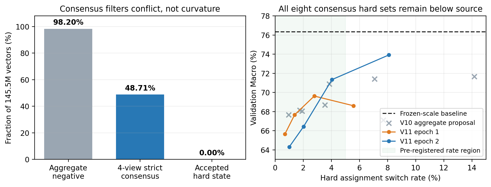

# 符号一致仍非离散可信域：2-bit Block-Scaled VQ 的局部下降失配

## 摘要

极低比特向量量化把大模型权重压入离散码字，同时保留少量连续尺度；这些部署坐标可以训练，却不保证一个坐标改善后另一个仍存在可叠加自由度。本文研究固定共享码本的 2-bit block-scaled VQ：先用 block scale 把不同动态范围映射到共同领域，以 Hessian-aware Vector-GPTQ 构造硬量化锚点，再比较 group scale 与当前码字附近领域 assignment 的任务适应。已有实验发现，在已审计 scale 硬端点上，98.20% 的 1.45 亿个六维向量都能从 8-way 邻域找到负一阶候选，但两轮共八个真实 hard projection 全部退化。我们指出，对七个邻居取聚合梯度最小值会把跨样本冲突放大成近乎必然的负方向，并提出一个无额外数据、无 seed 变化的机制检验：将完整训练集确定性划为四个任务分层互斥视图，邻居只有在四个视图中都预测下降才可训练，否则精确冻结。严格共识把加权候选率从 98.1973% 降至 48.7101%，冻结 7461 万个向量，并把最佳 changed endpoint 相对上一版提高 2.27 个百分点；然而八个硬投影仍全部低于 scale baseline，最佳 changed state 为 73.91% 对 76.33%，balanced loss 高 7.10%。选择器因此安全回滚为零切换，最终部署状态沿用 scale-only 的 10.9448 WikiText2 PPL、71.72% 六任务平均与 2.1208 bpp。结果表明，跨视图符号冲突解释了约一半的一阶虚假许可，但符号一致仍不是有限码字跳转的离散可信域；剩余方法问题必须显式处理 scale-conditioned curvature 与集合交互，而不是继续扫描 assignment 超参数。

**关键词：** 大语言模型压缩；向量量化；码字指派；梯度一致性；二阶信息；任务适应；硬部署

## 1 引言

约 2 bit/parameter 的大模型压缩不是把每个浮点数独立换成一个整数。GPTVQ、AQLM、QuIP# 与 QTIP 分别以低维向量、加性码本、格码和 trellis 提升有限码率下的表示能力 [2--5]；GPTQ、OmniQuant、QuaRot 与 SpinQuant 则利用激活二阶信息、可学习尺度或等价旋转改变量化条件 [1,7--9]。这些路线共同说明：极低比特质量取决于表示几何与模型功能，而不是最近邻权重误差 alone。

本文考虑一种直接可部署的表示。每个 block 先由 group scale 映射到共同数值领域，随后所有 block 在同一套 4096 个六维码字上做 VQ；Vector-GPTQ 在 top-128 几何候选中使用激活 Hessian 并把量化误差反馈给后续列。得到的硬 checkpoint 不只有 assignment，还含 FP16 group scale、共享 codebook 与 normalizer。固定码本后，scale 是组级连续径向坐标，assignment 是向量级离散切向坐标。它们都已经存在于 checkpoint 中，不增加逻辑码率。

部署坐标的可训练性并不等于可组合性。在同一 Meta-Llama-3.1-8B-Instruct 2.1208-bpp 锚点上，只训练最后四层 scale 可将六任务平均从 68.00% 提至 71.72%，WikiText2 PPL 从 10.4960 变为 10.9448；只训练局部 assignment，接受 0.378% 的 index 切换，可达到 69.48% 与 10.7347。同步 soft 训练二者反而只有 69.74% / 11.4098，因为 scale 补偿了尚未部署的 codeword mixture。先固化 scale、再冻结它训练 assignment 的 hard handoff 消除了该补偿，却仍没有一个硬投影优于 scale。

这一失败暴露了更尖锐的矛盾：145,465,344 个向量中，98.20% 在当前码字的 8-way 邻域内有负一阶候选，而从 0.96% 到 14.17% 切换率的八个真实集合全部退化。若把七个邻居的线性分数看作带噪估计，取最小值本身会产生强选择偏差；聚合任务与文本梯度还会掩盖不同样本间的符号冲突。因此 V10 无法区分两种解释：proposal 主要被跨数据噪声污染，还是一阶信息即使稳定也无法预测有限离散步。

我们用一个最小干预区分二者。完整的 2560 条任务样本和 4096 条长文本不增不减地分成四个互斥视图；每个任务在每个视图中都有 128 条，文本每视图 1024 条。对每个当前码字邻居分别计算四个一阶变化，只有同一邻居在四个视图中严格为负才允许成为 alternative，并在合格邻居中最小化最差视图分数。无共同下降邻居的向量保持 anchor，权重扰动严格为零。该设计没有新的连续超参数，且 V10/V11 除 proposal 外共享训练、投影和 Gate。

结果同时肯定并否定了假设的一部分。四视图共识把可提议向量降至 48.71%，说明跨视图冲突确实解释约一半的聚合负方向；最佳 changed hard state 也从 V10 的 71.64% 提到 73.91%。但 V11 的八个投影仍没有一个触及 76.33% 的 source，5% 切换率内最佳点甚至低 5.00 pp。符号稳定性因此是有信息的过滤器，却不是离散可信域。

本文的贡献与证据严格对应：

1. 建立同一 block-scaled VQ 中连续 scale、离散 assignment、同步 soft joint 与 hard handoff 的完整部署因果链，并明确区分状态失配与 proposal 失配。
2. 提出任务分层、互斥四视图的严格共识 proposal；它在不增加数据与不更换 seed 的前提下，将候选池减少 50.40%，为 V10 的 min-of-neighbors 偏差给出直接测量。
3. 通过两轮八个真实 int32 投影证明：共识改善候选质量但仍 0/8 成功。该负结果把下一方法问题从“曲率或一致性”收缩为有限步曲率与集合交互，并以精确 no-op 保护部署状态。

我们不声称新的 SOTA endpoint。QTIP 在不使用目标任务标签的通用 PTQ 设置具有更低 PPL 和更低名义码率；PV-Tuning 已覆盖更一般的连续—离散优化。本文的认知增量是一个可复现边界：稳定的一阶下降信号仍不能充当极低比特 VQ 的离散部署证据。

## 2 相关工作

### 2.1 极低比特 VQ 与二阶量化

GPTQ 以层输入构造近似 Hessian，并在顺序量化中把当前误差反馈给未量化权重 [1]。GPTVQ 把量化单位扩展为向量 [2]。AQLM 使用多个码本的加性组合和 block-level refinement 提升 2-bit 表达 [3]；QuIP# 以 Hadamard incoherence 与格码改善权重/Hessian 几何 [4]；QTIP 用 trellis 解耦有效维度和显式码本规模 [5]。这些工作表明有限离散步的质量必须考虑曲率或表示几何。本文的 Vector-GPTQ 以 Hessian-aware 硬锚点作为共同起点；研究对象是锚点形成后的任务适应坐标，而非宣称首次向量化 GPTQ。

### 2.2 可学习的量化参数与离散优化

OmniQuant、SpinQuant 等方法训练 clipping、scale 或等价旋转 [7,9]。GSQ 使用 Gumbel-Softmax 学习标量量化 assignment [10]；Gumbel-Softmax 与 Concrete 为离散变量提供可微松弛 [11,13]。PV-Tuning 进一步将量化参数分为连续 value 与离散 partition/code，并以交替更新超越 STE [12]。因此，“训练 assignment”“使用 Gumbel/Concrete”以及“连续后离散”都不是本文单独的新颖性。我们的新增证据是：在固定共享码本、乘性 group scale 和当前码字邻域中，soft 状态、稳定一阶方向与 hard endpoint 三者可以系统性不一致。

### 2.3 梯度冲突与鲁棒 proposal

多任务优化长期关注不同任务梯度冲突，例如 PCGrad 通过投影冲突梯度减少负迁移 [15]。本文不修改任务目标或做多任务优化器设计，而把互斥数据视图当作 proposal 诊断：只有同一有限码字跳转在所有视图的一阶项都为负，才认为其符号不依赖某个数据子集。这一共识条件比聚合梯度严格，但仍只约束 Taylor 展开的线性项；V11 的失败说明它不能代替二阶代价。

## 3 方法

### 3.1 Block scale 后的共享码本 VQ

将 Linear 权重划分为 $d$ 维向量 $w_i$，group 为 $g(i)$，共享码本为 $\mathcal C=\{c_1,\ldots,c_K\}$。先以 group scale 归一化：

$$
u_i=\frac{w_i}{s_{g(i)}},\qquad a_i=\arg\min_k\|u_i-c_k\|_2^2,
$$

部署重构为

$$
\hat w_i=s_{g(i)}c_{a_i}.
$$

实验固定 $d=6$、$K=4096$、group size 160；12-bit index 分摊为 2 bit/weight，计入 FP16 scale、码本与元数据后为 2.1207557 bpp。Block scale 的作用不是额外分配一套码本，而是把不同动态范围移到可共享的领域。

### 3.2 Hessian-aware Vector-GPTQ 硬锚点

几何最近邻忽略输入激活对方向的不同敏感性。我们以校准激活估计 Hessian/逆 Hessian因子，在 top-128 几何候选中比较六维码字的二阶代理；选定第 $j$ 个向量后，把误差 $e_j$ 反馈到剩余列：

$$
W_{:,j+1:}\leftarrow W_{:,j+1:}-e_j\frac{H^{-1}_{j,j+1:}}{H^{-1}_{jj}}.
$$

这一过程覆盖 32 层、224 个 Linear，产生硬锚点 $(s^0,a^0,\mathcal C)$。任务适应始终固定共享码本、row/column normalizer 与逻辑码率。

### 3.3 两个可部署适应坐标

Scale 坐标学习有界 log delta：

$$
\tilde s_g=s_g^0\exp(r_g),\qquad |r_g|\le\rho,
$$

并以 FP16 写回。Assignment 坐标为当前码字 $a_i^0$ 建立含自身的 8-way 几何邻域 $\mathcal N(a_i^0)$，从中选一个 alternative $a_i^1$，再学习二元 switch：

$$
p_i=\sigma(z_i/\tau),\qquad
\tilde w_i=s_{g(i)}[(1-p_i)c_{a_i^0}+p_ic_{a_i^1}].
$$

训练使用 soft probability；部署只保存 $z_i>0$ 对应的 int32 ID。同步训练 scale 与 $p_i$ 会允许连续尺度补偿 soft prototype，故组合实验必须先将 scale 折叠为真实 hard checkpoint，再冻结它重算 proposal。

### 3.4 聚合梯度的 min-of-neighbors 偏差

V10 以聚合梯度 $g_i$ 为每个邻居计算

$$
\Delta_i(c)=\langle g_i\odot s_{g(i)},c-c_{a_i^0}\rangle
$$

并选择七个非 anchor 邻居中最小的一项。即使每项都是零均值噪声，七项最小值为负的概率也很高；当任务/文本梯度方向冲突时，聚合还会隐藏条件性符号。98.20% 的负候选因而不是 98.20% 的可靠下降步。

### 3.5 四视图严格梯度共识

将每个任务的 512 条训练样本按确定性轮转分为四份，每份 128 条；4096 条文本同样轮转为四份。各视图互斥、并集等于完整训练集，不改变样本总量或梯度 pass 数。对视图 $v$ 定义

$$
\Delta_i^{(v)}(c)=\langle g_i^{(v)}\odot s_{g(i)},c-c_{a_i^0}\rangle.
$$

合格集合为

$$
\mathcal E_i=\{c\in\mathcal N(a_i^0)\setminus\{c_{a_i^0}\}:\forall v,\Delta_i^{(v)}(c)<0\}.
$$

若 $\mathcal E_i$ 非空，选择最小化最差视图变化的邻居：

$$
c_i^1=\arg\min_{c\in\mathcal E_i}\max_v\Delta_i^{(v)}(c).
$$

若为空，则 $a_i^1=a_i^0$；无论 switch logit 如何变化，重构权重都精确不变。共识没有可调阈值，直接检验“符号冲突是否是主要失败源”。

### 3.6 为什么共识仍不能保证 hard loss

令集合 $S$ 的总离散变化为 $\delta_S=\sum_{i\in S}\delta_i$，则存在中间点 $\xi$ 使

$$
\mathcal L(W+\delta_S)=\mathcal L(W)+g^\top\delta_S+
\frac12\delta_S^\top H(\xi)\delta_S.
$$

四视图共识只要求第一项在不同数据子集上符号稳定。它既不约束单个有限码字跳转的对角曲率，也不约束多个切换之间的交叉项。V11 的目的不是用该式事后解释任意失败，而是通过共识过滤后是否出现非零 hard 改善来辨别线性噪声是否足够解释 V10。

### 3.7 硬投影 Gate 与精确回滚

每个 epoch 把正 logit 按置信度构造 1/8、1/4、1/2、full 四个嵌套 hard set。每个集合都写成真实 assignment 后重新评估。候选必须相对 scale source 改善 balanced loss，Macro 最多回退 1 pp，任一任务 loss 与文本 CE 最多相对回退 0.5%，切换率不超过 5%。只有 validation 通过的唯一状态才进入 candidate-unexposed audit；否则选择 no-op。最后检查 assignment/scale dtype、codebook、normalizer、非目标状态、逻辑 bpp 与 fresh reconstruction。

## 4 实验

### 4.1 研究问题与协议

我们回答四个问题：Q1，共识是否显著减少 V10 的一阶许可？Q2，过滤是否改善真实 hard endpoint？Q3，是否产生超过 scale source 的非零状态？Q4，失败时部署与正式测试如何处理？

模型为 Meta-Llama-3.1-8B-Instruct。共同 Vector-GSQ 锚点使用 4096 条 FineWeb-Edu train、128 validation、512 Vector-GPTQ 序列，长度 4096。任务适应仅开放 layers 28--31。五项任务 training split 各 512 train、256 validation、31 audit；任务 audit offset 1088，因 ARC-Challenge 剩余窗口限制而只含 31 条/任务。文本为 4096 train、128 validation、64 audit，长度 4096；V11 新文本 audit rows 为 5504--5567。

训练固定两轮、seed 0，不扫描学习率、group size、候选数、视图数或投影比例。正式 PPL 协议为 WikiText2 raw test、seqlength 2048；准确率为 `lm_eval 0.4.4` 全量 0-shot ARC-C、ARC-E、HellaSwag、LAMBADA、PIQA、WinoGrande。所有实验串行使用一张 A100 80GB。

### 4.2 Figure 1：共识筛选漏斗与硬端点

Figure 1 左图直接分开“过滤有效”与“方法成功”：候选池约减半说明梯度冲突真实存在，但零 accepted hard state 说明它不是充分解释。右图显示 V11 epoch 2 的 dense endpoint 比 V10 更接近 source，却仍未越过 source；5% 预注册区域内也没有例外。

### 4.3 同模型部署端点

| 部署端点 | 任务标签 | 主要变化 | PPL ↓ | Macro-6 ↑ | 公共五任务 ↑ |
|---|:---:|---|---:|---:|---:|
| QTIP（通用 PTQ） | 否 | 2.0-bpp trellis | **8.7971** | 69.8469 | 69.8749 |
| Vector-GSQ anchor | 否 | 无 | 10.4960 | 67.9997 | 68.1046 |
| Assignment-only | 是 | 0.3781% index | 10.7347 | 69.4774 | 69.0744 |
| **Scale-only** | **是** | 5.52M FP16 scale | **10.9448** | **71.7223** | **72.5484** |
| Naive simultaneous joint | 是 | scale + 0.8610% index | 11.4098 | 69.7434 | 68.9511 |
| V10 aggregate hard handoff | 是 | 最终 0 switch | 10.9448 | 71.7223 | 72.5484 |
| V11 consensus hard handoff | 是 | **最终 0 switch** | **10.9448** | **71.7223** | **72.5484** |

V11 不产生新 Pareto endpoint。QTIP 不使用目标任务标签，只用于通用 PTQ 质量定位；scale/assignment 使用任务 training split，不能据任务平均声称公平超过 QTIP。Assignment-only 仍是 PPL 漂移较小的独立分支，但不再作为 scale 后续模块。

### 4.4 共识究竟过滤了多少？

| 统计 | 数值 |
|---|---:|
| 总向量 | 145,465,344 |
| 聚合梯度负邻居率 | 98.1973% |
| 四视图严格共识率（向量加权） | 48.7101% |
| 合格 / 冻结向量 | 70,856,267 / 74,609,077 |
| 28 Linear 共识率范围 | 37.4745%--74.9129% |
| 选中邻居平均最差视图变化 | $-1.8309\times10^{-7}$ |

共识池为聚合负方向池的 49.60%。这直接验证了 V10 审稿提出的“min-of-seven 选择偏差/跨 batch 冲突”假设，但也揭示其量级：即便使用最严格的零阈值，仍有接近一半向量被线性代理判为共同下降。

### 4.5 八个 hard projection

| Epoch | 投影 | 切换率 | Macro ↑ | Balanced loss ↓ | Gate |
|---:|---:|---:|---:|---:|---|
| -- | Scale baseline | 0 | **76.3281** | **0.679691** | -- |
| 1 | 1/8 | 0.6980% | 65.6250 | 0.902381 | 失败 |
| 1 | 1/4 | 1.3961% | 67.6563 | 0.904748 | 失败 |
| 1 | 1/2 | 2.7921% | 69.6094 | 0.821650 | 失败 |
| 1 | full | 5.5843% | 68.5938 | 0.862776 | 失败 |
| 2 | 1/8 | 1.0126% | 64.2969 | 0.930973 | 失败 |
| 2 | 1/4 | 2.0252% | 66.4063 | 0.918392 | 失败 |
| 2 | 1/2 | 4.0503% | 71.3281 | 0.775270 | 失败 |
| 2 | full | 8.1007% | **73.9063** | **0.727951** | 失败 |

共识并非完全没有改善。V11 最佳 changed endpoint 比 V10 的 71.6406% 提高 2.2656 pp，loss 从 0.736233 降至 0.727951。但相对 source，它仍低 2.4219 pp、loss 高 7.10%。在 5% 切换率内，最佳点低 5.00 pp、loss 高 14.06%。由于 V10/V11 使用同一训练、投影和 Gate，这一结果可归因于 proposal 改善但不足，而非训练预算变化。

### 4.6 最终 audit、正式结果与资源

全部 changed candidate 在 validation 阶段失败，没有非零状态进入 audit。`audit_gate_passed=false` 表示没有 changed candidate 具备审计资格，不表示 audit 拒绝了一个已选状态。最终选择 epoch 0；任务 audit Macro 74.8387%、balanced loss 0.731766，新文本 audit CE 2.440649，均等于 baseline。

输出文件增加了 V11 元数据，文件哈希不同；但 assignment、scale、codebook、normalizer、固定元数据与非目标逻辑状态精确不变，fresh reconstruction error 为 0。预注册协议规定 no-op 不重复 benchmark，因此最终指标复用同一部署状态已经完成的正式测量：PPL 10.9447565、Macro-6 71.7223%、公共五任务 72.5484%。这不是一轮新的独立评测。

完整 calibration、两轮训练和八投影耗时 24,078.20 秒（6.688 小时），峰值显存 31.80 GiB；单卡程序正常退出。四视图没有增加总样本或总 proposal backward 数，相比 V10 的 6.65 小时几乎同量级。

### 4.7 局限

结论只覆盖一个模型、最后四层、固定 8-way 邻域和目标任务监督。四视图由同一训练分布确定，不能代表 OOD 鲁棒性。我们没有直接计算 Hessian/Gauss--Newton 候选代价或交叉项，也没有测量训练后 logit 与一阶分数的排序相关。31 条/任务 audit 的统计强度有限，而且任务 baseline 曾被 V10 读取；虽然没有 changed candidate 暴露给它，仍不能称 fresh。最后，本方法没有压缩 kernel，逻辑 bpp 不等于实际吞吐收益。

## 5 讨论

### 5.1 共识为何是必要的负对照？

若直接从 V10 跳到 Hessian proposal，任何改善都无法区分二阶信息与简单降噪。V11 以零阈值、无新超参数的共识检验表明：降噪确实改善 proposal，但不能越过 source。这使“需要曲率”的判断来自排除实验，而不是对 GPTQ 的事后模仿。

### 5.2 为什么不继续增加视图数？

更多视图会机械缩小候选池，却不改变每个有限码字步只由线性项判断的事实；它还引入新的可调离散度。当前四视图已经冻结超过一半向量，并改善最佳 endpoint，仍 0/8 成功。继续改变视图数更像超参数扫描，不能回答剩余误差机制。

### 5.3 下一方法必须满足什么？

候选打分必须直接对应有限步，而不是只看 $g^\top\delta$。最小下一步是为每个 8-way 邻居估计 scale-conditioned $\frac12\delta^\top H\delta$，并在训练前验证该分数对单步或小集合 hard loss 的排序能力。若没有这项预测证据，不应再投入第二模型或更长 assignment 训练。

## 6 结论

本文研究 2-bit block-scaled VQ 中局部 assignment 是否能叠加到已经任务适应的 scale 硬端点。V10 的聚合一阶 proposal 在 98.20% 向量上预测存在下降邻居，却无法产生任何改善的 hard set。V11 将完整训练数据分成四个互斥任务分层视图，只允许跨视图共同下降的同一码字邻居。该共识把候选率降到 48.71%，证明跨数据冲突解释约一半虚假许可，也改善了最佳 changed endpoint；然而两轮八个真实硬投影仍全部低于 scale。最终部署安全回滚为零切换，保持 scale-only 状态与指标。

因此，稳定的一阶符号不是极低比特 VQ 的离散可信域。Assignment-only 可以保留为独立适应分支，但当前证据否定继续把它作为 scale 后续主模块。后续研究若要重启这条路线，必须显式估计有限码字步的曲率与集合交互；增加视图、epoch、seed 或调松投影 Gate 都不能回答已经暴露的机制问题。

## 参考文献

[1] Frantar, E., Ashkboos, S., Hoefler, T., & Alistarh, D. GPTQ: Accurate Post-Training Quantization for Generative Pre-trained Transformers. ICLR, 2023.

[2] van Baalen, M., et al. GPTVQ: The Blessing of Dimensionality for LLM Quantization. 2024.

[3] Egiazarian, V., Panferov, A., Kuznedelev, D., Frantar, E., Babenko, A., & Alistarh, D. Extreme Compression of Large Language Models via Additive Quantization. ICML, 2024.

[4] Tseng, A., Chee, J., Sun, Q., Kuleshov, V., & De Sa, C. QuIP#: Even Better LLM Quantization with Hadamard Incoherence and Lattice Codebooks. ICML, 2024.

[5] Tseng, A., Sun, Q., Hou, D., & De Sa, C. QTIP: Quantization with Trellises and Incoherence Processing. NeurIPS, 2024.

[6] Lin, J., et al. AWQ: Activation-aware Weight Quantization for LLM Compression and Acceleration. MLSys, 2024.

[7] Shao, W., et al. OmniQuant: Omnidirectionally Calibrated Quantization for Large Language Models. ICLR, 2024.

[8] Ashkboos, S., et al. QuaRot: Outlier-Free 4-Bit Inference in Rotated LLMs. NeurIPS, 2024.

[9] Liu, Z., et al. SpinQuant: LLM Quantization with Learned Rotations. ICLR, 2025.

[10] Dadgarnia, A., et al. GSQ: Highly-Accurate Low-Precision Scalar Quantization for LLMs via Gumbel-Softmax Sampling. 2026.

[11] Jang, E., Gu, S., & Poole, B. Categorical Reparameterization with Gumbel-Softmax. ICLR, 2017.

[12] Malinovskii, V., et al. PV-Tuning: Beyond Straight-Through Estimation for Extreme LLM Compression. NeurIPS, 2024.

[13] Maddison, C. J., Mnih, A., & Teh, Y. W. The Concrete Distribution: A Continuous Relaxation of Discrete Random Variables. ICLR, 2017.

[14] Goodman, K., et al. LoTA-QAF: Lossless Ternary Adapters for Quantization-Aware Fine-Tuning. NeurIPS, 2025.

[15] Yu, T., et al. Gradient Surgery for Multi-Task Learning. NeurIPS, 2020.
