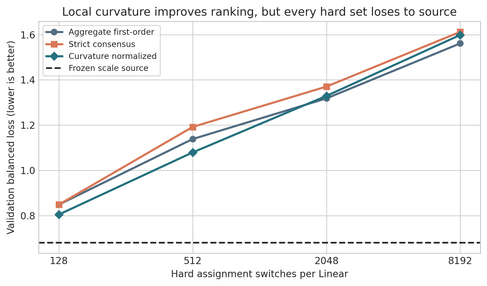

# 局部曲率仍非部署证书：2-bit Block-Scaled VQ 中 Assignment 集合的代理失配

## 摘要

极低比特向量量化的难点不只是找到重构误差较小的码本，还要判断哪些有限码字替换能在真实任务上形成可部署收益。本文研究约 2.12 bpp 的 block-scaled shared-codebook VQ：每个权重 block 先经 scale 归一到共同数值领域，再用同一套 4096 个六维码字表示；Vector-GPTQ 在几何候选中引入激活二阶信息与误差反馈，产生硬量化锚点。在此锚点上，我们考察是否还能通过当前码字附近领域内的 assignment 学习获得增益。

此前实验揭示了一个悖论：聚合一阶梯度在 98.20% 的向量上找到预测下降邻居，四视图严格共识将其筛至 48.71%，但二者都不能产生优于冻结 scale source 的硬 assignment 集合。本文进一步提出一个训练前、可证伪的 scale-conditioned 局部曲率 probe。对每个有限码字跳转，我们结合真实 group scale、码字差分与 Linear 输入激活二阶矩，估计对角局部输出曲率，并以曲率归一化的最差视图一阶变化排序候选。我们在 Meta-Llama-3.1-8B-Instruct 最后四层的 28 个 Linear 上构造 aggregate first-order、strict consensus 与 curvature-normalized 三类等基数排序；每类采用 128、512、2048、8192 个切换/Linear，共评估 12 个真实硬集合。

曲率排序相对严格共识在 4/4 个预算上降低 balanced loss，证明 scale-conditioned 局部曲率含有有效信息；但它相对聚合一阶仅 2/4 胜，未通过预注册的 3/4 predictor Gate。最佳曲率硬集合的 Macro Accuracy 为 70.86%，低于 source 的 76.33%；balanced loss 为 0.8042，比 source 的 0.6797 恶化 18.31%。Gate 因而阻止候选 audit、checkpoint 写入、完整 assignment 训练和正式测试。本文不宣称新的压缩 SOTA，而给出一个明确边界：独立候选的 Linear 局部曲率可以改善排序，却不能代表深网端到端离散集合交互。离散 assignment 的下一步应从逐候选分数转向集合级误差传播与条件收益。

**关键词：** 大语言模型量化；向量量化；共享码本；离散 Assignment；后训练量化；局部曲率；部署审计

## 1 引言

2-bit 大语言模型量化把连续权重压到极稀疏的离散表示空间。标量 PTQ 通常在 rounding、缩放与二阶误差补偿之间权衡；向量量化则把多个权重共同映射为码字，使同一 bit budget 获得更强表达能力，但也把优化变量变成组合 assignment。AQLM、QuIP# 与 QTIP 等方法说明，极低比特性能同时依赖表示几何与二阶敏感度 [3--5]。然而，一个在连续或局部代理上看似更优的 assignment，最终必须物化为硬整数索引；soft loss、单点一阶变化和真实 hard checkpoint 之间并不存在自动等价。

本文从一种 block-scaled shared-codebook VQ 出发。权重先按 group scale 映射到共同数值领域，然后共享一套六维码本。Block scale 不是附属技巧：它决定不同动态范围的 block 能否复用相同码字。几何 VQ 获得初始码本与 assignment 后，Vector-GPTQ 在 top-128 几何候选中加入激活 Hessian 代理，并把当前量化误差反馈给后续列，形成部署态硬锚点。这个锚点回答“怎样构造更好的 VQ”，却没有回答“锚点形成后还能否训练 assignment”。

Assignment 是最直接的剩余自由度。对每个当前码字，我们只允许在含 anchor 的 8-way 几何附近领域中选择 alternative，再用概率化 binary Concrete 学习是否切换。这个训练方式保持固定码本、固定逻辑码率，并把搜索限制在当前码字附近。问题不在训练是否可微，而在训练后哪些离散集合值得真正切换。

我们的完整证据逐步排除了三个看似合理的局部代理。第一，聚合一阶 proposal 在 145,465,344 个六维向量中的 98.20% 上找到负邻居，但真实 hard projection 全部退化。第二，将数据划成四个互斥任务分层视图，只保留同一邻居在所有视图都下降的严格共识，资格率降到 48.71%，最佳 hard endpoint 得到改善，却仍不能越过 source。符号冲突确实存在，但符号稳定仍不是离散可信域。

第三，也是本文的新检验：有限码字跳转的大小不同，同样的跳转还会被 group scale 与输入激活敏感度放大。我们在产生一阶梯度的同一次真实 backward forward 中累计每个 Linear 输入维度的二阶矩，对真实 weight jump 计算 scale-conditioned 对角输出曲率。随后不训练参数，而是让三个排序在完全相同的 hard cardinality 下接受端到端 validation 裁决。这样可以在数小时完整 assignment 训练之前回答：局部曲率是否至少能预测硬集合的相对质量。

结果呈现出清楚的“有信息但不充分”边界。曲率排序在四个预算上全部优于严格共识，说明二阶代价修复了共识对大扰动不敏感的问题；但在较大预算上仍输给聚合一阶，而且所有集合都显著差于 source。一个局部二阶代理可以改善候选排序，不等于它足以授权 hard deployment。

本文贡献如下：

1. 在 block-scaled shared-codebook VQ 的硬锚点上，定义 scale-conditioned assignment curvature probe，将有限码字差分、真实 group scale 和输入激活二阶矩统一为无可调系数的候选排序。
2. 建立 matched-cardinality hard-set 诊断协议：三个排序、四个固定预算、12 个真实端到端集合，并以预注册胜负门禁决定是否允许后续训练，而非用 soft surrogate 自证有效。
3. 给出机制边界：局部曲率对严格共识 4/4 胜，却未稳定超过聚合一阶，最佳点仍较 source 低 5.47 pp Macro。证据把剩余问题定位到非线性误差传播和集合交叉作用，终止无方法依据的 assignment-after-scale 训练路线。

## 2 相关工作

### 2.1 二阶后训练量化

OBQ 与 GPTQ 使用近似 Hessian 评估权重误差，并在顺序量化中把当前误差反馈给尚未量化的权重 [1,2]。GPTQ 的重要启示是：欧氏距离并不等价于输出敏感度。本文的 Vector-GPTQ 把该原则用于六维码字候选，作为共同硬锚点；V12 不声称首次使用 Hessian，而研究锚点之后的离散 assignment 集合。

BRECQ 指出参数空间误差与模型空间误差并不等价，并用 block reconstruction 近似任务损失 [6]。MREM 通过模块级重构打破端到端依赖以提高并行性 [7]。近期量化误差传播研究进一步强调，前层量化误差会改变后续层输入分布 [8]。这些工作共同约束本文的 claim：我们的 $q_i$ 是单个 Linear 的对角局部输出二次代价，不是完整 Transformer Hessian。

### 2.2 极低比特向量量化

GPTVQ 把 GPTQ 式二阶量化扩展到向量候选 [9]；AQLM 使用多个码本的加性组合与 block-level refinement [3]；QuIP# 用 incoherence processing 与格码改善权重/Hessian 几何 [4]；QTIP 用 trellis 量化解耦有效维度和显式码本规模 [5]。这些工作主要改进表示或通用 PTQ 端点。本文聚焦固定 block-scaled shared-codebook 表示形成后，任务适应 assignment 的硬代理是否可信。

### 2.3 离散量化参数优化

GSQ 以 Gumbel Softmax 优化量化结构 [10]；PV-Tuning 直接在离散与连续量化参数之间交替优化 [11]。因此“训练 assignment”本身不是充分的新颖性来源。我们的区分点有两个：训练只发生在当前码字附近领域内，且任何 soft 训练之前必须通过候选级 hard-set predictor Gate。本文的核心不是提出另一种 Gumbel 温度或训练顺序，而是验证 soft/局部代理能否授权真实部署状态。

### 2.4 多视图稳定性与代理验证

多任务学习中的梯度冲突表明，聚合梯度可能隐藏条件性负迁移 [12]。V11 用互斥数据视图的严格共识控制一阶符号稳定性；V12 保持这一资格集合，只加入 scale-conditioned 曲率排序。Matched-cardinality 设计使差异不能归因于切换数量，真实 hard validation 则避免用同一个局部代理定义候选又证明候选。

## 3 方法

### 3.1 Block scale 后的共享码本 VQ

将 Linear 权重切分为 $d$ 维向量 $w_i\in\mathbb R^d$，实验中 $d=6$。向量所属 scale group 记为 $g(i)$，共享码本为 $\mathcal C=\{c_1,\dots,c_K\}$，$K=4096$。先归一化

$$
u_i=\frac{w_i}{s_{g(i)}},\qquad a_i=\arg\min_k\|u_i-c_k\|_2^2,
$$

部署重构为

$$
\hat w_i=s_{g(i)}c_{a_i}.
$$

Scale 把不同动态范围的 block 映射到同一领域，assignment 决定共享原型。计入 FP16 scale、共享码本和必要元数据后，本文端点为 2.1207557 bpp。

### 3.2 Hessian-aware Vector-GPTQ 硬锚点

几何最近邻只最小化参数误差。Vector-GPTQ 先保留 top-128 几何码字，再使用校准激活估计的二阶代理比较候选；选定第 $j$ 个量化单位后，将误差 $e_j$ 反馈到剩余列：

$$
W_{:,j+1:}\leftarrow W_{:,j+1:}-e_j\frac{H^{-1}_{j,j+1:}}{H^{-1}_{jj}}.
$$

该阶段产生硬状态 $(s^0,a^0,\mathcal C)$。后续 probe 固定 codebook、normalizer、scale 和逻辑码率，因而只研究 assignment 坐标。

### 3.3 当前码字附近领域的 Assignment

对 anchor $c_{a_i^0}$，构造含自身与七个几何邻居的 $\mathcal N(a_i^0)$。候选 $c$ 的真实有限 weight jump 是

$$
\delta_i(c)=s_{g(i)}^0\left(c-c_{a_i^0}\right).
$$

若进入训练，alternative 与 anchor 之间用 binary Concrete switch：

$$
p_i=\sigma(z_i/\tau),\qquad
\tilde w_i=(1-p_i)s_{g(i)}^0c_{a_i^0}+p_i s_{g(i)}^0c_{a_i^1}.
$$

V12 的目标不是再次训练 $z_i$，而是先判断 $a_i^1$ 的选择器是否预测真实 hard loss。

### 3.4 三个等基数候选排序

完整训练数据确定性分成四个互斥、任务分层视图。视图 $v$ 的一阶变化为

$$
\Delta_i^{(v)}(c)=\langle g_i^{(v)},\delta_i(c)\rangle.
$$

**聚合一阶。** 对平均梯度选择 $\bar\Delta_i(c)=\frac1V\sum_v\Delta_i^{(v)}(c)$ 最小的负邻居，并按该值排序。

**严格共识。** 只有满足 $\Delta_i^{(v)}(c)<0,\forall v$ 的邻居合格；在合格集合中最小化最差视图变化

$$
r_i^{\rm con}(c)=\max_v\Delta_i^{(v)}(c).
$$

**曲率归一化。** 在产生梯度的真实 backward forward 中，对 Linear 输入 $x$ 累计逐维二阶矩 $m_j=\mathbb E[x_j^2]$。定义

$$
q_i(c)=\sum_jm_j\delta_{ij}(c)^2,
$$

并在严格共识候选中最小化

$$
r_i^{\rm curv}(c)=\frac{\max_v\Delta_i^{(v)}(c)}{\sqrt{q_i(c)+\epsilon}}.
$$

$q_i$ 对应对角化 Linear 输出平方误差的局部二次项。它捕获三个一阶排序缺失的量：实际 scale、码字有限步长和输入维度敏感度；但忽略 Transformer 非线性、残差传播、非对角项和不同切换间交叉项。

### 3.5 Predictor Gate 与硬状态事务

对每个排序，在每个 Linear 选择 128、512、2048、8192 个最优候选，得到四个 nested hard set。三类排序的每个预算具有相同 cardinality。每个集合以稀疏原位更新应用到真实权重，运行完整任务 validation，随后精确恢复 source。

曲率预测器必须同时满足：相对 aggregate 与 consensus，各自在至少 3/4 个预算上取得更低 balanced loss，且四预算平均 loss 更低。只有 predictor 通过，且一个 curvature set 相对 source 通过任务/text validation，才允许它进入一次 candidate-unexposed audit；audit 再通过才可写 checkpoint 与运行正式 WikiText2/lm_eval。该层级门禁把训练授权、部署选择和正式测试隔离。

## 4 实验

### 4.1 设置

模型为 Meta-Llama-3.1-8B-Instruct，冻结 source 为已审计的 task group-scale 硬端点。只开放 layers 28--31，共 28 个 Linear、145,465,344 个六维向量。五个任务为 ARC-Challenge、ARC-Easy、HellaSwag、PIQA、WinoGrande；每任务 512 train、256 validation、31 audit。文本使用 4096 train、128 validation、64 audit 条长度 4096 的序列；三段 row 区间互不重叠。任务损失与 teacher KL 构成训练视图，但 V12 不更新任何参数。

实验只用本机物理 GPU5 单卡，耗时 5325.16 秒（1.479 小时），峰值分配 25.285 GiB。没有 seed、LR、group、曲率权重或训练 epoch 扫描。正式 PPL 预注册为 WikiText2 raw test、sequence length 2048；准确率预注册为 lm_eval 0.4.4 的 ARC-C/E、HellaSwag、LAMBADA、PIQA、WinoGrande 全量 0-shot，但本轮 Gate 失败，二者均未运行。

### 4.2 候选资格

| Proposal | 合格向量 | 比例 |
|---|---:|---:|
| Aggregate negative | 142,842,971 | 98.1973% |
| Four-view strict consensus | 70,856,047 | 48.7099% |

曲率与严格共识共享资格集合，只改变优先级；因此二者的 hard-set 差异可归因于排序，而不是候选数量。

### 4.3 Matched-cardinality 硬集合

| Switch/Linear | Aggregate loss / Macro | Consensus loss / Macro | Curvature loss / Macro |
|---:|---:|---:|---:|
| Source, 0 | \- / 76.3281% | **0.679691 / 76.3281%** | \- / 76.3281% |
| 128 | 0.848070 / 67.5000% | 0.848267 / 67.1875% | **0.804163 / 70.8594%** |
| 512 | 1.138119 / 56.4063% | 1.191663 / 55.0781% | **1.078899 / 61.0156%** |
| 2048 | **1.317897 / 44.2969%** | 1.370206 / 43.1250% | 1.328956 / **45.4688%** |
| 8192 | **1.561233 / 37.0313%** | 1.612292 / 36.9531% | 1.598649 / **38.3594%** |

曲率相对 consensus 在 4/4 个预算上 loss 更低，平均 loss 从 1.255607 降至 1.202667。这证明曲率信息不是无效噪声。相对 aggregate，它只在 128 与 512 预算取胜，在 2048 与 8192 预算失利；虽平均 loss 1.202667 低于 1.216330，2/4 胜仍未达到预注册 3/4。因此 predictor Gate 失败。

### 4.4 最佳点仍显著低于 Source

最佳 curvature set 只在每个 Linear 切换 128 个向量，总计 3584 个，占全部向量 0.002464%。即使如此，其 Macro 70.8594% 仍比 source 低 5.4688 pp；balanced loss 0.804163 相对 source 0.679691 恶化 18.313%。更大集合的 loss 随预算显著上升。这不是“训练还不够”能够解释的现象，因为 probe 没有训练，问题发生在训练前的候选授权阶段。

### 4.5 状态合同与正式测试

Predictor Gate 失败后，validation source Gate 自然也失败。程序未把任何 changed candidate 暴露给 audit，未写多 GB checkpoint，未运行正式测试，也未授权完整 assignment training。最终逻辑状态是原 scale source。其已有正式指标为 WikiText2 PPL 10.9448、Macro-6 71.7223%、公共五任务 72.5484%、2.1207557 bpp；这些数值只描述相同 source，不是 V12 的新评测。

### 4.6 与 QTIP/GSQ 的关系

本轮不产生新部署端点，因此不能声称超过 QTIP 或 GSQ。QTIP 是通用、无目标任务标签的 PTQ 强基线；本文 scale source 与 assignment probe 使用任务 training split，目标不同。V12 的贡献是候选代理审计，而非刷新压缩 Pareto。任何性能比较仍应引用此前同模型、同协议的完整原始 JSON，并明确监督差异。

### 4.7 机制分析

令集合 $S$ 的总扰动为 $\delta_S=\sum_{i\in S}\delta_i$，则

$$
\mathcal L(W+\delta_S)=\mathcal L(W)+g^\top\delta_S+\frac12\delta_S^\top H(\xi)\delta_S.
$$

曲率排序只近似每个候选的部分对角项。即便单点 $g_i^\top\delta_i$ 与 $q_i$ 都有利，集合项仍包含 $\delta_i^\top H\delta_j$；量化后激活分布变化还会沿后续层传播。随着预算增加，这些遗漏项快速累积，解释曲率在小预算优于两个 control、在大预算却不能保持优势，也解释所有方法都低于 source。

这一结果把三版实验串成可证伪漏斗：V10 否定聚合一阶足够；V11 证明符号冲突存在但共识不够；V12 证明独立候选局部曲率有用但仍不够。剩余方法问题不再是寻找更好的单点归一化，而是估计集合条件增益。

### 4.8 局限

实验只覆盖一个 8B 模型最后四层，不能证明结论跨模型、跨层普遍成立。输入二阶矩为对角近似，没有估计非对角 Hessian、残差流或跨候选交叉项。任务监督使结果不能与通用 PTQ 基线作无条件排名。最后，负 predictor 结果是对当前 8-way 邻域和冻结 scale source 的否定，不是对所有 assignment 优化的不可行性证明。

## 5 结论

本文在 block-scaled shared-codebook VQ 上研究硬锚点之后的 assignment 可信域。我们把真实 group scale、有限码字差分和输入激活二阶矩结合为 scale-conditioned 局部曲率，并用 12 个 matched-cardinality hard set 直接审计其预测能力。曲率排序稳定优于严格共识，却未稳定超过聚合一阶，且最佳集合仍显著差于冻结 source。由此可见，局部 Linear 曲率是一种有信息的排序特征，而不是端到端部署证书。

因此，本文停止 assignment-after-scale 的完整训练路线，不以 seed 或超参数扫描掩盖机制缺口。下一步若重启 assignment，应以真实 hard 小集合的 sequential conditional gain、block/layer 输出重构或可校准的低秩交叉代理直接建模集合级误差传播。只有当这种代理先通过端到端预测门禁，概率化 assignment 训练才具有方法依据。

## 参考文献

[1] Frantar et al. Optimal Brain Compression: A Framework for Accurate Post-Training Quantization and Pruning. NeurIPS 2022.

[2] Frantar et al. GPTQ: Accurate Post-Training Quantization for Generative Pre-trained Transformers. ICLR 2023.

[3] Egiazarian et al. Extreme Compression of Large Language Models via Additive Quantization. ICML 2024.

[4] Tseng et al. QuIP#: Even Better LLM Quantization with Hadamard Incoherence and Lattice Codebooks. ICML 2024.

[5] Tseng et al. QTIP: Quantization with Trellises and Incoherence Processing. NeurIPS 2024.

[6] Li et al. BRECQ: Pushing the Limit of Post-Training Quantization by Block Reconstruction. ICLR 2021.

[7] Bai et al. Towards Efficient Post-training Quantization of Pre-trained Language Models. NeurIPS 2022.

[8] Quantization Error Propagation: Revisiting Layer-Wise Post-Training Quantization. NeurIPS 2025.

[9] van Baalen et al. GPTVQ: The Blessing of Dimensionality for LLM Quantization. 2024.

[10] Liu et al. GSQ: Grouped Shared Quantization for Large Language Models. 2025.

[11] Malinovskii et al. PV-Tuning: Beyond Straight-Through Estimation for Extreme LLM Compression. NeurIPS 2024.

[12] Yu et al. Gradient Surgery for Multi-Task Learning. NeurIPS 2020.
