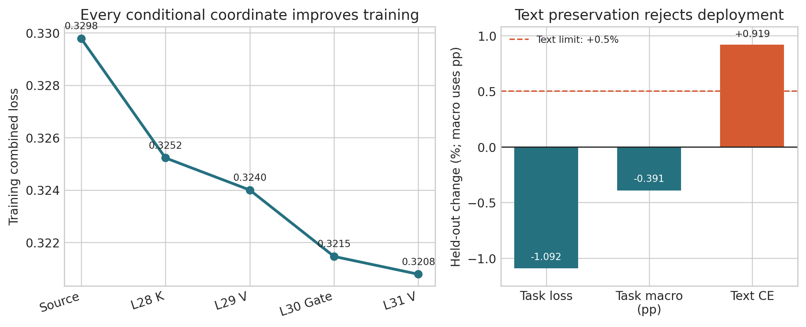

# 条件收益仍非泛化证书：2-bit Block-Scaled VQ 中离散 Assignment 的集合交互与跨域失配

## 摘要

极低比特向量量化不仅要把权重映射到紧凑码本，还要判断一组有限码字替换能否在真实模型中形成可部署收益。本文研究约 2.12 bpp 的 block-scaled shared-codebook VQ：每个权重 block 先经 scale 归一到共同数值领域，再共享 4096 个六维码字；Vector-GPTQ 在几何候选中加入激活二阶信息和误差反馈，形成硬量化锚点；锚点之后只允许 assignment 在当前码字的局部邻域内变化。此前逐候选一阶、跨视图共识与局部曲率都不能可靠预测硬集合，暴露出集合交互缺口。

我们提出因果集合条件 assignment 搜索。固定每个 Linear 的 curvature top-128 bundle，在 Transformer 层序中、在已经接受的硬状态条件下，真实评估七个 Linear bundle 的完整训练目标；每层只接受严格降低五任务 supervised CE 与 dense-teacher KL 联合目标的最佳坐标。与把独立分数相加不同，该过程直接测量 $F(S\cup B)-F(S)$，并保证训练目标单调下降。为避免缓存代理自证，我们用完全相同 batch 的完整 Hugging Face 前向校验最后四层重放，并用局部曲率--即时 block MSE 相关作为不参与选择的正控制。

在 Meta-Llama-3.1-8B-Instruct 最后四层，四个层级坐标全部被接受，共切换 512 个 assignment；训练联合目标改善 2.73%，held-out 五任务 balanced loss 改善 1.09%。然而，独立文本 validation CE 恶化 0.919%，超过预注册 0.5% 上限；程序因此不访问 audit、不写 checkpoint、不运行正式 PPL/lm_eval。这一正式结果首先是诊断性失败，而非部署成功：集合条件评估在当前四层、固定 bundle 设置中缓解了离散交互计分缺口，却不能自动保证跨域语言保持。Task-only 条件收益是任务适应信号，不是通用 PTQ 的泛化或部署证书。

**关键词：** 大语言模型量化；向量量化；共享码本；离散 Assignment；集合条件收益；任务适应；部署审计

## 1 引言

2-bit 大语言模型量化把连续权重压入高度稀疏的离散表示空间。向量量化以一个码字表示多个权重，因而在相同比特预算下比逐标量 rounding 更有表达力；代价是优化变量不再是相互独立的标量，而是会沿残差流、注意力和 MLP 非线性相互作用的 assignment 集合。AQLM、QuIP# 与 QTIP 等工作表明，极低比特性能依赖表示几何、二阶敏感度与可实现编码 [3--5]。但无论局部代理多精细，部署对象最终都是硬整数索引；soft loss 或独立候选分数不会自动等价于硬模型行为。

本文从 block-scaled shared-codebook VQ 出发。对于不同动态范围的权重 block，scale 先把它们映射到同一数值领域，使整层能够共享一套 4096 个六维码字。几何 VQ 产生初始码本与 assignment；Vector-GPTQ 再在 top-128 几何候选中引入激活 Hessian 代理，并把当前量化误差反馈给后续列，获得硬锚点。这个两阶段过程回答“如何得到更小损失的 VQ 表示”，却没有回答“锚点形成后，能否通过训练当前码字附近领域内的 assignment 进一步适应任务”。

Assignment 训练本身不是本文唯一创新。我们此前使用含 anchor 的 8-way 邻域和 binary Concrete/Gumbel 式概率训练，只更新离散选择，不改变码本与逻辑码率。然而，真实难点发生在训练之前：哪些 alternative 值得被激活？聚合一阶梯度在 98.20% 向量上找到预测下降邻居，四视图严格共识将其筛到 48.71%，局部曲率又在 4/4 个预算上优于共识，但三者形成的硬集合仍全面输给冻结 source。局部信号有信息，却不是集合证书。

V13 直接干预这个缺口。我们不再调整单点分数，也不扫描 bundle size、seed、学习率或阈值。每个 Linear 只提供一个固定 curvature top-128 bundle；按 layers 28--31 因果顺序，在此前接受的硬状态下真实重放最后四层，比较当前层七个 bundle 的完整任务训练目标。只有最佳 bundle 严格改善当前目标时才进入状态。这样，后层选择能够感知前层量化误差，集合交叉项被实际 forward 吸收，而不是被独立 Taylor 分数忽略。

Figure 1 展示了本文的核心观察。四个被接受坐标使训练联合目标从 0.3298 单调降至 0.3208；同一端点也使 held-out 任务 loss 降低 1.09%。这说明集合条件评估在当前受限设置中缓解了 V12 暴露的交互计分缺口。可是，文本 teacher CE 同时上升 0.919%，越过预注册保护线。交互计分改善后，新的瓶颈变成跨域目标错位：task-only 的真实边际收益仍会消费语言保持裕量。

本文贡献如下：

1. 提出因果集合条件 assignment 搜索，把固定局部码字 bundle 作为离散坐标，在已接受硬状态条件下真实测量端到端训练边际收益；该过程无需连续参数，并保证训练目标单调下降。
2. 建立数值可审计的重放协议：同一 shape bucket、同一 batch composition、显式 causal mask、32 例跨任务/长度/continuation parity，以及不参与选择的曲率--block MSE 正控制。
3. 给出新的机制边界：四个坐标均获得训练条件增益，held-out 任务 loss 也改善，但文本 CE 超过保护线。证据将剩余问题从“独立代理不能表示集合交互”推进到“任务条件收益不能保证跨域语言保持”。

## 2 相关工作

### 2.1 二阶后训练量化与误差反馈

OBQ 与 GPTQ 用校准激活构造近似 Hessian，并在顺序量化中把当前误差反馈给尚未量化的权重 [1,2]。GPTQ 的核心不是固定的 Linear 顺序，而是让后续决策感知前序离散误差。本文的 Vector-GPTQ 将候选单位扩展为六维码字，作为所有 assignment refinement 共享的硬锚点；V13 研究的是锚点之后的集合选择，而非宣称首次使用 Hessian。

BRECQ 通过 block reconstruction 缩小参数误差与模型行为之间的距离 [6]。MREM 用模块级重构打破整模型端到端依赖，以获得并行性 [7]。DiscQuant 则从数据依赖 rounding 与梯度差异出发分析量化选择 [13]。这些工作共同说明，更接近模型函数的重构通常比参数距离可靠；但局部重构仍需验证是否预测最终任务和跨域行为。本文用即时 block-output MSE 作为正控制，用最终任务/text validation 作为真正门禁。

### 2.2 极低比特向量量化

GPTVQ 将 GPTQ 式敏感度扩展到向量候选 [8]；AQLM 用多个码本的加性组合与 block-level refinement 提升 2-bit 表达 [3]；QuIP# 用 incoherence processing 与格码改善权重/Hessian 几何 [4]；QTIP 用 trellis 解耦有效向量维度和显式码本规模 [5]。这些方法主要面向通用 PTQ Pareto。本文固定 block scale、共享码本与 2.1207557 bpp 逻辑状态，只研究极少量 assignment 是否能形成任务适应且保持语言分布的硬端点。

### 2.3 离散量化参数优化

GSQ 使用 Gumbel Softmax 优化量化结构 [9]；PV-Tuning 在离散与连续量化参数间交替优化，并强调直接处理离散变量的价值 [10]。因此，“可微地训练 assignment”不是充分贡献。我们的局部训练空间以当前码字为中心，anchor 永远是零步安全选择；更重要的是，本文把 proposal、条件接受、validation、candidate-unexposed audit 与正式测试分开，避免用训练代理或最佳 test 点反向选择部署状态。

### 2.4 集合优化、坐标下降与多目标泛化

坐标下降通过在当前状态条件下优化一个坐标吸收变量间交互；量化中的层级或模块重构也采用相似思想。本文的坐标不是连续权重或整层重构参数，而是一组共享码本整数 assignment；目标是最后四层重放后的任务 supervised+teacher loss。多任务梯度冲突说明，聚合方向可能隐藏任务间负迁移 [11]。V11 的四视图共识控制方向稳定性，V12 的曲率控制有限步代价，V13 则真实测量集合条件收益。新结果进一步表明，即使任务 train 与 held-out task loss 同向，未进入接受目标的文本域仍可能退化。

## 3 方法

### 3.1 Block scale 后的共享码本 VQ

将 Linear 权重切分为 $d$ 维向量 $w_i\in\mathbb R^d$，实验中 $d=6$。向量所属 scale group 为 $g(i)$，共享码本为 $\mathcal C=\{c_1,\ldots,c_K\}$，$K=4096$。先在归一化领域执行 VQ：

$$
u_i=\frac{w_i}{s_{g(i)}},\qquad
a_i=\arg\min_k\|u_i-c_k\|_2^2,
$$

部署时重构

$$
\hat w_i=s_{g(i)}c_{a_i}.
$$

Block scale 的作用是把不同 block 的幅值对齐到共同领域，使一套码本能够被复用；assignment 决定每个归一化向量使用哪个共享原型。本文 source 计入 FP16 scale、码本与元数据后为 2.1207557 bpp。

### 3.2 Hessian-aware Vector-GPTQ 硬锚点

纯几何最近邻只最小化参数空间误差。Vector-GPTQ 先保留每个向量 top-128 几何码字，再以校准激活构造的二阶代理选择候选；选定第 $j$ 个量化单位后，把误差 $e_j$ 反馈给尚未量化的列：

$$
W_{:,j+1:}\leftarrow W_{:,j+1:}-e_j
\frac{H^{-1}_{j,j+1:}}{H^{-1}_{jj}}.
$$

由此得到硬状态 $(s^0,a^0,\mathcal C)$。V13 固定 codebook、normalizer、scale 和逻辑码率；任何新状态只能改变整数 assignment。

### 3.3 当前码字附近领域与固定 Bundle

对 anchor $c_{a_i^0}$，构造包含自身与七个几何邻居的 $\mathcal N(a_i^0)$。候选 $c$ 的真实 weight jump 是

$$
\delta_i(c)=s_{g(i)}^0(c-c_{a_i^0}).
$$

若进入概率训练，anchor 与 alternative 可由 binary Concrete switch 表示：

$$
p_i=\sigma(z_i/\tau),\qquad
\tilde w_i=(1-p_i)s^0c_{a_i^0}+p_i s^0c_{a_i^1}.
$$

V13 不训练 $z_i$，而只构造离散坐标。完整 train 被确定性分成四个互斥任务/文本视图；对视图 $v$，候选一阶变化为

$$
\Delta_i^{(v)}(c)=\langle g_i^{(v)},\delta_i(c)\rangle.
$$

在同一 backward forward 中累计 Linear 输入二阶矩 $m_j=\mathbb E[x_j^2]$，定义局部输出曲率

$$
q_i(c)=\sum_jm_j\delta_{ij}(c)^2.
$$

只保留四视图均为负的邻居，并按 $\max_v\Delta_i^{(v)}(c)/\sqrt{q_i(c)+\epsilon}$ 排序。每个 Linear 固定取 128 个候选，组成 bundle $B_{\ell,m}$。这个排序只提出坐标；真实接受完全不使用其数值。

### 3.4 因果集合条件搜索

记 source assignment 集合为 $S_0$，训练目标为

$$
F(S)=\frac1{|\mathcal T|}\sum_{t\in\mathcal T}
\left[\mathcal L_{\mathrm{sup}}^t(S)+
\lambda_{\mathrm{KL}}\mathcal L_{\mathrm{KL}}^t(S)\right],
\qquad \lambda_{\mathrm{KL}}=0.25.
$$

按 $\ell=28,29,30,31$ 的因果顺序，在当前集合 $S_{\ell-1}$ 下对该层七个 Linear 分别计算

$$
G_{\ell,m}=F(S_{\ell-1})-F(S_{\ell-1}\cup B_{\ell,m}).
$$

令 $m^*=\arg\max_m G_{\ell,m}$。若 $G_{\ell,m^*}>10^{-7}$，则

$$
S_\ell=S_{\ell-1}\cup B_{\ell,m^*};
$$

否则 $S_\ell=S_{\ell-1}$。每层最多接受一个 bundle，总切换不超过 512。

**单调性。** 按定义，每次接受都满足 $F(S_\ell)<F(S_{\ell-1})$；因此

$$
F(S_L)=F(S_0)-\sum_{\ell:\mathrm{accepted}}G_{\ell,m^*}<F(S_0).
$$

该性质只对搜索使用的训练目标成立，不推出 validation、文本分布或正式 benchmark 改善。V13 的实验正是检验这个缺失的外推关系。

### 3.5 因果重放、正控制与部署门禁

对 2560 个任务 train 样本的全部 8193 个 choice 缓存 layer-28 输入 hidden state。记录按 `(total length, continuation start)` 分桶，dense teacher、source 与候选使用完全相同的 batch composition；最后四层重放显式构造与 Hugging Face 完整前向一致的 causal mask。搜索前，用 32 个跨任务、序列长度和 continuation 起点分层样本比较 cache 与同 batch 完整前向；score 最大误差需不超过 0.02 且 argmax 全一致。

每层还记录七个 bundle 的曲率成本和真实即时 block-output MSE，并报告 Spearman 相关；该正控制不参与接受。搜索结束后，任务 validation 要求联合 loss 改善、Macro 回退不超过 1 pp、任一任务 loss 回退不超过 0.5%；文本 validation teacher CE 回退不得超过 0.5%。只有二者均通过，才允许 candidate-unexposed audit；audit 再通过才写 checkpoint 并运行 WikiText2 PPL 与六任务 lm_eval。

## 4 实验

### 4.1 设置

模型为 Meta-Llama-3.1-8B-Instruct，source 为已经审计的 task group-scale 硬端点。开放 layers 28--31 的 28 个 Linear，共 145,465,344 个六维向量。任务包括 ARC-Challenge、ARC-Easy、HellaSwag、PIQA 与 WinoGrande，每任务使用 512/256/31 条互斥 train/validation/audit。文本使用 4096/128/64 条长度 4096 的互斥序列，正式 audit 为 rows 5568--5631。文本 top-k teacher 只参与 proposal gradient 与最终保持门禁，不参与 bundle 的条件接受目标。

实验固定四个 gradient views、8-way 邻域、128/Linear bundle 和因果层序，没有 seed、bundle size、层序、阈值、LR 或 group 扫描。只使用本机物理 GPU7 单卡，耗时 12,653.27 秒（3.515 小时），峰值 25.285 GiB；未使用服务器 14。正式 PPL 预注册为 WikiText2 raw test、sequence length 2048；准确率为 lm_eval 的 ARC-C/E、HellaSwag、LAMBADA、PIQA、WinoGrande 全量 0-shot。

### 4.2 重放是否可信？

最终 parity 的 32 个样本覆盖五个任务，序列长度 11--163、continuation 起点 7--133。Cache 与同 batch 完整 HF 前向最大 choice-score 误差为 $1.1444\times10^{-5}$，32/32 argmax 一致。

这一门禁暴露并修复了一个会污染结论的实现缺陷：旧 direct DecoderLayer 重放曾传入 `attention_mask=None`，而完整 HF 前向会构造 causal mask。修复后逐层手工重放的最终 logits 与完整前向最大误差为 0。进一步分解表明，batch=4 与 singleton BF16 score 本身最高可差 0.254416，而 cache 与同 batch 完整前向只差 0.0005286；因此 dense teacher 与搜索都改为同一 batch 协议，而不是放宽 0.02 门槛。失败运行发生在方法搜索前，不进入结果比较。

### 4.3 集合条件搜索是否修复独立代理失效？

| 层 | 接受的 Linear | 条件增益 | 曲率--MSE Spearman |
|---:|---|---:|---:|
| 28 | K projection | 0.0045590 | 0.9643 |
| 29 | V projection | 0.0012241 | 0.3571 |
| 30 | MLP gate projection | 0.0025375 | 0.5714 |
| 31 | V projection | 0.0006785 | 0.8214 |

四层均存在严格改善坐标。训练联合目标从 0.329784 依次降到 0.325225、0.324001、0.321463 与 0.320785，总体改善 2.7288%。这一结果直接反驳“scale 锚点附近没有任何有益 assignment 自由度”的强解释：至少在任务训练分布上，真实条件评估能够找到非零硬收益。

正控制相关在 0.357--0.964 之间。局部曲率对 layer 28 和 31 的即时 block distortion 排序较好，对 layer 29 较弱；但每层仅比较七个 Linear bundle，样本量不足以把相关系数解释为普遍排序定律。所有接受决定均由端到端训练目标作出。因此 V12 的结论应被精化为：局部曲率适合提出候选，却不足以单独授权；当前设置下，集合条件重放可承担后一裁决。

### 4.4 条件训练收益能否泛化？

| 指标 | Source | 条件搜索端点 | 变化 |
|---|---:|---:|---:|
| Train combined loss | 0.329784 | **0.320785** | $-2.7288\%$ |
| Train Macro | **98.9063%** | 98.5938% | $-0.3125$ pp |
| Validation balanced task loss | 0.679691 | **0.672270** | $-1.0919\%$ |
| Validation task Macro | **76.3281%** | 75.9375% | $-0.3906$ pp |
| Validation text teacher CE | **2.441416** | 2.463844 | $+0.9186\%$ |

Held-out 任务 balanced loss 改善 1.0919%，Macro 下降 0.3906 pp，仍在预注册 1 pp 容忍内；五个任务逐项 loss 也满足门禁。ARC-E、HellaSwag、WinoGrande 与 ARC-C loss 均下降，PIQA 仅上升 0.001023。因而任务 validation Gate 通过，训练收益不是纯粹记忆 2560 个 train 样本。

但是，文本 teacher CE 从 2.441416 上升到 2.463844，相对恶化 0.9186%，超过 0.5% 上限。该现象与训练内部的 teacher KL 从 0.344850 上升到 0.420074 一致：任务 supervised loss 的收益覆盖了分布保持损失，使联合目标仍下降。换言之，条件搜索忠实优化了其目标；错误在于 task-only 标量目标没有给跨域保持不可交易的地位。

### 4.5 状态合同与正式基线边界

文本 Gate 失败后，程序没有读取 task/text audit，没有写多 GB checkpoint，没有运行 WikiText2 PPL 或六任务 lm_eval。终态为 `set_conditional_gain_rejected`，逻辑部署状态仍是 source。Source 已有的 PPL、准确率与 QTIP/GSQ 对比不是 V13 新测量，本文不复用它们声称新 Pareto。

由于当前端点使用目标任务标签，而 QTIP 是通用无标签 PTQ，二者不能无条件排名。V13 没有产生部署候选，因此不能声称超过 QTIP 或 GSQ。本文贡献是识别集合条件收益的能力与边界，而非刷新 2-bit benchmark。

### 4.6 机制分析

对集合 $S$，独立 Taylor 代理写作

$$
\mathcal L(W+\delta_S)=\mathcal L(W)+\sum_i g^\top\delta_i+
\frac12\sum_i\delta_i^\top H\delta_i+
\sum_{i<j}\delta_i^\top H\delta_j+\cdots.
$$

V12 的单点曲率只近似第二项的局部对角部分。V13 对每个 bundle 重新执行真实 forward，并在接受后更新 incumbent，因此把同层/跨层交叉作用和后续非线性传播吸收到测得的 $G_{\ell,m}$。四步单调下降只证明该机制在当前四层、固定 bundle 和缓存任务目标上缓解了集合计分问题；它不是对全模型或其他数据域的普遍证明。

但条件收益仍是相对于一个目标 $F$ 定义的。若文本域 $D_{\rm text}$ 不在接受规则中，$G_{\ell,m}>0$ 不约束 $\mathcal L_{D_{\rm text}}$。本文的失败不是集合交互再次失真，而是目标可交换性：任务 CE 可以用更大的 teacher KL 换取净下降。下一方法应把文本保持写为约束或词典序目标，而不是继续改进任务标量分数。

### 4.7 局限

实验只覆盖一个 8B Instruct 模型最后四层，不能证明集合条件搜索跨模型或全层有效。四个 bundle 的选择使用目标任务 train split，不能与通用 PTQ 公平比较。每层曲率--MSE 正控制只有七个候选，其相关值只能作实现与方向诊断。文本只通过 teacher CE 门禁衡量，尚未运行 generation、长上下文、代码或正式 PPL，因为 Gate 正确阻止了这些测试。搜索需要 28 次最后四层真实任务重放，3.515 小时虽远小于全模型 assignment 训练，但还不是低成本通用算法。此外，V13 以前依赖 direct DecoderLayer 重放的旧代理结果未采用这一 causal-mask parity 合同，不能由本次修复追溯性认证；已有完整 Hugging Face 硬验证则不受该重放缺陷影响。最后，V13 证明 task-only 条件目标不足，不证明所有 constrained 或多目标 assignment 搜索都不可行。

## 5 结论

本文在 block-scaled shared-codebook VQ 的 Vector-GPTQ 硬锚点上，提出因果集合条件 assignment 搜索。它把当前码字附近领域内的固定 bundle 作为离散坐标，在此前已接受硬状态下真实测量训练边际收益。四个层级坐标全部使训练目标下降，held-out 任务 loss 也改善，说明集合条件评估在当前四层、固定 bundle 设置中缓解了独立候选分数无法表示交互的问题。

然而，文本 validation CE 恶化并越过预注册门槛，候选因而未被部署。由此得到的核心发现是：真实任务条件收益仍非跨域泛化证书。下一版不应扫描 bundle、seed 或阈值，而应把语言保持作为不可交易约束加入离散坐标接受规则，并用 candidate-unexposed 文本 audit 检验其泛化；若该最小方法仍失败，应把 assignment refinement 明确定位为任务适应，而不是通用 PTQ。

## 参考文献

[1] Frantar et al. Optimal Brain Compression: A Framework for Accurate Post-Training Quantization and Pruning. NeurIPS 2022.

[2] Frantar et al. GPTQ: Accurate Post-Training Quantization for Generative Pre-trained Transformers. ICLR 2023.

[3] Egiazarian et al. Extreme Compression of Large Language Models via Additive Quantization. ICML 2024.

[4] Tseng et al. QuIP#: Even Better LLM Quantization with Hadamard Incoherence and Lattice Codebooks. ICML 2024.

[5] Tseng et al. QTIP: Quantization with Trellises and Incoherence Processing. NeurIPS 2024.

[6] Li et al. BRECQ: Pushing the Limit of Post-Training Quantization by Block Reconstruction. ICLR 2021.

[7] Bai et al. Towards Efficient Post-training Quantization of Pre-trained Language Models. NeurIPS 2022.

[8] van Baalen et al. GPTVQ: The Blessing of Dimensionality for LLM Quantization. 2024.

[9] Liu et al. GSQ: Grouped Shared Quantization for Large Language Models. 2025.

[10] Malinovskii et al. PV-Tuning: Beyond Straight-Through Estimation for Extreme LLM Compression. NeurIPS 2024.

[11] Yu et al. Gradient Surgery for Multi-Task Learning. NeurIPS 2020.

[12] Quantization Error Propagation: Revisiting Layer-Wise Post-Training Quantization. NeurIPS 2025.

[13] Chee et al. DiscQuant: Data-Driven Rounding Meets Low-Rank Gradient Discrepancy for Efficient LLM Quantization. COLT 2025.
