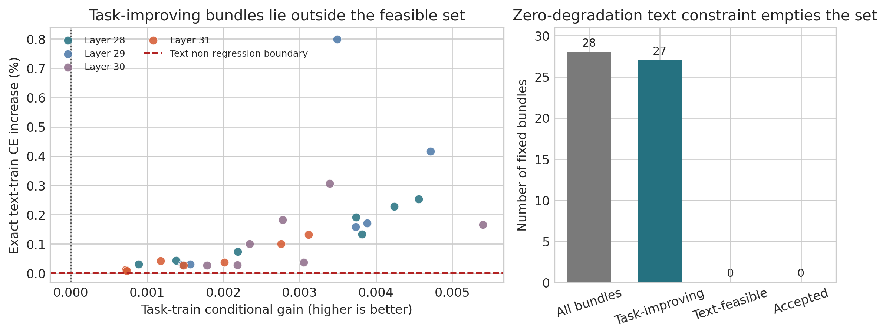

# 任务收益不是语言保持方向：2-bit Block-Scaled VQ 中 Assignment 局部可行域的坍塌

## 摘要

极低比特向量量化不仅要构造紧凑码本，还要判断当前硬码字附近的离散 assignment 自由度能否在不破坏通用
语言行为的前提下用于任务适应。本文研究约 2.12 bpp 的 block-scaled shared-codebook VQ：每个权重 block 先由
scale 归一到共同数值领域并共享 4096 个六维码字，Vector-GPTQ 再用激活二阶信息与误差反馈形成硬锚点；
锚点之后只允许 assignment 在当前码字的 8-way 邻域内变化。此前集合条件搜索能在 Meta-Llama-3.1-8B-
Instruct 最后四层找到真实任务收益，却使 held-out 文本 teacher CE 恶化。为区分“事后泛化失败”与“局部
动作本身冲突”，我们固定原有 28 个 curvature top-128 bundle，以完整 4096×4096-token 数据上、固定
top-32 teacher 分布的 exact full-vocabulary cross entropy 定义不可交易的零退化可行域，并只在可行域内
最小化任务训练损失。计算通过 128-GiB prefix cache、候选
batch 重放和分块词表精确 CE 在单卡上完成，不使用 token sketch。正式结果显示，28 个 bundle 中 27 个严格
改善任务目标，但这 27 个的文本 CE 全部上升；最小相对代价仍为 +0.00785%，因此四层可行集均为空，最终
接受 0 个 switch。程序按预注册合同不访问 validation/audit、不写 checkpoint、不运行 PPL 或 lm_eval。
这一结果不是新部署端点，也不证明 assignment 全局不可行；它揭示在当前硬锚点、最后四层与固定 bundle
粒度下，任务收益丰富而零文本代价方向缺失。下一步若继续，必须改变可行动作本身，例如构造有原理的跨层
补偿坐标，而不是只对同一固定动作集合重排序或事后放宽阈值。

**关键词：** 大语言模型量化；向量量化；共享码本；离散 Assignment；可行域；任务适应；语言保持

## 1 引言

2-bit 大语言模型量化把连续权重压入极为稀疏的离散空间。向量量化（VQ）用一个索引表示多个权重，能够在
相同比特预算下利用码字 shaping 提高表示效率；但其优化变量不再是相互独立的标量 rounding，而是会沿注意力、
MLP 与残差流相互作用的整数 assignment 集合。AQLM、QuIP# 与 QTIP 已表明，极低比特质量依赖表示几何、
二阶敏感度和可实现编码的共同设计 [3--5]。然而，部署对象最终仍是硬整数索引：局部重构更小、soft loss
下降或某个候选的一阶方向为负，都不能自动授权一组硬切换进入模型。

本文从一种 block-scaled shared-codebook VQ 表示出发。不同动态范围的权重 block 先通过 group scale 映射到
共同归一化领域，使整层可复用一套 4096×6 码本；几何 VQ 给出初始码字，Vector-GPTQ 再在每个向量的
top-128 几何候选中加入激活 Hessian 代理，并把当前量化误差反馈给后续列，形成可部署的硬锚点。这个过程
回答“如何获得低失真的 VQ 表示”。锚点形成后，当前码字附近的 assignment 是不增加码本或逻辑码率的剩余
自由度：可以用 binary Concrete/Gumbel 概率训练局部开关，也可以直接比较有限硬 bundle。真正困难不是
assignment 是否可训练，而是训练得到的离散动作是否同时保持任务与语言行为。

一系列正式实验逐步排除了更简单的失败解释。聚合一阶梯度曾在 98.20% 的开放向量上找到预测下降邻居；
四个互斥任务/文本视图的严格符号共识将资格率降至 48.71%，但硬集合仍失败；scale-conditioned 局部曲率
在 4/4 个 matched budget 上优于共识排序，却仍不能超过冻结 source。随后，因果集合条件搜索不再相加独立
分数，而是在已经接受的硬状态下真实测量每个 Linear bundle 的任务边际收益。它在最后四层各接受一个坐标，
使任务训练联合损失改善 2.73%，held-out 任务 loss 改善 1.09%；但独立文本 validation CE 恶化 0.919%。
这说明集合交互计分可以被真实 forward 缓解，新的瓶颈是目标错位：task-only 收益能够消费语言保持裕量。

由此产生一个比继续改 scorer 更直接的问题：若文本保持不是加权项，而是在候选接受时不可交易的约束，原有
局部 assignment 空间中是否仍存在任何正任务收益方向？本文固定上一实验的模型、硬锚点、28 个 curvature
top-128 bundle、层序与数据；不更换 seed，不扫描 bundle、文本预算、学习率或 group。对每个候选先测量真实
task-train 条件收益，仅当严格改善时才计算固定 top-32 teacher 分布上的 exact full-vocabulary text-train CE；
可行候选必须满足文本 CE 相对当前状态不增加，然后才按任务 loss 排序。Validation 和 audit 在整个搜索中
不可见。零退化在本文中是检验“无需交易的方向是否存在”的机制探针，不是现实部署的唯一容忍度；任何非零
预算都属于需要重新预注册和独立审计的新实验。

Figure 1 给出核心观察。在 28 个固定 bundle 中，27 个严格降低任务训练目标；但所有 27 个都位于文本零退化
边界之上，text-feasible 数量为 0。最温和的 layer-31 MLP down bundle 只增加 0.00785% 文本 CE，却仍违反
预注册的零预算。四层因此均保持 source，accepted switches 为 0。这个结果可被任何一个 task-improving 且
text-nonregressing 候选反证，但正式全量计算没有观察到这样的候选。

本文贡献如下：

1. 提出精确文本约束的离散 assignment 可行性检验：固定 top-32 teacher 分布上的 exact full-vocabulary
   text-train CE 先定义不可交易可行域，task gain 只在域内排序，从优化问题上消除损失权重之间的购买关系。
2. 建立单卡全量计算与审计合同：4096×4096-token 文本通过 128-GiB layer-prefix cache、候选 batch 重放与
   8192 词表分块计算数学等价的精确 CE；task/text cache 分别通过同 batch 完整模型 parity。
3. 给出明确的局部机制边界：当前固定 bundle 空间中任务收益并不稀缺（27/28），但零文本代价方向缺失
   （0/27）。证据否决在同一固定动作集合内仅靠重排序找到零退化端点，却不外推为其他 scorer、粒度、
   组合动作或所有 assignment 的全局不可能性。

## 2 相关工作

### 2.1 二阶后训练量化与误差传播

OBQ 与 GPTQ 以校准激活构造近似 Hessian，并在顺序量化时把当前误差反馈给尚未量化的权重 [1,2]。关键
思想不是固定的 Q/K/V/O/MLP 顺序，而是使后续决策感知先前离散误差。本文的 Vector-GPTQ 将候选单位从
标量网格扩展为六维共享码字；它形成后续实验固定的硬锚点，而不是本文声称首次提出 Hessian-aware rounding。

BRECQ 通过 block reconstruction 减少局部参数误差与网络行为的差距 [6]，模块级重构也常用于降低整模型
训练成本 [7]。这类方法支持“越靠近模型函数的目标越可靠”，但局部 block output 仍不等同最终任务和跨域
语言行为。本文同时报告曲率--即时 block MSE 正控制和最终 task/text 目标：前者检验局部计算是否工作，
后者决定离散动作是否可行。

### 2.2 极低比特向量与结构化编码

AQLM 以多个码本的加性组合和 Transformer-block 联合优化改善 2-bit 表示，并提供实际 GPU/CPU kernel [3]。
QuIP# 先通过随机 Hadamard 变换改善 weight/Hessian incoherence，再用 E8 格码匹配近球形权重分布 [4]。
QTIP 以 trellis code 解耦有效量化维度和指数码本规模，同时把推理结构纳入设计 [5]。GPTVQ 也把 GPTQ 式
二阶敏感度扩展到向量候选 [8]。这些方法的核心贡献是通用 PTQ 质量--效率 Pareto；本文没有产生新部署
checkpoint，因此只把它们作为目标标准，不能复用 source 指标声称超过这些方法。

### 2.3 离散量化变量与 Gumbel 训练

Gumbel-Softmax/Concrete 提供对 categorical 离散变量的连续可微松弛 [14,15]。PV-Tuning 直接交替优化离散与
连续量化变量，说明 assignment 优化本身已有明确先验 [10]。2026 年 GSQ 预印本进一步在少量标量 levels 上
联合学习 per-coordinate assignment 与 group scale，并强调现有 scalar kernel 兼容性 [9]。因此，本文不把
“用概率训练 assignment”单独包装为创新；我们的研究对象是 block-scaled 共享 VQ 中当前码字附近的有限硬
动作，以及从 soft/proposal 信号到可部署整数状态之间的可信门禁。

### 2.4 多目标约束与分布保持

加权和将不同目标放在可交易标尺上：一个足够大的任务收益可以覆盖 teacher KL 或文本 CE 上升。多任务梯度
冲突也说明平均方向可能隐藏特定域退化 [11]。本文采用词典序约束，不学习权重系数：文本非退化先定义可行
集合，任务目标只在其中排序。该规则比事后 validation guard 更严格，但它仍只是训练分布上的必要条件，
不是部署充分证书；若产生非零端点，仍需独立 validation、candidate-unexposed audit 和正式 benchmark。

## 3 方法

### 3.1 Block scale 后的共享码本 VQ

将 Linear 权重切分为 $d$ 维向量 $w_i\in\mathbb R^d$，实验中 $d=6$。向量所属 scale group 为 $g(i)$，
共享码本为 $\mathcal C=\{c_1,\ldots,c_K\}$，$K=4096$。先在归一化领域执行 VQ：

$$
u_i=\frac{w_i}{s_{g(i)}},\qquad
a_i=\arg\min_k\|u_i-c_k\|_2^2,
$$

部署时重构

$$
\hat w_i=s_{g(i)}c_{a_i}.
$$

Block scale 不是简单后处理：它把不同 block 的幅值映射到共同领域，使一套有限码本可在整层复用。码本描述
归一化形状，FP16 scale 恢复局部幅值，整数 assignment 决定每个向量选择哪个共享原型。计入码本、scale 与
元数据后，实验 source 的逻辑码率为 2.1207557 bpp。

### 3.2 Hessian-aware Vector-GPTQ 硬锚点

纯几何最近邻只最小化参数空间距离。Vector-GPTQ 先保留每个六维向量的 top-128 几何码字，再用校准激活
构造的二阶代理选择候选。选定第 $j$ 个量化单位后，将误差 $e_j$ 反馈给尚未量化的列：

$$
W_{:,j+1:}\leftarrow W_{:,j+1:}-e_j
\frac{H^{-1}_{j,j+1:}}{H^{-1}_{jj}}.
$$

得到硬状态 $(s^0,a^0,\mathcal C)$。本文后续固定 codebook、normalizer、scale、元数据与逻辑码率；任何
候选状态只改变整数 assignment。因此零 switch 与 source bit-exact 等价，非零 switch 也不增加模型格式。

### 3.3 当前码字附近领域、概率训练与固定 Bundle

对 anchor $c_{a_i^0}$，只考虑包含自身和七个几何邻居的 $\mathcal N(a_i^0)$。候选 $c$ 对真实权重的有限跳转为

$$
\delta_i(c)=s_{g(i)}^0(c-c_{a_i^0}).
$$

若执行概率训练，anchor 与一个选定 alternative 可由 binary Concrete switch 表示：

$$
p_i=\sigma((z_i+\eta_i)/\tau),\qquad
\widetilde w_i=(1-p_i)s^0c_{a_i^0}+p_i s^0c_{a_i^1},
$$

其中 $\eta_i$ 为 logistic/Gumbel 噪声。该参数化只训练 assignment 开关，不训练码本或增加码率；anchor
始终提供零步安全状态。但 V10--V13 表明，soft 概率或逐候选预测不能替代真实硬集合评估。V14 因此不再训练
$z_i$，而隔离固定硬动作的可行性。

固定 bundle 沿用上一版 proposal。完整 train 确定性分为四个互斥任务/文本视图；候选一阶变化为

$$
\Delta_i^{(v)}(c)=\langle g_i^{(v)},\delta_i(c)\rangle.
$$

同一 backward 中累计 Linear 输入二阶矩 $m_j=\mathbb E[x_j^2]$，定义局部输出曲率

$$
q_i(c)=\sum_jm_j\delta_{ij}(c)^2.
$$

只保留四视图均预测下降的邻居，并按 $\max_v\Delta_i^{(v)}(c)/\sqrt{q_i(c)+\epsilon}$ 排序。每个 Linear
固定 top-128 构成 $B_{\ell,m}$。V14 不改变这些 bundle；proposal 分数只提供动作，接受完全由真实 task/text
目标决定。

### 3.4 精确文本约束的词典序搜索

任务训练目标为五任务等权 supervised CE 与 dense-teacher KL：

$$
F(S)=\frac1{|\mathcal T|}\sum_{t\in\mathcal T}
\left[\mathcal L_{\rm sup}^t(S)+0.25\mathcal L_{\rm KL}^t(S)\right].
$$

在当前硬状态 $S_{\ell-1}$ 下，对第 $\ell$ 层七个 Linear bundle 分别计算

$$
G_{\ell,m}=F(S_{\ell-1})-F(S_{\ell-1}\cup B_{\ell,m}).
$$

只有 $G_{\ell,m}>10^{-7}$ 才进入文本计算。令文本 teacher CE 为 $T(S)$，定义可行集合

$$
\mathcal F_\ell(S)=\left\{m:G_{\ell,m}>10^{-7},\quad
T(S\cup B_{\ell,m})\le T(S)\right\}.
$$

若 $\mathcal F_\ell$ 非空，选择其中 $F(S\cup B)$ 最小者；否则该层保持不变。这个顺序不是把文本 loss
权重设得更大，而是禁止任意 task gain 购买文本退化。若接受发生，则 task loss 严格下降且文本 train CE
单调不增；但这些性质只针对 train，仍不能推出 held-out 或正式 benchmark。

### 3.5 完整文本缓存与精确分块 CE

Text train 包含 4096 条长度 4096 的序列，共 16,777,216 token。Source 状态在首个搜索层输入处缓存完整
BF16 hidden：

$$
4096\times4096\times4096\times2
=137{,}438{,}953{,}472\text{ bytes}=128\text{ GiB}.
$$

对当前层，所有 task-improving bundle 共享 incumbent prefix；仅覆盖候选 Linear 权重，后续层保持 incumbent。
候选最终 hidden 沿 batch 维拼接，提高单卡 LM-head GEMM 利用率。该并行改变调度和内存布局，但总 FLOPs
仍随候选数线性增长。

为避免物化 `candidate × token × vocabulary` logits，LM head 按 8192 词表块计算。对每个块更新全词表精确
log-sum-exp，并收集 teacher top-32 token 的期望 logit：

$$
H(p_T,p_B)=\operatorname{LSE}(z_B)-\sum_{j\in\operatorname{topk}(T)}p_T(j)z_B(j).
$$

这里 teacher 已被固定截断并重归一化；对该固定 teacher 分布，上式与一次性完整词表 softmax 的 cross
entropy 数学等价。由于 teacher entropy 对候选不变，候选 CE 差也等于相应 KL 差。所有路径使用
`hidden[:, :-1]` 对齐 next-token teacher。

### 3.6 数据隔离与 Fail-Closed 合同

搜索前只构造 task/text train teacher。Task validation 每任务 256 条、text validation 128 条，task audit
每任务 31 条、text audit 64 条，索引与 train 互斥。只有产生非零 endpoint 才允许 validation；validation
通过后才构造 candidate-unexposed audit teacher；audit 通过后才写 checkpoint，并运行 WikiText2 raw test
（sequence length 2048）和 ARC-C、ARC-E、HellaSwag、LAMBADA、PIQA、WinoGrande 全量 0-shot lm_eval。

Task cache 用 32 个跨任务、长度与 continuation 起点的同 batch 完整 HF 前向做 parity，误差阈值 0.02。
Text cache 用覆盖首尾的 8 条完整序列比较相同 batch 的 HF transformer 与分块精确 LM head，CE 阈值 0.001。
任一 parity 失败视为基础设施失败；零 switch 视为方法不可行，不访问 held-out 数据。

## 4 实验

### 4.1 实验设置

模型为 Meta-Llama-3.1-8B-Instruct，source 为已审计 task group-scale 硬端点，逻辑码率 2.1207557 bpp。开放
layers 28--31 的 28 个 Linear，共 145,465,344 个六维向量。每个 Linear 只有一个固定 top-128 bundle，
每层最多接受一个。任务为 ARC-Challenge、ARC-Easy、HellaSwag、PIQA 和 WinoGrande，每任务使用
512/256/31 条互斥 train/validation/audit。文本使用 4096/128/64 条长度 4096 的互斥序列。

实验固定四个 gradient views、8-way 邻域、bundle size 128、层序和零文本退化预算，没有 seed、bundle、
层序、阈值、学习率或 group 扫描。只使用本机物理 GPU5 单卡，未使用服务器 14。运行耗时 13,303.33 秒
（3.695 小时），PyTorch 峰值 27,149,745,152 bytes（25.285 GiB）。

### 4.2 缓存重放是否可信？

Task prefix cache 包含 2560 个任务样本、8193 个 choice 和 353,058 个 token。32 例 parity 覆盖五个任务，
总长度 11--163、continuation 起点 7--133；cache 与完全相同 batch composition 的完整 HF 前向最大
choice-score 误差为 $1.1444\times10^{-5}$，32/32 argmax 一致。

Text cache 包含 4096×4096 token，hidden bytes 与理论值均为 137,438,953,472。Parity 行为
0、585、1170、1755、2340、2925、3510、4095，覆盖数据首尾；cache replay 与同 batch 完整 HF transformer
路径的最大和平均 CE 误差均为 0。因此后续空可行域不能归因于 next-token 错位、分块 CE 近似或 cache replay
漂移。需要强调，parity 抽检 8 行，不是把 4096 行逐一做双路径比较；4096 行都参与正式约束目标。

### 4.3 任务收益是否存在？

| 层 | Task-improving / 7 | 最大任务增益（Linear） | 曲率--即时 block MSE Spearman |
|---:|---:|---:|---:|
| 28 | 7 | 0.0045590（K projection） | 0.9643 |
| 29 | 6 | 0.0047145（MLP gate） | 0.3571 |
| 30 | 7 | 0.0054025（MLP up） | 0.5714 |
| 31 | 7 | 0.0031168（K projection） | 0.7143 |

28 个固定 bundle 中 27 个严格降低 task-train combined loss，说明任务收益方向并不稀缺。唯一失败项是
layer-29 Q projection，条件收益为 $-6.32\times10^{-5}$，按预注册合同不再计算文本 CE。各层最大收益落在
不同 Linear，且曲率--即时 block MSE 相关从 0.357 到 0.964，进一步说明局部重构信号可提出动作却不能替代
双目标可行性裁决。

### 4.4 任务收益与文本保持是否有交集？

| 层 | Task-improving | Text-feasible | 本层最小文本 CE 增幅（Linear） |
|---:|---:|---:|---:|
| 28 | 7 | **0** | +0.02976%（MLP down） |
| 29 | 6 | **0** | +0.02896%（O projection） |
| 30 | 7 | **0** | +0.02603%（O projection） |
| 31 | 7 | **0** | +0.00785%（MLP down） |

Source text-train CE 为 2.1035536536。27 个被评估候选的 CE 全部上升；全局最小绝对增量为
0.000165183（相对 +0.0078526%），最大为 0.016824409（相对 +0.7998089%）。因此四层
$\mathcal F_\ell$ 均为空。V13 中每层任务最优坐标并非只是偶尔撞上文本坏方向；在固定 bundle 粒度下，所有
正任务方向都需要支付正文本代价。

最小增幅在常规评测噪声尺度上看很小，但本版不能事后把它视为可忽略：零预算是实验前固定的定义，目的是检验
是否存在真正不交易语言保持的局部动作。若看到 +0.00785% 后再扫描 0.01%、0.05% 或 0.5% 阈值，就会把
方法检验退化为使用同一数据选择预算。非零容忍度是另一个科学问题，需要独立预注册与 held-out 审计，而不是
V14 的补救解释。

### 4.5 终态与正式基线边界

四层都未接受 bundle，当前任务损失和文本 CE 与 source 完全相同，accepted bundles/switches 为 0。Launcher
写入 `text_constrained_gain_rejected` 并正常退出 0。由于不存在候选 endpoint，task/text validation 均为
`null`，audit 未访问，checkpoint 未写，formal test data 未使用。

因此 V14 没有新的 WikiText2 PPL 或六任务准确率，也没有可用于部署的模型。Source 的历史 PPL 与 QTIP/GSQ
对比不属于 V14 新测量，不能在表格中伪装为本方法结果。尤其是 QTIP 属于通用无标签 PTQ，当前 task gain
来自目标任务标签与 teacher 的联合训练目标；即使 V14 产生 endpoint，也必须先明确监督成本和评测协议才能
公平比较。

### 4.6 机制解释：失败发生在评分器之后、动作空间之内

V10--V12 主要检验“独立代理能否给动作排序”，V13 检验“真实条件 forward 能否修复集合交互”，V14 则检验
“真实 task gain 与 text non-regression 是否在同一动作中共存”。27 个 task-improving 候选说明 scorer 已经能
提出真实任务方向；0 个 text-feasible 候选说明仅把文本目标加入接受规则不会创造新方向。问题由 selection
rule 转移到 action space。

对两个目标的一阶局部变化，可把单个 bundle 写为向量

$$
v(B)=\left(\Delta L_{\rm task}(B),\Delta L_{\rm text}(B)\right).
$$

V14 观测到的 27 个点都落在 $\Delta L_{\rm task}<0,\Delta L_{\rm text}>0$ 象限。词典序过滤只能从已有点中
选择，不能把点移动到双非正象限。要获得非空可行域，必须产生新的动作：例如把大 bundle 分解为有理论依据的
可撤销子结构，或组合一个 task-improving 动作与一个 text-restoring 补偿动作。后者还需控制非线性交互，
不能简单相加独立一阶分数。

### 4.7 局限

实验只覆盖一个 8B Instruct 模型最后四层，不能外推到全模型、Base 模型、70B 或其他模型族。固定 top-128
bundle 是从局部曲率 proposal 导出的单一粒度；空可行域不排除单 switch、更小结构或跨层组合存在解。文本
目标是固定 top-32 teacher 分布上的精确 full-vocab cross entropy，而不是原始 dense teacher 的全分布 CE，
也不是生成质量、长上下文、代码或事实性指标。零退化 train 约束是必要性探针，不是部署充分证书。每层正控制
只有七个 Linear，Spearman 只能作诊断。完整 text cache 需要 128 GiB 宿主内存且 3.695 小时只检验 27 个
候选，计算成本也限制其作为通用训练算法的实用性。

## 5 结论

本文在 2-bit block-scaled shared-codebook VQ 中检验了一个自然但未经验证的假设：只要把文本保持提前写进
离散 assignment 的接受规则，就能保留任务条件收益并得到安全端点。固定上一版全部候选后，27/28 个 bundle
确有任务收益，但 0/27 满足固定 top-32 teacher 分布上的 exact full-vocabulary text-train CE 零退化；
最终 0 switch，并按合同停止在 validation 之前。

这一负结果把研究边界进一步收紧。Block scale 与 Vector-GPTQ 能形成稳定硬表示，当前码字附近也存在丰富的
任务适应方向；但在当前最后四层、top-128 bundle 粒度下，这些方向不是免费的语言保持方向。继续调 scorer、
seed、group 或文本阈值不会回答这个机制问题。若继续 assignment 主线，下一方法必须改变可行动作，并在
train 上先满足 $G_{\rm task}(A)>0$ 且 $T(S\cup A)\le T(S)$，之后才允许访问 validation/audit；否则应把
local assignment 明确定位为 task-adapted quantization，而非通用 PTQ 的质量恢复模块。

## 参考文献

[1] Frantar, E., et al. Optimal Brain Compression: A Framework for Accurate Post-Training Quantization and Pruning. NeurIPS, 2022.

[2] Frantar, E., et al. GPTQ: Accurate Post-Training Quantization for Generative Pre-trained Transformers. ICLR, 2023.

[3] Egiazarian, V., et al. Extreme Compression of Large Language Models via Additive Quantization. ICML, 2024.

[4] Tseng, A., et al. QuIP#: Even Better LLM Quantization with Hadamard Incoherence and Lattice Codebooks. ICML, 2024.

[5] Tseng, A., et al. QTIP: Quantization with Trellises and Incoherence Processing. NeurIPS, 2024.

[6] Li, Y., et al. BRECQ: Pushing the Limit of Post-Training Quantization by Block Reconstruction. ICLR, 2021.

[7] Bai, H., et al. Towards Efficient Post-training Quantization of Pre-trained Language Models. NeurIPS, 2022.

[8] van Baalen, M., et al. GPTVQ: The Blessing of Dimensionality for LLM Quantization. arXiv, 2024.

[9] Dadgarnia, A., et al. GSQ: Highly-Accurate Low-Precision Scalar Quantization for LLMs via Gumbel-Softmax Sampling. arXiv, 2026.

[10] Malinovskii, V., et al. PV-Tuning: Beyond Straight-Through Estimation for Extreme LLM Compression. NeurIPS, 2024.

[11] Yu, T., et al. Gradient Surgery for Multi-Task Learning. NeurIPS, 2020.

[12] Chee, J., et al. DiscQuant: Data-Driven Rounding Meets Low-Rank Gradient Discrepancy for Efficient LLM Quantization. COLT, 2025.

[13] Chee, J., et al. QuIP: 2-Bit Quantization of Large Language Models With Guarantees. NeurIPS, 2023.

[14] Jang, E., Gu, S., and Poole, B. Categorical Reparameterization with Gumbel-Softmax. ICLR, 2017.

[15] Maddison, C., Mnih, A., and Teh, Y. The Concrete Distribution: A Continuous Relaxation of Discrete Random Variables. ICLR, 2017.
