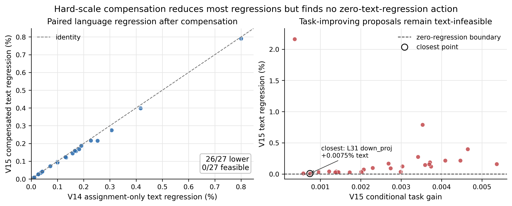

# 局部幅值修复不是语言保持方向：2-bit Block-Scaled VQ 中 Hard Assignment 后的 Scale 补偿边界

## 摘要

极低比特向量量化（VQ）不仅要把权重映射到紧凑码本，还要判断硬码字附近的离散 assignment 自由度能否在不牺牲通用语言行为的前提下用于任务适应。本文研究一种约 2.12 bpp 的 block-scaled shared-codebook VQ：每个权重 block 先通过 FP16 scale 归一到共同数值领域，再共享 4096 个六维码字；随后 Vector-GPTQ 在每个向量的 top-128 几何候选中引入激活二阶信息和误差反馈，形成可部署的硬 assignment 锚点。锚点之后，当前码字 8-way 邻域内仍存在不增加码本和逻辑码率的离散动作，可由概率开关训练或由固定硬 bundle 评估。此前严格文本约束实验表明，固定 28 个 curvature top-128 assignment bundle 中 27 个改善任务训练目标，却全部提高固定 teacher top-32 分布、学生端 full-vocabulary normalization 的 4096×4096-token 文本 CE，零退化可行集为空。本文检验一个更强但最小的动作空间扩展：先提交真实 hard assignment bundle，再只对被切换向量触及的现有 row/input group 计算闭式加权最小二乘 scale 补偿，并在 FP16 舍入后的最终硬状态上重新评分。正式结果显示，hard-first scale compensation 使局部 weighted anchor error 从 1.503737 降到 1.474448（-1.9477%），并在 26/27 个可比动作上降低 assignment-only 文本退化；但 28/28 个任务收益动作仍有文本 CE 上升，最接近点仍为 +0.0074999%，最终接受 0 个 switch。该结果不是部署端点，也不声称超过 QTIP、GSQ 或 source；它否决了一个自然局部修复解释：当前 VQ 邻域中的问题不只是“码字方向改变后幅值未跟上”，单个局部乘性 scale 能缓解语言代价，却不能创造零文本代价的任务收益方向。

**关键词：** 大语言模型量化；向量量化；共享码本；Vector-GPTQ；离散 Assignment；Scale 补偿；语言保持

## 1 引言

2-bit 大语言模型量化把连续权重压入极小的离散空间。标量量化把每个权重独立舍入到少量 levels；向量量化则用一个整数索引表示多个权重，能够通过码字形状（codeword shaping）更有效地利用比特预算。代价是优化变量从独立标量 rounding 变成一组相互耦合的离散 assignment：一次码字替换会同时改变多个维度，并通过 attention、MLP 与 residual stream 影响后续层。

本文的出发点是一个 block-scaled shared-codebook VQ 表示。权重先被切分成六维向量；每个 row/input group 使用 FP16 scale 把局部幅值归一到共同领域；所有 group 共享同一套 4096×6 码本。这样，码本学习的是归一化后的“形状”，scale 恢复局部幅值，assignment 决定每个六维向量采用哪个共享原型。该设计把“表示几何”和“幅值范围”拆开，使 2-bit 左右的逻辑码率仍能表达非均匀权重分布。

仅靠几何最近邻还不够。我们使用 Vector-GPTQ 形成硬锚点：对每个六维向量保留 top-128 几何近邻，再用校准激活构造的 Hessian 代理选择候选，并把当前量化误差反馈给后续列。它是 GPTQ 思想在 VQ 候选空间中的对应版本：决策单位从标量 grid 变成六维 codeword，误差反馈仍让后续选择感知先前离散误差。经过这一阶段，模型已经拥有可部署的整数 assignment、FP16 scale 和固定码本。

锚点之后仍有一个容易被低估的问题：当前码字附近的 assignment 是否还能被“训练”成更好的模型？这不是码本重训练，也不是增加额外 residual，而是在同一个码率下重新选择部分向量的邻近码字。概率化训练（例如 binary Concrete 或 Gumbel-Softmax）可以给 assignment 开关提供梯度；固定 bundle 评估可以避免 soft-to-hard 失配，直接测量最终整数状态。真正的科学问题不是 assignment 能不能优化某个局部 loss，而是它在硬化后是否存在同时改善任务且保持语言分布的可行动作。

此前实验给出了一个尖锐现象。对 Meta-Llama-3.1-8B-Instruct 最后四层的 28 个 Linear，固定 curvature-ranked top-128 assignment bundle，并把固定 teacher top-32 分布、学生端 full-vocabulary normalization 的 text-train CE 作为不可交易约束：候选只有在任务训练 loss 下降且文本 CE 不增加时才能被接受。结果是 27/28 个 bundle 改善任务训练目标，但 0/27 个满足文本非退化；最小文本代价仍为 +0.0078526%。这说明任务收益方向很多，但在该固定 assignment-only 动作空间内没有观察到“免费方向”，即 task-improving 且 text-CE-nonregressing 的动作。

本文问一个更进一步、也更接近 VQ 结构的问题：V14 的失败是否只是因为 assignment 改变了归一化码字方向，却没有同步修复对应 block 的幅值？如果是，那么 hard assignment 之后对被触及 group 重新计算 scale，可能把文本 CE 拉回 source，同时保留任务收益。我们因此提出 hard-first local scale compensation：先提交真实硬 assignment bundle，再只对被切换向量覆盖的已有 row/input group 求一个闭式加权最小二乘 scale；scale 先舍入为 FP16，再进行 task/text 评分。该动作不引入学习率、epoch、正则强度或 validation 选择，也不改变码本、normalizer、未触及 scale、未选 assignment 与逻辑码率。

正式实验显示，这个补偿确实不是无效操作。它把全部 touched groups 的局部 weighted anchor error 降低 1.9477%，并在 26/27 个与 V14 可比的 task-improving assignment 上降低文本退化，平均减少 0.0072663 个百分点。最典型地，layer-31 `mlp.down_proj` 的文本退化从 +0.0078526% 降到 +0.0074999%。但所有 28 个 paired 动作仍严格提高完整文本 CE，text-feasible 数量仍为 0，最终 checkpoint 不写入，validation/audit/PPL/lm_eval 均按预注册合同不访问。

本文贡献如下：

1. 检验 hard-first local scale compensation 这一 VQ assignment 后的最小动作空间扩展：在最终硬码字状态上闭式修复 touched group 的 FP16 scale，以直接测试 soft--hard 错位之外的局部幅值解释。
2. 给出一个可证伪的 VQ 机制诊断：局部幅值补偿几乎一致降低 assignment-only 文本代价并降低局部 hard-weight anchor error，但不足以让任何任务收益动作进入零文本退化可行域。
3. 建立严格的负结果边界：该实验只否决当前 Llama-3.1-8B 最后四层、固定 top-128 邻域 bundle、零文本预算下的局部乘性修复路线；它不外推为所有 assignment 全局不可行，也不构成新部署端点或 SOTA 声明。

## 2 相关工作

### 2.1 二阶后训练量化与误差反馈

OBQ/OBC 和 GPTQ 使用校准激活构造近似 Hessian，并在顺序量化时把当前误差反馈给尚未处理的权重。其核心不是某个固定 Linear 顺序，而是让后续离散决策感知先前误差。本文的 Vector-GPTQ 沿用这一原则，但把候选单位从标量 levels 扩展到六维 VQ codeword：先用几何近邻缩小候选，再用二阶代理和误差反馈选择硬 assignment。它形成后续 assignment 训练和补偿实验的 source 锚点。

### 2.2 极低比特向量量化与结构化编码

AQLM、QuIP#、QTIP 等方法说明，极低比特 LLM 量化不能只看局部参数误差，还要同时考虑表示几何、二阶敏感度、编码结构和推理可实现性。本文不把这些方法作为被击败的 baseline，因为 V15 没有产生新的可部署 checkpoint，也没有运行正式 PPL 或 accuracy。它们在本文中的作用是定义研究标准：一个真正可用的 2-bit VQ 方法最终必须在相同模型、相同评测和真实端点下证明质量--效率 Pareto。

### 2.3 离散 assignment 的概率训练

Gumbel-Softmax 与 Concrete 分布为离散 categorical 或 binary 变量提供连续可微松弛。用于量化时，assignment 可以被写成锚点码字与邻近码字之间的概率开关，并通过任务或蒸馏 loss 训练 logits。PV-Tuning 和 GSQ 等工作也说明，学习离散 assignment 与 scale 是自然方向。因此，本文不把“用概率训练 assignment”本身包装为唯一创新，而是强调从 soft/proposal 信号到最终 hard integer state 的可信门禁：最终接受必须由真实硬状态上的任务收益和语言保持共同决定。

### 2.4 局部重构、Scale 与多目标约束

Block reconstruction 类方法试图缩小局部参数误差与网络行为之间的差距；scale 学习或重参数化则常用于把难表示的幅值分布迁移到更易量化的空间。本文的 scale compensation 属于更受限的变体：它不重新训练 scale，也不优化 validation loss，只在 hard assignment 后对 touched group 做一维闭式投影。多目标方面，加权和会允许任务收益“购买”文本退化；本文采用词典序约束，先要求固定 teacher top-32 分布、学生端 full-vocabulary normalization 的 text-train CE 不增加，再比较任务 loss。这个规则更适合作为机制探针，因为任何一个可行动作都能直接反证“局部邻域无免费方向”。

## 3 方法

### 3.1 Block scale 后的共享码本 VQ

将一个 Linear 权重矩阵切分为六维向量 \(w_i\in\mathbb R^6\)。向量 \(i\) 所属的 row/input group 为 \(g(i)\)，共享码本为 \(\mathcal C=\{c_1,\ldots,c_K\}\)，其中 \(K=4096\)。VQ 在归一化领域进行：

\[
u_i=\frac{w_i}{s_{g(i)}},\qquad
a_i=\arg\min_k\|u_i-c_k\|_2^2,\qquad
\hat w_i=s_{g(i)}c_{a_i}.
\]

这一分解有三个变量：码本描述跨 block 共享的归一化形状；FP16 scale 描述局部幅值；整数 assignment 描述每个向量选择哪个形状。本文所有后续实验都固定码本大小、向量维度、逻辑格式和 source bit rate（约 2.1207557 bpp）。

### 3.2 Vector-GPTQ 硬锚点

几何 VQ 只最小化 \(\|u_i-c_k\|^2\)，没有利用激活分布。Vector-GPTQ 先为每个向量保留 top-128 几何候选，再使用校准输入 \(X\) 形成 Hessian 代理 \(H=X X^\top\)。选择第 \(j\) 个量化单位后，将对应误差 \(e_j\) 反馈给后续列：

\[
W_{:,j+1:}\leftarrow W_{:,j+1:}-e_j
\frac{H^{-1}_{j,j+1:}}{H^{-1}_{jj}}.
\]

与标量 GPTQ 相比，这里的候选不是单个数值 level，而是六维 codeword；误差反馈仍在列空间传播。输出是硬状态
\[
S^0=(a^0,s^0,\mathcal C,\text{normalizer},\text{metadata}),
\]
后续动作必须从该状态出发，并在部署格式中保持可表示。

### 3.3 邻域 assignment 与硬 bundle

对每个锚点码字 \(c_{a_i^0}\)，只开放包含自身和七个几何邻居的局部邻域 \(\mathcal N(a_i^0)\)。替换到邻居 \(c\) 的真实权重跳转为

\[
\delta_i(c)=s_{g(i)}^0(c-c_{a_i^0}).
\]

若采用概率训练，可令锚点和一个 alternative 之间的开关为

\[
p_i=\sigma((z_i+\eta_i)/\tau),\qquad
\widetilde w_i=(1-p_i)s^0c_{a_i^0}+p_i s^0c_{a_i^1},
\]

其中 \(\eta_i\) 为 logistic/Gumbel 噪声，\(z_i\) 是 assignment logit。该训练只改变 assignment 概率，不改变码本或码率。但为了避免 soft-to-hard 投影后指标失真，本文的正式检验沿用固定 hard bundle：四个互斥 train 视图给出一阶变化

\[
\Delta_i^{(v)}(c)=\langle g_i^{(v)},\delta_i(c)\rangle,
\]

并用 Linear 输入二阶矩 \(m_j=\mathbb E[x_j^2]\) 构造局部曲率

\[
q_i(c)=\sum_j m_j\delta_{ij}(c)^2.
\]

仅保留四视图均预测下降的邻居，按 \(\max_v \Delta_i^{(v)}(c)/\sqrt{q_i(c)+\epsilon}\) 排序，每个 Linear 取 top-128 形成固定 bundle \(B_{\ell,m}\)。Proposal 分数只决定候选集合；最终接受只看真实硬 forward。

### 3.4 Hard-first local scale compensation

V14 的 assignment-only 动作保持 \(s^0\) 不变。V15 改变一次动作的定义：先把 \(B_{\ell,m}\) 真实写入 assignment，得到新的归一化重建 \(q^1\)，再只对被切换向量触及的 row/input group 重新计算 scale。

对一个 touched group，记原硬重建的归一化向量为 \(q^0\)，新 assignment 的归一化向量为 \(q^1\)，原 scale 为 \(s^0\)，column normalizer 为 \(r_j\)，并令权重 \(w_j=r_j^2\)。实现中的 row normalizer 在同一 row/group 内对新旧重建是公共正比例项，因而从该一维 argmin 中抵消。补偿目标不是拟合原始 FP16 权重，而是让新 hard assignment 的带 scale 重建尽量靠近 incumbent hard source：

\[
\min_s \sum_j w_j(s q^1_j-s^0 q^0_j)^2.
\]

当分母为正且投影给出正 scale 时，其闭式解为

\[
s^\star=s^0\frac{\sum_j w_jq_j^1q_j^0}{\sum_jw_j(q_j^1)^2}.
\]

否则该候选被标记为补偿不可行并继续评估其余候选。可行解立即舍入为最终 checkpoint 会存储的 FP16，再进行 task/text 评分。未触及 group 的 scale、未选择的 assignment、codebook、normalizer 和 metadata 全部冻结。该动作没有学习率、步数、clip、正则或 validation-selected 超参数；没有 switch 时 \(q^1=q^0\)，因此 scale compensation 退化为 source identity。这里“local”指补偿的支持集仅限于被 switch 触及的既有 group，而不是预设 scale 变化幅度很小；正式实验观察到的最大单 group 相对变化达到 31.4247%。

### 3.5 词典序接受与数据隔离

任务目标为五个内部任务等权的 supervised CE 与 dense-teacher KL：

\[
F(S)=\frac1{|\mathcal T|}\sum_{t\in\mathcal T}
\left[\mathcal L_{\rm sup}^t(S)+0.25\mathcal L_{\rm KL}^t(S)\right].
\]

对每个 paired action \(A_{\ell,m}\)（hard assignment + touched-scale compensation），先计算

\[
G_{\ell,m}=F(S)-F(S\cup A_{\ell,m}).
\]

只有 \(G_{\ell,m}>10^{-7}\) 的动作才进入 text-train CE 计算。文本目标使用 4096 条长度 4096 的序列和固定 dense teacher top-32 分布，学生端 log-sum-exp 覆盖完整词表；后文所谓“精确文本 CE”均指这一固定 teacher 分布上的 full-vocabulary-normalized CE：

\[
H(p_T,p_S)=\operatorname{LSE}(z_S)-\sum_{j\in\operatorname{top32}(T)}p_T(j)z_S(j).
\]

可行集定义为

\[
\mathcal F_\ell(S)=\{m:G_{\ell,m}>10^{-7},\ T(S\cup A_{\ell,m})\le T(S)\}.
\]

只有当 \(\mathcal F_\ell(S)\) 非空时，才在其中选择任务 loss 最低者；否则该层保持 source。Validation、audit、checkpoint、PPL 和 lm_eval 全部位于可行 endpoint 之后；若 train 可行集为空，程序必须 fail closed。

## 4 实验

### 4.1 设置

实验模型为 Meta-Llama-3.1-8B-Instruct，source 为已审计 matched task group-scale hard checkpoint，逻辑码率约 2.1207557 bpp。开放层为 28--31，每层七个 Linear（q/k/v/o/gate/up/down），共 28 个坐标。Assignment 动作复用 V14 的固定 curvature-ranked top-128 bundle；V15 唯一新增动作是 hard assignment 后 touched row/input group 的闭式 FP16 scale 投影。实验不更换 scorer、bundle、seed、group size、层序或文本阈值。

任务 train 包含 ARC-C、ARC-E、HellaSwag、PIQA、WinoGrande 各 512 条，共 2560 examples、8193 choices、353058 tokens。Text train 包含 4096 sequences × 4096 tokens，共 16,777,216 tokens。正式 run 使用当前本地服务器物理 GPU4（A100-SXM4-80GB）单卡；未连接也未使用 10.30.0.14。总耗时 13,510.7063 秒（3.7530 小时），GPU peak memory 为 27,149,745,152 bytes（25.2852 GiB）。

### 4.2 缓存与合同验证

Task cache 使用 32 个分层样本与同 batch 完整 HF forward 做 parity，最大 choice-score 误差为 \(1.1444092\times10^{-5}\)，32/32 argmax 一致。Text prefix cache 大小为

\[
4096\times4096\times4096\times2=137{,}438{,}953{,}472\text{ bytes}=128\text{ GiB}.
\]

8 个覆盖首尾位置的 full-forward CE parity 最大和平均误差均为 0。Raw summary SHA256 为 `45e05f24b98bb677b10d25af2e06585195e026012aac3e91908b1f08342bd2d2`。程序正常退出，状态为 `hard_scale_compensated_gain_rejected`；这表示方法 gate 失败，不是基础设施失败。

### 4.3 主要结果

Source task balanced combined loss 为 0.3297837665，source text CE 为 2.1035536536。28 个 paired actions 全部降低 task-train loss，但 28 个动作的完整 text CE 全部高于 source，因此 text-feasible 数量为 0，accepted bundles/switches 为 0/0。由于没有非零 endpoint，task validation、text validation、task audit、text audit、checkpoint、WikiText2 PPL 与 lm_eval 均未访问。

| 指标 | 结果 |
|---|---:|
| Paired candidates | 28 |
| Task-improving | 28 / 28 |
| Exact text-feasible | 0 / 28 |
| Accepted bundles / switches | 0 / 0 |
| Touched groups | 2,133 |
| FP16 后真实变化 groups | 2,048 |
| Weighted anchor error | 1.503737 → 1.474448 |
| Weighted anchor error 降幅 | 1.9477% |
| 最大单 group 相对 scale 变化 | 31.4247% |

“Local”只描述支持集。为避免把它误读为小幅更新，我们进一步统计 28 个动作各自的“组内最大相对 scale
变化”：中位数为 5.0238%，nearest-rank p90/p95 分别为 16.5939%/18.2663%，最大值为 31.4247%。原始
summary 没有持久化 2,133 个 group 的逐组变化，因此这些不是 group-level 分位数；完整逐组分布是当前
证据的复现限制。

每层最接近零文本退化的动作如下：

| Layer | 坐标 | Task gain | Text CE 相对退化 | 可行 |
|---:|---|---:|---:|---|
| 28 | mlp.down_proj | 0.0009583 | +0.0296650% | 否 |
| 29 | self_attn.o_proj | 0.0014160 | +0.0289287% | 否 |
| 30 | mlp.down_proj | 0.0020233 | +0.0259710% | 否 |
| 31 | mlp.down_proj | 0.0007411 | +0.0074999% | 否 |

最大任务收益来自 layer-30 `mlp.up_proj`：combined loss 下降 0.0053658，但 text CE 增加 0.1593725%。最大文本退化来自 layer-29 `self_attn.q_proj`：text CE 增加 2.160956%，任务收益仅 0.0003638。

### 4.4 与 assignment-only 的机制对比

V15 的负结果不能简单解释为 scale 补偿无效。与 V14 assignment-only 的 27 个共同坐标相比，V15 在 26/27 个动作上降低文本退化，只有 layer-30 `self_attn.o_proj` 轻微变差。平均变化为 -0.0072663 percentage points。最大改善来自 layer-28 `self_attn.k_proj`，文本退化从 0.2528836% 降到 0.2153255%。最接近可行的 layer-31 `mlp.down_proj` 从 0.0078526% 降到 0.0074999%。

这说明 hard-first compensation 捕捉到了真实的幅值修复信号：它降低局部 hard-weight 扰动，也几乎一致降低文本代价。但它没有改变可行性拓扑：连续的幅值改善没有让任何点跨过零退化边界。换言之，V14 的冲突不只是“assignment 变了，scale 没动”；还存在单个 group 乘性 scale 无法修复的方向误差、跨 Linear 传播或 residual-stream 耦合。

方法演进进一步排除了两个更简单解释：V9 的 soft joint scale--assignment 在 hard projection 后失配，说明补偿必须作用于真实离散态；V14 的 assignment-only 搜索得到 0/27 可行，说明固定 scale 的动作空间不足；V15 修复了前者并扩展了后者，却仍得到 0/28 可行。因此，当前证据将瓶颈从 soft--hard 交接和纯幅值失配推进到方向性与跨模块传播，但尚未验证何种更高维补偿能够产生端点。

| 版本 | 机制问题 | 正式结果 | 被排除的简单解释 |
|---|---|---|---|
| V8 | Scale-only 与 assignment-only 是否近似等价 | Scale 更强，assignment 漂移较小 | 二者并非等价坐标 |
| V9 | Soft joint 是否产生互补 | Joint 被 scale-only 严格支配 | Soft mixture 补偿不能直接交给 hard 投影 |
| V14 | Assignment-only 是否有零退化任务收益 | 27 个 task gain，0 个 feasible | 固定 assignment-only 动作空间为空 |
| V15 | Hard-first scale repair 是否打开可行域 | 28 个 task gain，0 个 feasible | 简单局部幅值补偿不足 |

### 4.5 边界与不能声称的内容

本文没有产生 deployable endpoint，因此不能报告新的 PPL/accuracy，也不能声称超过 QTIP、GSQ 或 source。0/28 可行只适用于当前 Llama-3.1-8B-Instruct、最后四层、固定 top-128 bundle、完整 text-train 零退化合同和 hard-first local scale compensation。它不证明所有 VQ assignment 全局不可行，也不否认非零文本预算、跨层补偿、低秩残差或重新设计的候选动作可能有效。

同样，V15 不是一个调参实验。它没有扫描 group size、bundle size、seed、scale clipping 或文本预算；这些扫描即使找到更好点，也会回答不同问题。本文回答的是：在最小新增自由度“touched group 的闭式幅值补偿”下，原先空的零退化可行域是否变为非空。正式答案是否定的。

## 5 结论

本文把 block-scaled VQ 的局部 assignment 训练问题拆成三步：先用共享码本和 block scale 获得低损失表示，再用 Vector-GPTQ 引入二阶敏感度和误差反馈形成硬锚点，最后在当前码字邻域内检验 assignment 及其 scale 补偿是否能提供免费的任务收益方向。V15 的 hard-first local scale compensation 给出了一个有信息量的负结果：局部幅值修复能降低 1.9477% 的 weighted anchor error，并在 26/27 个可比动作上减少文本退化，但 28/28 个任务收益动作仍违反完整 text-train CE 非退化约束。

因此，当前瓶颈已经从“如何训练 assignment”推进到“什么动作空间能够同时改变任务和语言方向”。若继续沿通用 PTQ 恢复路线推进，下一步不应只是重排同一 bundle 或扫描阈值，而应设计带有明确机制的 cross-Linear、residual-stream 或低秩 text-restoring 补偿坐标；否则，局部 VQ assignment 更适合被定位为 task-adapted quantization，而不是无需交易的通用语言保持改进。

## 参考文献

[1] Frantar et al. Optimal Brain Compression: A Framework for Accurate Post-Training Quantization and Pruning. NeurIPS, 2022.

[2] Frantar et al. GPTQ: Accurate Post-Training Quantization for Generative Pre-trained Transformers. ICLR, 2023.

[3] Egiazarian et al. Extreme Compression of Large Language Models via Additive Quantization. ICML, 2024.

[4] Tseng et al. QuIP#: Even Better LLM Quantization with Hadamard Incoherence and Lattice Codebooks. ICML, 2024.

[5] Tseng et al. QTIP: Quantization with Trellises and Incoherence Processing. NeurIPS, 2024.

[6] Li et al. BRECQ: Pushing the Limit of Post-Training Quantization by Block Reconstruction. ICLR, 2021.

[7] Bai et al. Towards Efficient Post-training Quantization of Pre-trained Language Models. NeurIPS, 2022.

[8] van Baalen et al. GPTVQ: The Blessing of Dimensionality for LLM Quantization. arXiv, 2024.

[9] Malinovskii et al. PV-Tuning: Beyond Straight-Through Estimation for Extreme LLM Compression. NeurIPS, 2024.

[10] Dadgarnia et al. GSQ: Highly-Accurate Low-Precision Scalar Quantization for LLMs via Gumbel-Softmax Sampling. arXiv:2604.18556, 2026.

[11] Jang et al. Categorical Reparameterization with Gumbel-Softmax. ICLR, 2017.

[12] Maddison et al. The Concrete Distribution: A Continuous Relaxation of Discrete Random Variables. ICLR, 2017.

[13] Yu et al. Gradient Surgery for Multi-Task Learning. NeurIPS, 2020.
