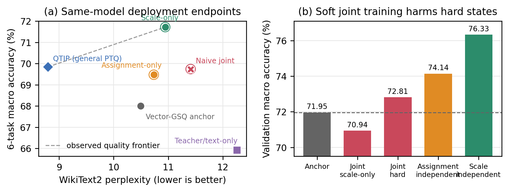

# 软联合并不等于可部署组合：2-bit Block-Scaled VQ 的连续—离散适应失配

## 摘要

极低比特向量量化的部署权重常同时包含连续变量与离散变量，例如 group scale 和 codeword assignment。一个直观但未经证实的假设是：既然两类变量可分别优化，把它们放入同一可微松弛中就会自然互补。本文在固定共享码本的 2-bit block-scaled VQ 中发现该假设不成立。在完全相同的 Llama-3.1-8B-Instruct、最后四层、任务/长文本监督与 2.1208-bpp 合同下，独立训练已有 FP16 group scale 将六任务平均从 68.00% 提至 71.72%，WikiText2 PPL 为 10.9448；独立训练当前码字 8-way 附近领域的 assignment 将其提至 69.48%，PPL 为 10.7347。然而，在同一 binary Concrete 软 assignment 上同步学习 scale 的 naive joint 只达到 69.74%/11.4098，被 scale-only 严格支配。更关键的是，只保留 joint 过程学到的 scale、把 switch 置零时，验证平均仅 70.94%，明显低于独立 scale 的 76.33%。该硬状态反证定位了失败机制：scale 在训练中补偿尚未部署的软 codeword mixture，hard projection 改变 mixture 后两个坐标同时失配。我们因此提出一项部署态原则：连续与离散坐标只能在真实 hard checkpoint 上交接，每一步都必须用与部署一致的权重验收。本文的贡献是对功能非均匀性和软—硬联合失配的可复现证据，而不是尚未验证的联合优越性或通用 PTQ SOTA。

**关键词：** 大语言模型压缩；向量量化；任务适应；码字指派；连续—离散优化；软—硬失配

## 1 引言

约 2 bit/parameter 的极端压缩已不能只依靠逐元素舍入。GPTVQ、AQLM、QuIP# 和 QTIP 通过高维向量、加性码本、格码或 trellis 扩大有限比特下的表示能力 [2--5]。这些工作主要回答如何从浮点权重构造高质量低比特 checkpoint。但一个量化模型在部署时不是单一整数张量：它通常还保留 scale、zero point、codebook 与 assignment。当模型需要在不回复浮点影子权重、不增加逻辑码率的条件下适应任务时，真正的问题是：哪些已有部署变量应该承担这一变化？

Block-scaled VQ 提供了一个最小但非平凡的对象。它先把不同 block 缩放到共享数值域，再用同一套码本量化归一化向量；部署权重因此由“共享原型 × 组尺度”重构。固定码本后，group scale 是组级连续坐标，assignment 是向量级离散坐标。PV-Tuning 已经指出量化表示中连续与离散变量需要不同优化步，并以交替坐标视角形式化这一问题 [12]。因此，本文不声称首次发现连续/离散变量，而追问一个更具体的部署问题：在固定共享码本、只允许当前码字附近领域切换时，两种坐标可否在同一软松弛中直接组合？

我们首先做完全匹配的单坐标实验。在同一 Meta-Llama-3.1-8B-Instruct 2.1208-bpp 锚点上，训练最后四层的 552 万个 FP16 group scale 使 Macro-6 提高 3.72 pp，但 PPL 退化 4.28%；在当前码字 8-way 邻域内训练 assignment，最终仅 0.378% 的稀疏硬切换被接受，Macro-6 提高 1.48 pp，PPL 退化 2.27%。连续尺度是高任务收益、高语言漂移坐标；局部 assignment 是较低收益、较低漂移坐标。这一非均匀性意味着，“可训练”不等于“可互换”。

更出乎意料的是，最直接的联合方法失败了。我们在同一参数化中对 scale log delta 与 binary Concrete assignment switch 同时反向传播，并对零-switch、1/8、1/4、1/2 与 full 真实硬投影做 loss-dominance 选择。该方法通过了一次从未观察的 task/C4 audit，也相对锚点提高 1.74 pp Macro-6；但它仅得到 69.74% 和 11.4098 PPL，在准确率与 PPL 上同时劣于 scale-only。这不是一个可以用平均数或附录隐藏的小差异，而是对“软联合自然互补”的直接反例。

失败可以被进一步定位。在同一 joint epoch 中，把所有 assignment switch 置零、只保留联合过程学到的 scale，验证 Macro 为 70.94%，比未修改锚点的 71.95% 还低，也远低于独立 scale 的 76.33%。这说明 joint scale 并未学会一个可独立部署的连续端点；它在优化过程中补偿的是连续 codeword mixture。当 mixture 被 hard assignment 替换时，补偿关系被破坏。因此最小的方法原则不是更换学习率或投影比例，而是要求坐标只在真实部署态上交接：一个坐标先折叠成 hard checkpoint，下一坐标再以该权重为锚点重新计算功能方向。

本文做出以下贡献：

1. 在同一 2-bit block-scaled VQ checkpoint 内，通过同锚点、同监督、同层和同码率的完整实验，揭示 group scale 与当前码字附近领域 assignment 具有显著不同的任务—语言建模效应。
2. 完整验证并否决 naive simultaneous joint；利用零-switch joint scale 的 hard-state 反证，将失败定位为软 assignment mixture 与硬部署之间的补偿—投影失配，而不是泛化的“优化不稳定”。
3. 建立部署态坐标原则：当连续与离散变量共享重构路径时，下一坐标必须以上一坐标的真实 hard checkpoint 为锚点，且选择与 audit 都必须检查真实部署权重。我们明确承认，由该原则导出的分阶段修复尚待下一版本正式验证。

## 2 相关工作

### 2.1 极低比特表示与量化锚点

GPTQ 用校准激活估计 Hessian，在逐列量化中把当前误差反馈到剩余权重 [1]。AWQ 利用 activation salience 重标定少量重要通道 [6]；OmniQuant、QuaRot 与 SpinQuant 通过可学尺度或等价旋转改善量化条件 [7--9]。GPTVQ、AQLM、QuIP# 与 QTIP 进一步使用向量、加性码本、格或 trellis [2--5]。本文的 block-scaled VQ 同样使用共享码本，但我们不把码本形状作为主要贡献；它只是暴露 scale 与 assignment 两类部署坐标的共同表示载体。

### 2.2 连续—离散量化微调

GSQ 用 Gumbel-Softmax 学习标量量化 assignment [10,11]。AQLM 和 QuIP# 在极低比特表示上微调连续码本或尺度。PV-Tuning 最直接地形式化了这类混合变量：固定 partition 优化连续值，固定可用值集后用线性化子空间步更新离散 code，并为理想交替步给出单调损失和收敛结论 [12]。这是本文不能回避的最直接先验：坐标交替不是我们的首创。我们的研究范围更窄：码本与 normalizer 始终固定，连续变量只是已有 block group scale，离散步只允许当前码字的 8-way 附近领域，并以任务功能梯度、binary Concrete、真实 hard projection 和一次独立 audit 闭合训练—部署差异。本文的新证据是同步软组合在该表示上产生的具体补偿失配。

### 2.3 任务适应与通用 PTQ

通用 PTQ 以未标注校准文本保留整体语言建模能力；任务适应则可以利用下游 training split。LoTA-QAF 等方法学习可合并的低比特适配变量，关心训练形式与部署形式一致 [14]。我们不增加 adapter，而是修改 checkpoint 已存在的 scale 或 assignment。由于正结果使用了目标任务 training split，GSQ 和 QTIP 只能作为同模型质量坐标，不能被写成同监督设置下的被超越基线。我们通过完整 teacher/text-only 负对照显式验证这一边界。

## 3 表示、适应坐标与失配机制

### 3.1 Block scale 后的共享码本 VQ

将 Linear 权重分成 $d$ 维向量 $w_i$，共享码本为 $\mathcal C=\{c_1,\ldots,c_K\}$，离散索引为 $a_i$，尺度组为 $g(i)$。不同 block 的原始动态范围不同；若直接共享码本，高幅值 block 会主导原型，低幅值 block 则只占据码本局部。因此我们先以 block/group scale $s_{g(i)}$ 归一化：

$$
u_i=\frac{w_i}{s_{g(i)}}.
$$

所有 $u_i$ 被映射到同一数值域，再在共享码本上选取 assignment。忽略为稳定训练保留的 row/column normalizer，部署权重为

$$
\hat w_i=s_{g(i)}c_{a_i}.
$$

这一分解非常关键：本文的连续与离散坐标不是事后添加的两个 adapter，而是 VQ 部署权重本身的两个乘性因子。本文使用 $d=6$、$K=4096$、group size 160；12-bit assignment 分摊到 6 个权重上对应 2 bit/weight，计入码本、scale 与其他元数据后逻辑码率为 2.1207557 bpp。

### 3.2 Hessian-aware Vector-GPTQ 锚点

第一阶段以 block-scale 后的 VQ 得到较小的 Hessian 加权重构误差：

$$
\min_{\mathcal C,a,s}\sum_i\omega_i\|u_i-c_{a_i}\|_2^2,
$$

其中 $\omega_i$ 来自校准激活的 Hessian 或其对角近似。固定码本后，Vector-GPTQ 不对 4096 个码字逐个执行后续二阶计算，而是先使用几何 top-128 候选，再在局部候选上计算向量化二阶目标。当前向量量化误差经逆 Hessian 因子传给剩余列：

$$
W_{:,j+1:}\leftarrow W_{:,j+1:}-e_j\frac{H^{-1}_{j,j+1:}}{H^{-1}_{jj}}.
$$

这是 VQ 版 GPTQ 的核心：选择对象从标量格点变为向量码字，误差反馈仍保持二阶顺序校正。它产生完整 32 层、224 个 Linear 的共同硬锚点 $(s^0,a^0)$。后续所有适应实验从同一锚点出发，因此不会把初始量化差异误归因到适应坐标。

### 3.3 连续 group-scale 坐标

对适应层中每个已有 group scale 学习有界对数增量 $r_g$：

$$
\tilde s_g=s_g^0\exp(r_g),\qquad |r_g|\le\rho.
$$

Assignment、codebook、normalizer 和非目标层均冻结。训练后 $\tilde s_g$ 以 FP16 折叠回原 checkpoint 已有字段，不增加逻辑 bpp。该坐标一次改变组内多个向量的幅值，因此是密集、组级和径向的。它可以用小步平滑移动任务 logit，但也会同时改变很多语言建模路径。

### 3.4 当前码字附近领域的 Assignment 坐标

离散分支不从 4096 个码字全局重新分配。对每个当前码字 $a_i^0$，先构造包含自身的 8-way 几何邻域 $\mathcal N(a_i^0)$。激活任务监督、浮点教师 KL 与长文本 guard，得到对部署权重的功能梯度 $g_i$。每个邻居的一阶变化为

$$
\Delta_i(c)=\langle g_i\odot s^0_{g(i)},c-c_{a_i^0}\rangle.
$$

仅保留 $\Delta_i$ 最小的邻居 $c_i^1$。几何邻域限制从当前 codeword 出发的扰动半径，任务功能梯度决定邻域内方向。每个向量因此只有“保持当前码字”和“切换到功能邻居”两个状态。

为每个向量学习 switch logit $z_i$，binary Concrete 训练态为

$$
p_i=\sigma((z_i+\epsilon_i)/\tau),\qquad
\tilde w_i=s^0_{g(i)}[(1-p_i)c_{a_i^0}+p_i c_i^1].
$$

训练完成后不保存 $p_i$。将 $z_i>0$ 的候选按置信度排序，构造 1/8、1/4、1/2 和 full 嵌套硬投影，每个候选都以真实 int32 assignment 重构权重并评估。这一步是必要的：所有局部切换可以各自具有负一阶项，但当切换集合 $S$ 增大时，二阶交叉项会抵消收益：

$$
\mathcal L(W+\delta_S)=\mathcal L(W)+\sum_{i\in S}g^\top\delta_i+
\frac12\delta_S^\top H(\xi)\delta_S.
$$

### 3.5 Naive simultaneous joint

最直接的联合参数化是在上式中同时用可学 $r_g$ 替换 $s^0_g$：

$$
\tilde w_i= s^0_{g(i)}\exp(r_{g(i)})
[(1-p_i)c_{a_i^0}+p_i c_i^1].
$$

Assignment logit 与 scale delta 使用独立 Adam parameter group，共享任务/教师/文本目标。每个 epoch 的 scale 快照分别与零-switch、1/8、1/4、1/2 和 full assignment 硬投影组合。该设计在工程上可部署：scale 折叠为 FP16，assignment 折叠为 int32，codebook 与逻辑 bpp 不变。但“可折叠”并不保证“训练几何与折叠后几何一致”。

### 3.6 补偿—投影失配

设训练时软原型为 $m_i(p_i)=(1-p_i)c_{a_i^0}+p_i c_i^1$，部署时硬原型为 $h_i\in\{c_{a_i^0},c_i^1\}$。对一个 scale 组 $g$，soft objective 允许 $r_g$ 根据组内所有 $m_i(p_i)$ 学习共同补偿。若硬投影产生不可忽略的组内残差

$$
R_g=\sum_{i:g(i)=g}\|h_i-m_i(p_i)\|^2,
$$

则软状态上学到的 $r_g$ 不再是硬状态上的有效尺度。特别地，当 scale 与 $p_i$ 在软目标中形成补偿方向时，即使各自梯度平稳、训练 loss 下降，也可能存在

$$
\mathcal L(\Pi_a(\tilde W(r,p)))>
\min\{\mathcal L(\tilde W(r,0)),\mathcal L(\tilde W(0,\Pi_a(p)))\},
$$

其中 $\Pi_a$ 是 hard assignment 投影。这不是关于所有模型的普遍定理，而是一个可验证的充分失配机制。我们在实验中同时观察到：(i) joint 的零-switch scale 端点退化；(ii) joint hard 端点低于两个独立坐标；(iii) joint 在正式 PPL--Macro 上被 scale-only 支配。

### 3.7 部署态 Gate 与单次 Audit

所有坐标使用共享目标

$$
\mathcal L=\mathcal L_{\rm sup}+\lambda_{\rm KL}\mathcal L_{\rm teacher}
+\lambda_{\rm text}\mathcal L_{\rm text}+\mathcal R,
$$

其中 scale 的 $\mathcal R$ 为 log-delta $L_2$，assignment 的 $\mathcal R$ 为 switch penalty。验证候选必须使 balanced task loss 相对锚点至少改善 0.5%，macro 最多回退 1 pp，任一任务 loss 与文本 CE 最多相对回退 0.5%。对 joint，候选先在所有 Gate 内按 balanced task loss 排序，稀疏度只作平局规则。唯一入选端点只在一组从未观察的 task/C4 audit 上验收一次，失败则整体回滚。最后审计 assignment dtype、scale dtype、codebook/normalizer/非目标状态、逻辑 bpp 与 fresh reconstruction。

由失配机制自然导出的下一原则是：不同坐标不应在同一未部署软状态上相互补偿；应先固化一个真实 hard checkpoint，再以它为锚点重新计算下一坐标的功能方向。这与 PV-Tuning 一样具有坐标优化精神；本文的特定闭环是固定共享码本、当前码字附近领域、任务功能定向和 hard deployment audit。本版本只把该原则作为被负结果支持的后续假设，不声称已完成最终联合方法。

## 4 实验

### 4.1 协议与评测

主模型为 Meta-Llama-3.1-8B-Instruct。共同 Vector-GSQ 锚点覆盖 32 层、224 个 Linear，FineWeb-Edu 使用 4096 train/128 validation，Vector-GPTQ 使用 512 条，所有序列长度为 4096。任务适应只开放 layers 28--31。独立 task-assignment 与 task-scale 使用五个任务 training split 中每任务 512 train、256 validation、256 audit；文本为 4096 条 FineWeb train、128 C4 validation、512 C4 audit，长度 4096。两者均训练 2 epochs，固定 seed 0，不扫描 group size、学习率或 seed。

Naive joint 使用同一 train/validation，但 final audit 更换为从未被任何前序实验读取的样本：任务随机排列 offset 1024 处每项 64 条，以及新 C4 rows 5376--5439 共 64 条。新 5440-row token cache 的前 5376 行与原缓存 bit-exact，新 64 行互异且未被旧实验访问。

PPL 在 WikiText2 raw test 上以 seqlength 2048 测量。准确率使用 `lm_eval 0.4.4` 全量 0-shot ARC-Challenge、ARC-Easy、HellaSwag、LAMBADA、PIQA 与 WinoGrande，无 `limit`。Macro-6 为六项平均；公共五任务去掉 LAMBADA，用于对齐 GSQ 的公开口径。所有正式实验每次只暴露一张 A100 80GB。

### 4.2 Figure 1：质量端点与 Hard-State 干扰

Figure 1(a) 把所有完整端点放到同一 PPL--Macro-6 平面。QTIP 是无任务标签的通用 PTQ 质量参照；空心圈表示使用了目标任务 training split。图中不存在一个同时具有 scale-only 准确率和 assignment-only PPL 的联合端点；naive joint 向右移动却没有向上超过 scale。Figure 1(b) 进一步排除“只是正式任务方差”：joint 训练中的 scale-only hard state 低于锚点，而独立训练 scale 显著更好。

### 4.3 两个坐标是否等价？

| 部署端点 | 任务标签进入训练 | 主要改动 | PPL ↓ | Macro-6 ↑ | 公共五任务 ↑ |
|---|:---:|---|---:|---:|---:|
| Vector-GSQ 锚点 | 否 | 无 | **10.4960** | 67.9997 | 68.1046 |
| teacher/text-only assignment | 否 | 0.4617% index | 12.2604 | 65.9217 | 67.2062 |
| task-assignment | 是 | 0.3781% index | 10.7347 | 69.4774 | 69.0744 |
| **task-scale** | **是** | 5.52M FP16 scale | 10.9448 | **71.7223** | **72.5484** |
| naive joint | 是 | scale + 0.8610% index | 11.4098 | 69.7434 | 68.9511 |

单坐标比较的答案是否定的。Task-scale 相对锚点的 Macro-6/公共五任务增益为 +3.7225/+4.4438 pp，task-assignment 为 +1.4777/+0.9698 pp；scale 分别多 2.2449/3.4740 pp。但 scale 的 PPL 相对锚点退化 4.2757%，assignment 只退化 2.2742%。Scale 是密集高增益/高漂移端点，assignment 是稀疏中间端点。两者的任务分工也不同：scale 主要改善 HellaSwag、ARC-C、WinoGrande 与 PIQA，assignment 在 ARC-E 和 LAMBADA 更好。

### 4.4 同步 Joint 是否互补？

Naive joint 选择 epoch 1 的 1/2 硬投影，改变 1,252,415 / 145,465,344 个 assignment（0.860971%）；5,521,408 个 scale delta 全部非零，mean absolute log-delta 为 0.033627。其 validation macro 由 71.9531% 升至 72.8125%，balanced loss 下降 4.6832%，C4 CE 下降 2.2968%。在全新 final audit 上，macro 保持 76.8750%，balanced loss 下降 8.5607%，C4 CE 下降 1.9967%，Gate 通过。

但正式结果否定互补性。Joint 相对锚点的 Macro-6/五任务提高 1.7437/0.8465 pp，PPL 退化 8.7063%。相对 assignment-only，它的 Macro-6 仅高 0.2660 pp，五任务低 0.1232 pp，PPL 再退化 6.2892%。相对 scale-only，Macro-6/五任务低 1.9789/3.5972 pp，PPL 还高 4.2489%。因此 scale-only 在两个准确率口径和 PPL 上都严格支配 joint。

| 任务 | 锚点 | Assignment | Scale | Naive joint |
|---|---:|---:|---:|---:|
| ARC-C | 47.2696 | 49.6587 | **53.7543** | 49.8294 |
| ARC-E | 76.0943 | **79.4192** | 78.5774 | 78.3670 |
| HellaSwag | 70.1354 | 69.9263 | **77.5443** | 69.3886 |
| LAMBADA | 67.4753 | 71.4923 | 67.5917 | **73.7046** |
| PIQA | 77.0947 | 77.1491 | **79.5430** | 76.7682 |
| WinoGrande | 69.9290 | 69.2186 | **73.3228** | 70.4025 |

Joint 相对 assignment 的微小 Macro-6 优势几乎全部由 LAMBADA 支撑，而在 HellaSwag 与 PIQA 上低于锚点。它没有组合两个坐标各自的逐任务优势。

### 4.5 失配发生在哪里？

| Validation hard state | Macro ↑ | Balanced loss ↓ | 含义 |
|---|---:|---:|---|
| 锚点 | 71.9531 | 0.83785 | 共同起点 |
| Joint epoch 1 scale、零 switch | 70.9375 | 0.88404 | 软 mixture 上的 scale 不可独立部署 |
| Joint epoch 1 入选 hard | 72.8125 | 0.79861 | 部分恢复，但仍弱于独立坐标 |
| 独立 assignment | 74.1406 | 0.78548 | 局部硬信赖域 |
| 独立 scale | **76.3281** | -- | 连续坐标的真实部署解 |

零-switch 反例是最重要的诊断。如果 joint 失败只是因为保留 switch 太多，那么零-switch 端点应该接近独立 scale；事实则相反。Joint 的 scale 已经在 soft assignment mixture 上改变了优化目标，因此无论保留多少 hard switch，都不会自动回到独立 scale 的部署解。这个结论直接否决继续扫描 joint 投影比例、学习率或 seed 作为主要修复。

### 4.6 为何 Assignment 仍需附近领域和稀疏投影？

独立 assignment 的嵌套硬投影提供了一个不依赖 joint 的机制对照：

| Assignment 投影 | 切换率 | Validation Acc ↑ | Balanced loss ↓ | 文本 CE ↓ |
|---|---:|---:|---:|---:|
| 锚点 | 0 | 71.9531 | 0.83785 | 2.66053 |
| **1/8** | **0.3781%** | **74.1406** | 0.78548 | **2.48025** |
| 1/4 | 0.7562% | 73.6719 | **0.77777** | 2.51655 |
| 1/2 | 1.5124% | 73.4375 | 0.77915 | 2.63600 |
| full | 3.0248% | 71.5625 | 0.81238 | 2.97347 |

所有 alternative 都来自当前码字的同一 8-way 附近领域，且由负一阶方向选出；但更多 hard switch 并不单调改善。Full 相对 1/8 准确率低 2.5781 pp，文本 CE 高 19.88%。这说明附近领域只是限制单步扰动的必要条件，不是联合多个离散步时的充分保证；真实部署态仍需要稀疏 hard trust region。

### 4.7 正结果是否需要任务监督？

Teacher/text-only assignment 保持相同锚点、8-way 候选、两个 epoch 与长文本预算，但任务标签不进入 proposal、训练、projection selection 或 audit。它把 held-out C4 validation/audit teacher CE 改善 1.5143%/1.6906%，却使 WikiText2 PPL 退化 16.8100%、Macro-6 下降 2.0780 pp，六项任务无一改善。这一完整负对照否决“附近领域 assignment 自动改善通用 PTQ”，也说明当前 top-k teacher-text CE 不是跨语料 PPL 的充分代理。本文的正结果必须定位为 task-adapted quantization。

### 4.8 与公开方法的边界

| 方法 | 目标任务监督 | bpp | PPL ↓ | 公共五任务 ↑ | 角色 |
|---|:---:|---:|---:|---:|---|
| GSQ（公开） | 否 | 2.13 | -- | 68.5500 | 同模型公开质量点 |
| QTIP（统一复现） | 否 | **2.00** | **8.7971** | 69.8749 | 通用 PTQ 前沿 |
| task-assignment | 是 | 2.1208 | 10.7347 | 69.0744 | 稀疏离散适应 |
| task-scale | 是 | 2.1208 | 10.9448 | **72.5484** | 密集连续适应 |
| naive joint | 是 | 2.1208 | 11.4098 | 68.9511 | 失败机制对照 |

本地 QTIP 复现使用同一 Llama-3.1-8B-Instruct、WikiText2 seqlength 2048 和六项全量 `lm_eval`，得到 PPL 8.7971、Macro-6 69.8469% 与公共五任务 69.8749%。Task-scale 的任务平均数值更高，但它使用了目标任务 training split，且 PPL 显著更差，不能据此声称通用 PTQ SOTA。PV-Tuning 也已经提供更一般的连续—离散坐标优化形式化和多模型 PPL 结果；本文当前的优势是对固定共享码本、当前码字邻域与 hard deployment 失配的直接诊断，而不是更广的理论或 SOTA。

### 4.9 成本、部署合同与局限

32 层 Vector-GSQ 锚点量化约 54.58 小时。Task-scale 校准 5,353.99 秒（1.49 小时），task-assignment 约 23,204.70 秒（6.45 小时），naive joint 为 27,226.14 秒（7.56 小时）。Joint 校准峰值显存 37,749,899,264 bytes（35.16 GiB），PPL 和六任务评测分别需要 55.69 秒与 1,501.42 秒。三个适应端点都不增加逻辑 bpp，但训练成本差异明显；“零额外部署存储”不等于“免费适应”。

Joint 落盘 checkpoint 同时改变 assignment 与 FP16 group scale，codebook、normalizer、固定元数据与非目标状态精确，fresh reconstruction 最大误差为 0，逻辑 bpp 仍为 2.1207557。因此失败不是 checkpoint 序列化或码率变化造成的。

当前证据只来自一个 8B Instruct 模型、固定 seed 和最后四层；没有 70B、第二模型族、前层/全层、长上下文生成或代码/数学任务。任务训练与测试同族，不声称跨任务迁移。当前没有针对该 checkpoint 格式的定制 kernel，因此只能报告逻辑存储而不能声称真实吞吐加速。最重要的是，部署态分阶段坐标修复尚未运行；本文只证明它是由已观察失配导出的最小后续假设，不声称它已经超过 scale-only。

## 5 讨论

### 5.1 这是一篇方法论断言，还是一个完成方法？

截至 V9，最可信的贡献是两个可复现现象和它们之间的机制闭环：第一，block-scaled VQ 中 scale 与当前码字邻域 assignment 具有不同任务—语言建模效应；第二，同时优化软assignment 与 scale 会产生 hard projection 后无法保留的补偿。这两项证据足以否定一个常见直觉，但还不足以构成最终联合 SOTA 方法。因此 V9 把自己定位为方法机制版本，而非提前宣布闭环完成。

### 5.2 与 PV-Tuning 的真正差异

PV-Tuning 已经提出一般的 P-step/V-step 交替优化，用连续反向传播更新值集，再在小离散子空间中更新 codes。如果本文下一版本只做“先 scale 再 assignment”，而没有当前码字附近领域、任务功能定向、硬 checkpoint 重锚定与单次 audit 的特定证据，那么创新性会明显不足。本文的可能空间不是重复发明坐标下降，而是研究“乘性 block scale 与局部 codeword 切换之间的部署交接”这个更窄、更可审计的问题。

### 5.3 下一个可证伪假设

最小后续不是重试 naive joint 的不同 LR、group 或 seed。应先以独立 scale 端点作为真实 FP16 hard checkpoint，冻结该 scale，再以新权重重新收集任务/文本功能梯度，为每个当前 codeword 重新构造 8-way 邻域中的 alternative，最后只学习稀疏 assignment repair。成功标准不是“又超过锚点”，而是至少不被 scale-only 支配：任务 macro 不低于 scale，或在相近 macro 下将 PPL 拉回 assignment 方向。若最佳 hard projection 为 no-op 或仍被 scale 支配，则应接受 assignment 是独立 Pareto 分支，而不是可叠加的主模块。

## 6 结论

本文研究 2-bit block-scaled VQ 中的连续—离散任务适应。完全匹配的实验表明，已有 FP16 group scale 和当前码字附近领域 assignment 不是等价接口：前者是密集高增益/高漂移坐标，后者是稀疏局部中间坐标。更重要的是，将两者放入同一软松弛并不会自然组合它们的优势；naive joint 被 scale-only 严格支配，而零-switch joint scale 的退化将原因定位为对 soft codeword mixture 的补偿与 hard deployment 之间的失配。这一负结果导出一个简单但必须正式验证的原则：连续与离散坐标只能在真实 hard checkpoint 上交接，每一步都必须在部署态下选择与 audit。本版本建立了现象、失配机制与最小方法原则，但不把尚未完成的分阶段修复包装成已验证结论。

## 参考文献

[1] Frantar, E., Ashkboos, S., Hoefler, T., & Alistarh, D. GPTQ: Accurate Post-Training Quantization for Generative Pre-trained Transformers. ICLR, 2023.

[2] van Baalen, M., et al. GPTVQ: The Blessing of Dimensionality for LLM Quantization. 2024.

[3] Egiazarian, V., Panferov, A., Kuznedelev, D., Frantar, E., Babenko, A., & Alistarh, D. Extreme Compression of Large Language Models via Additive Quantization. ICML, 2024.

[4] Tseng, A., Chee, J., Sun, Q., Kuleshov, V., & De Sa, C. QuIP#: Even Better LLM Quantization with Hadamard Incoherence and Lattice Codebooks. ICML, 2024.

[5] Tseng, A., Sun, Q., Hou, D., & De Sa, C. QTIP: Quantization with Trellises and Incoherence Processing. NeurIPS, 2024.

[6] Lin, J., et al. AWQ: Activation-aware Weight Quantization for LLM Compression and Acceleration. MLSys, 2024.

[7] Shao, W., et al. OmniQuant: Omnidirectionally Calibrated Quantization for Large Language Models. ICLR, 2024.

[8] Ashkboos, S., et al. QuaRot: Outlier-Free 4-Bit Inference in Rotated LLMs. NeurIPS, 2024.

[9] Liu, Z., et al. SpinQuant: LLM Quantization with Learned Rotations. ICLR, 2025.

[10] Dadgarnia, A., et al. GSQ: Highly-Accurate Low-Precision Scalar Quantization for LLMs via Gumbel-Softmax Sampling. 2026.

[11] Jang, E., Gu, S., & Poole, B. Categorical Reparameterization with Gumbel-Softmax. ICLR, 2017.

[12] Malinovskii, V., Mazur, D., Ilin, I., Kuznedelev, D., Burlachenko, K., Yi, K., Alistarh, D., & Richtárik, P. PV-Tuning: Beyond Straight-Through Estimation for Extreme LLM Compression. NeurIPS, 2024.

[13] Maddison, C. J., Mnih, A., & Teh, Y. W. The Concrete Distribution: A Continuous Relaxation of Discrete Random Variables. ICLR, 2017.

[14] Goodman, K., et al. LoTA-QAF: Lossless Ternary Adapters for Quantization-Aware Fine-Tuning. NeurIPS, 2025.
